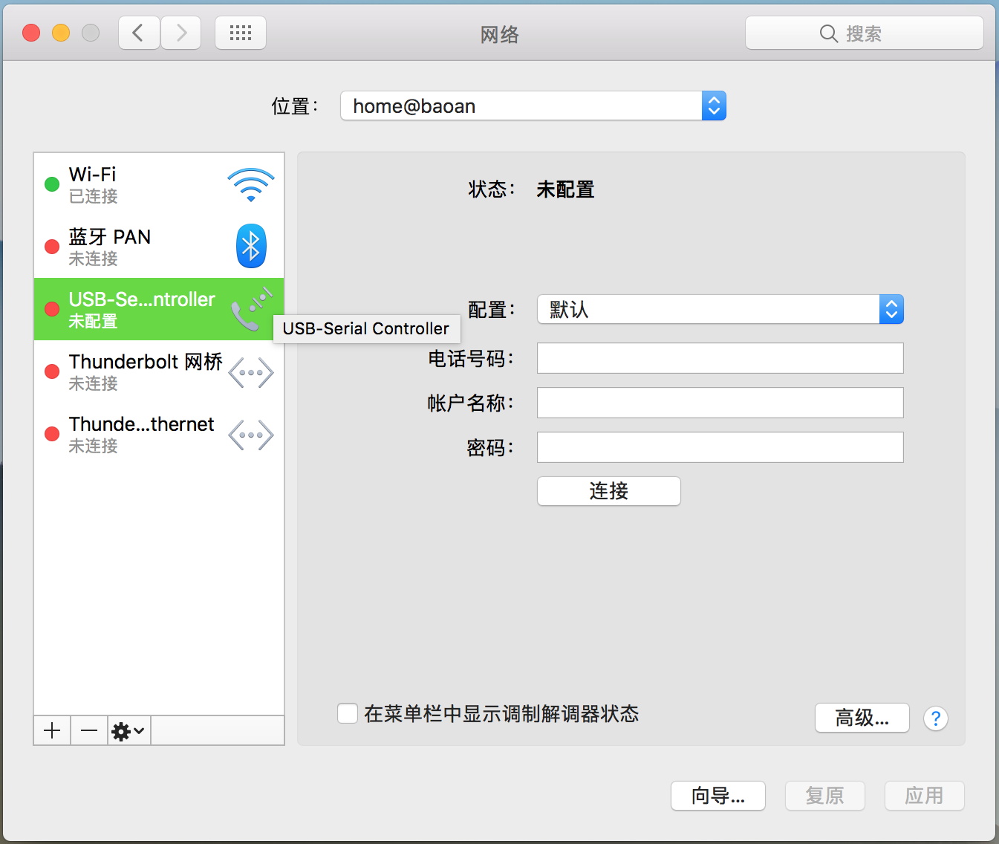
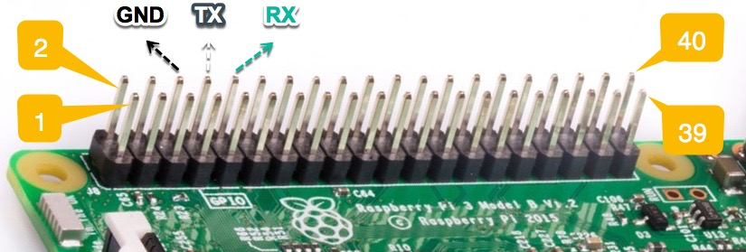
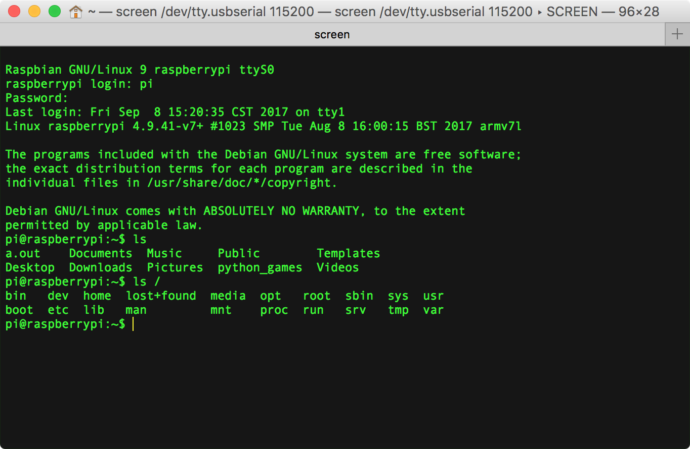
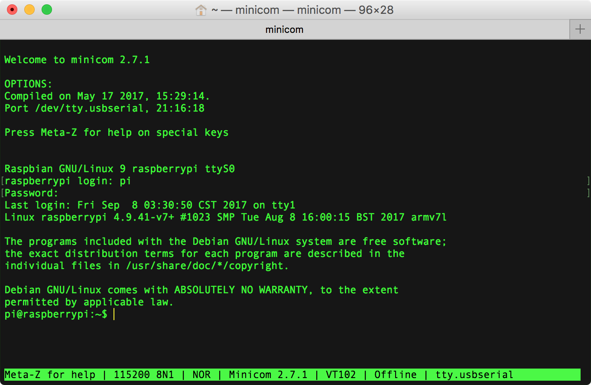
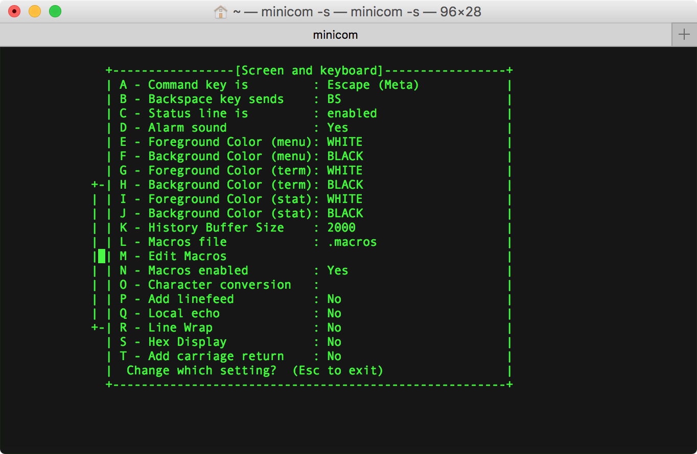

[Mac's and serial TTY's](https://pbxbook.com/other/mac-tty.html)  
[RPi Serial Connection](http://elinux.org/RPi_Serial_Connection)  

# mac 安装 PL2303 USB2TTL 驱动
下载安装 [PL2303 Mac OS X Driver](http://www.prolific.com.tw/US/ShowProduct.aspx?p_id=229&pcid=41)，安装完成要求重启。  
macOS 安装好 PL2303 USB2TTL 驱动后，网络偏好设置中将会多出一项名为 `USB-Serial Controller` 的服务配置项。  



# PL2303 接 RPi 串口通信 GPIO 引脚
PL2303 USB2TTL 转换串口板的四根线如下图：


右边的模块即对应树莓派的 GPIO 串口引脚。



面对 RASPBERRY PI 3 MODEL B 的 USB 和网口的 GPIO 引脚顺序：

- 第3根为 GND，接 PL2303 黑线（GND）；  
- 第4根 GPIO14 为 TXD0，接 PL2303 白线（RXD）；  
- 第5根 GPIO15 为 RXD0，接 PL2303 绿线（TXD）；  


[Raspberry Pi：透過序列埠登入系統](http://yehnan.blogspot.com/2013/09/raspberry-pi.html)  
[Getting Started with PL2303 USB to UART Converter](https://electrosome.com/pl2303-usb-to-uart-converter/)  
[Setup and PL2303 Serial Console on your Raspberry PI 3B](https://www.raspberrypi.org/forums/viewtopic.php?f=41&t=148208#p974975)  
[Read and Write From Serial Port With Raspberry Pi](http://www.instructables.com/id/Read-and-write-from-serial-port-with-Raspberry-Pi/)  
[How to Work With USB to TTL Converters Using Minicom on Mac](http://tinaunglinn.com/blog/2016/04/04/how-to-work-with-usb-to-ttl-converters-using-minicom-on-mac/)  

# RPi 启用串口
根据 Raspberry Pi 文档 [The Raspberry Pi UARTs](https://www.raspberrypi.org/documentation/configuration/uart.md) 中的描述。

## 方式1：修改配置文件
此时，我们还没有进入 raspbian 系统，没法直接配置。  
实际上，我们可以将安装 raspbian 系统的 microSD 卡从 RPi 再次取出，放入读卡器插入 mac USB 口。此时，macOS 会自动加载 SD 卡，在 finder 中可进入 MS-DOS FAT32 格式的 boot 文件夹，修改对应的引导配置文件。

根据 [pi 3 - How do I make serial work on the Raspberry Pi3 - Raspberry Pi Stack Exchange](https://raspberrypi.stackexchange.com/questions/45570/how-do-i-make-serial-work-on-the-raspberry-pi3) 中 naseer mohamad 的回答：

Add device tree to `/boot/config.txt` to disable the Raspberry Pi 3 bluetooth.

```Shell
sudo vi /boot/config.txt
```

Add at the end of the file 

	- if you want to change the blutooth to miniuart port(bad)

```Shell
dtoverlay=pi3‐miniuart‐bt
```

	- if you want to disable the blutooth(good)

```Shell
dtoverlay=pi3‐disable‐bt
```

根据 Arnout 的回答，只需要在 `/boot/config.txt` 末尾增加一行禁用蓝牙：

```Shell
dtoverlay=pi3‐disable‐bt
```

## 方式2：进入GUI修改系统设置
旧版的 RPi 需要一系列的配置命令才能启用串口，最新版在通过 USB 连接键盘鼠标、HDMI 接上显示屏后，进入系统界面即可设置。  
进入操作系统的图形界面后，左侧第一个系统菜单 `System Menu | Raspberry Pi Configuration | Interfaces`，默认 Camera、SSH、VNC、SPI、I2C、Serial、1-Write、Remote GPIO 等设备均为禁用（Disabled）状态，可在此启用串口（Serial）。同时建议开启 SSH 和 VNC 服务。  

> - **SSH**: Enable remote access to this Pi via SSH  
> - **VNC**: Enable remote access to thie Pi using RealVNC  
> - **Serial**: Enable shell and kernel messages on the serial connection  


将 Serial 设置为 **Enabled** 状态后，重启进入系统，`/boot/config.txt` 中会多出 `enable_uart=1` 项。  
同时设备树下（`/dev/`）将会多出节点 `tty.usbserial` 和 `cu.usbserial`，此即表明  PL2303 串口板连接成功。  


关于 TTY 和 Terminal 的相关概念可参考 [Console-TTY-Terminal.md](./Console-TTY-Terminal.md)。

## tty vs cu
> You might notice that each serial device shows up twice in `/dev`, once as a `tty.*` and once as a `cu.*`. So, what's the difference? Well, **TTY** devices are for <u>calling into</u> UNIX systems, whereas CU (Call Up) devices are for <u>calling out</u> from them (eg, modems). We want to *call out* from our Mac, so `/dev/cu.*` is the correct device to use.  
> The technical difference is that `/dev/tty.*` devices will wait (or listen) for DCD (data carrier detect), eg, someone calling in, before responding. `/dev/cu.*` devices do not assert DCD, so they will always connect (respond or succeed) immediately.  

以下配置使用 screen 和 minicom 串口终端时，以 `/dev/tty.usbserial` 为主，相对 cu 而言，支持 [DCD](https://en.wikipedia.org/wiki/Data_Carrier_Detect)（Data Carrier Detect，数据载波检测）。

# serial terminal
## [GNU Screen](https://en.wikipedia.org/wiki/GNU_Screen)
 [Screen](https://ss64.com/osx/screen.html)  is  a  full-screen  window manager that multiplexes a physical terminal between several processes (typically interactive shells).

macOS 默认安装了 screen：


> [Using Screen on Mac OS X ](http://www.kinnetica.com/2011/05/29/using-screen-on-mac-os-x/)  
> [Use 'screen' as a serial terminal emulator](http://hints.macworld.com/article.php?story=20061109133825654)  
> [Taking Command of the Terminal with GNU Screen](https://www.linux.com/learn/taking-command-terminal-gnu-screen)  
> [GNU SCREEN - USB serial tty communication problems with MAC OS X 10.8.2](https://stackoverflow.com/questions/14474893/gnu-screen-usb-serial-tty-communication-problems-with-mac-os-x-10-8-2)  

### screen 通过 PL2303 连接 RPi
```Shell
screen /dev/tty.usbserial 115200
```

如果找不到设备（连接失败），则进入 screen 串口控制台窗口，底栏提示 `Cannot exec ‘/dev/tty.usbserial’:  No such file or directory`，过一会自动退出，mac 终端出现以下信息：

```Shell
faner@THOMASFAN-MB0:~|⇒  screen /dev/tty.usbserial 115200
[screen is terminating]
```

若连接串口成功，则进入 screen 串口控制台窗口会出现以下信息：

```Shell
Raspberry GNU/Linux 9 raspberrypi ttyS0
raspberrypi login:
```

输入默认账户 `pi`，再输入默认密码 `raspberry`，即可登录进入系统终端控制台。



### quit screen
[Using a serial console on Mac OS X](https://www.packetgeek.net/2016/02/using-a-serial-console-on-mac-os-x/)

按下 <kbd>ctrl</kbd>+<kbd>A</kbd>+<kbd>\\</kbd> 组合键可退出 screen，状态栏将弹窗提示：Really quit and kill all your windows [y/n]  
按下 <kbd>y</kbd> 键确定退出。

```Shell
faner@THOMASFAN-MB0:~|⇒  screen /dev/tty.usbserial 115200
[screen is terminating]
```

### kill screen
需要注意的是，screeen 程序退出的时候不会自动断开连接，如果直接拔掉 USB 串口板，会造成系统重启。

1. 通过终端命令 `ps | grep tty` 查找串口连接进程号。

```Shell
Last login: Sun Sep 17 16:28:45 on ttys001
faner@THOMASFAN-MB0:~|⇒  ps | grep tty
  998 ttys000    0:00.22 -zsh
 1438 ttys000    0:00.02 screen /dev/tty.usbserial 115200
 2739 ttys001    0:00.12 -zsh
 2836 ttys001    0:00.00 grep --color=auto --exclude-dir=.bzr --exclude-dir=CVS --exclude-dir=.git --exclude-dir=.hg --exclude-dir=.svn tty
 1439 tty.usbserial   0:04.54 SCREEN /dev/tty.usbserial 115200
```

以上查到 screen 连接 Raspberry-Pi 的 PL2303 串口板的进程号（PID）为 1438。

2. 通过 `kill pid` 命令强杀 screen 进程，则不会导致 macOS 重启。

```Shell
faner@THOMASFAN-MB0:~|⇒  kill 1438
```

窗口 screen 终端窗口会输出 terminated 信息：

```Shell
[1]    1438 terminated  screen /dev/tty.usbserial 115200
```

## [minicom](https://linux.die.net/man/1/minicom)
minicom - friendly serial communication program

在 macOS 下，可通过 `brew install minicom` 命令安装 minicom。

```Shell
faner@THOMASFAN-MB0:~/Projects/git/FuturismSchedule|master⚡ 
⇒  brew install minicom
Updating Homebrew...
==> Downloading https://homebrew.bintray.com/bottles/minicom-2.7.1.sierra.bottle.tar.gz
######################################################################## 100.0%
==> Pouring minicom-2.7.1.sierra.bottle.tar.gz
==> Caveats
Terminal Compatibility
======================
If minicom doesn't see the LANG variable, it will try to fallback to
make the layout more compatible, but uglier. Certain unsupported
encodings will completely render the UI useless, so if the UI looks
strange, try setting the following environment variable:

  LANG="en_US.UTF-8"

Text Input Not Working
======================
Most development boards require Serial port setup -> Hardware Flow
Control to be set to "No" to input text.
==> Summary
🍺  /usr/local/Cellar/minicom/2.7.1: 17 files, 345.3KB
```

安装完成后，通过 `minicom -v` 可查看 minicom 版本。

```Shell
⇒  minicom -v
minicom version 2.7.1 (compiled May 17 2017)
Copyright (C) Miquel van Smoorenburg.
```

> [usb转串口minicom配置](http://blog.csdn.net/bxd1314/article/details/15839721)  
> [Linux / UNIX minicom Serial Communication Program](https://www.cyberciti.biz/tips/connect-soekris-single-board-computer-using-minicom.html)  
> [How to Work With USB to TTL Converters Using Minicom on Mac](http://tinaunglinn.com/blog/2016/04/04/how-to-work-with-usb-to-ttl-converters-using-minicom-on-mac/)  

### Setup 配置串口连接信息
在 macOS 终端运行命令 `minicom -s`，弹出 minicom 的配置控制台。  
通过上下箭头定位到 Serial port setup：  

![1-[minicom_-s]-configuration-Serial_port_setup](./3-serial_connection/minicom/1-[minicom-s]-configuration-Serial_port_setup.png)

按下 enter 键，进入配置界面：


- 按下 <kbd>A</kbd> 进入 - **Serial Device** 编辑模式，需改为 `/dev/tty.usbserial`。  
- 按下 <kbd>F</kbd> 进入 - **Hardware Flow Control**  编辑模式，修改为 `NO`。

![3-minicom-Serial_port_setup-[A]-[F]-modified](./3-serial_connection/minicom/3-minicom-Serial_port_setup-[A]-[F]-modified.png)

按下 enter 键，返回选择 Set save as dfl 再按 enter 键，保存修改退出重启。

![4-minicom-Serial_port_setup-[A]-[F]-save](./3-serial_connection/minicom/4-minicom-Serial_port_setup-[A]-[F]-save.png)

### minicom 通过 PL2303 连接 RPi
上面执行 -s 执行 Configuration | Serial port setup 配置之后，在 macOS 终端运行命令 `minicom` 即可启动串口连接 RPi。

如果找不到设备（连接失败），则不会进入 minicom 串口控制台窗口，mac 终端出现以下信息：

```Shell
faner@THOMASFAN-MB0:~|⇒  minicom
minicom: cannot open /dev/tty.usbserial: No such file or directory
```

若连接串口成功，则进入 minicom 串口控制台窗口会出现以下信息：

```Shell
Welcome to minicom 2.7.1

OPTIONS:
compiled on May 17 2017, 15:29:14.
Port /dev/tty.usbserial, 21:12:29

Press Meta-Z for help on special keys
```

![5-minicom-[minicom]-connect-welcome](./3-serial_connection/minicom/5-minicom-[minicom]-connect-welcome.png)

按下 enter 键，将会出现引导登录信息：

```Shell
Raspberry GNU/Linux 9 raspberrypi ttyS0
raspberrypi login:
```

输入默认账户 `pi`，再输入默认密码 `raspberry`，即可登录进入系统终端控制台。



### Meta-Z for help
底部状态栏显示 `Meta-Z for help`，那么到底啥是 Meta 键呢？

在 macOS 终端运行命令 `minicom -s`，弹出 minicom 的配置控制台。  
通过上下箭头定位到 Screen and keyboard：  

![7-[minicom-s]-configuration-Screen_and_keyboard](./3-serial_connection/minicom/7-[minicom-s]-configuration-Screen_and_keyboard.png)



可以看到 Command key is: Escape(Meta)，所谓 Meta 键即指 Escape（<kbd>esc</kbd>）。Windows 下可能默认为 <kbd>ctrl</kbd>+<kbd>A</kbd>，此处可配置修改。

在 minicom 窗口，按下 <kbd>esc</kbd>+<kbd>Z</kbd> 组合键可调出 Minicom Command Summary 帮助页面查看功能热键：


### 中文乱码问题
minicom 连接上 RPi 之后，ls 列举中文目录或文件名显示乱码。
退出 minicom，重新启动可带 -R utf8 参数指定采用  UTF8 编码通信，则可解决。

`minicom -c on -R utf8`

### exit minicom
[minicom disconnect](https://www.linuxquestions.org/questions/linux-newbie-8/minicom-disconnect-209775/)  
[How to exit minicom?](https://www.raspberrypi.org/forums/viewtopic.php?f=91&t=75493)  

在 Minicom Command Summary 帮助页面可以看到 `eXit and reset.....X`。  
通过 <kbd>esc</kbd>+<kbd>X</kbd> 组合键调出 Leave Minicom 对话框，点击 yes 确认断开 minicom 串口连接；或通过 tab 键控点击 no 放弃退出。  

## PuTTY
[PuTTY: a free SSH and Telnet client](https://www.chiark.greenend.org.uk/~sgtatham/putty/)  
- [Download PuTTY](https://www.chiark.greenend.org.uk/~sgtatham/putty/latest.html): latest release (0.70)  
