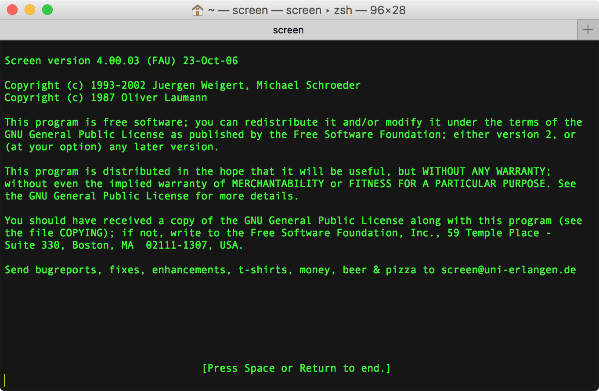
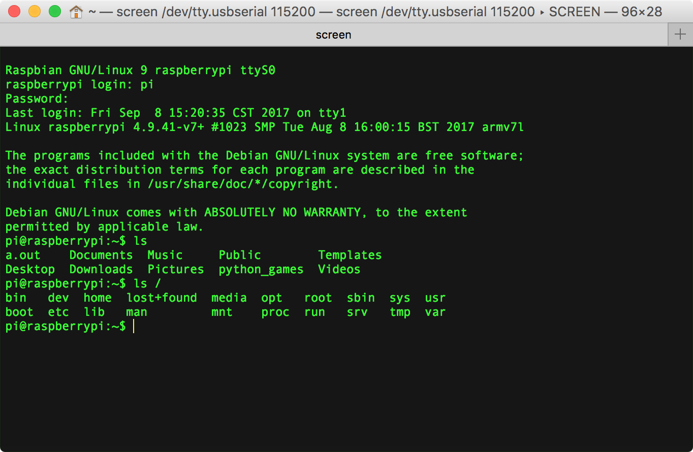
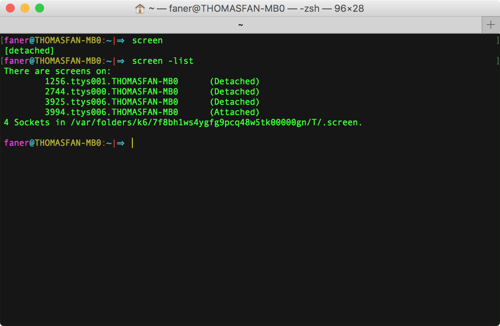

# [GNU Screen](https://www.gnu.org/software/screen/)
[**Screen**](https://en.wikipedia.org/wiki/GNU_Screen)  is  a text version of full-screen graphical <u>window manager</u> that ***multiplexes*** a physical terminal between several processes (typically interactive shells).

[screen](https://www.gnu.org/software/screen/manual/screen.html) 有点类似 [tmux](https://github.com/tmux/tmux/wiki)，可在一个终端窗口管理多个会话（[multiplex several virtual consoles](https://en.wikipedia.org/wiki/Tmux)）。  
在 macOS 终端输入 `screen -v` 可查看 macOS 默认安装的是比较旧的 [screen](https://ss64.com/osx/screen.html) 4.00.03（GNU Screen 官方目前最新版本为 [v.4.3.0](https://savannah.gnu.org/forum/forum.php?forum_id=8293)）：


在终端输入 `screen`，即可打开 screen 会话窗口。



> [GNU Screen](http://lugatgt.org/content/gnu_screen/downloads/presentation.pdf)  
> [GNU Screen](https://wiki.archlinux.org/index.php/GNU_Screen#Use_256_colors) @archlinux  
> [Using Screen on Mac OS X ](http://www.kinnetica.com/2011/05/29/using-screen-on-mac-os-x/)  
> [Taking Command of the Terminal with GNU Screen](https://www.linux.com/learn/taking-command-terminal-gnu-screen)  
> [Use 'screen' as a serial terminal emulator](http://hints.macworld.com/article.php?story=20061109133825654)  

## .screenrc
启动 screen 时，默认加载配置文件 `~/.screenrc`（如果存在的话），`~/.screenrc` 是当前用户目录下的一个隐藏文件，类似 vim 的配置文件 `~/.vimrc`。

启动 screen 时，可携带 `-c` 参数加载指定的配置文件（Read configuration file instead of '.screenrc'.）。

如果不存在 `~/.screenrc`，可以手动创建一个。例如我们创建名为 `rpi_uart.screenrc` 的配置文件，用于连接 Raspberry Pi 串口。  
在配置文件中增加一行 `startup_message off`，则下次执行 `screen -c rpi_uart.screenrc` 启动 screen，将不再出现欢迎介绍页面。  

```Shell
faner@THOMASFAN-MB0:~|⇒  cat rpi_uart.screenrc 
startup_message off
#starting screen for Raspberry Pi's UART
screen -fn -t "rpi_uart" /dev/cu.usbserial 115200 8N1

faner@THOMASFAN-MB0:~|⇒  screen -c rpi_uart.screenrc
```

> [screenrc简单设置](http://blog.csdn.net/asx20042005/article/details/7035115)  
> [tnarihi/.screenrc](https://gist.github.com/tnarihi/3c459b4df0ff7a64695c)  
> [What are useful .screenrc settings?](https://serverfault.com/questions/3740/what-are-useful-screenrc-settings)  
> [Understanding GNU Screen’s hardstatus strings](http://www.kilobitspersecond.com/2014/02/10/understanding-gnu-screens-hardstatus-strings/)  
> [GNU screen status bar - how to make it display shell session names?](https://unix.stackexchange.com/questions/114505/gnu-screen-status-bar-how-to-make-it-display-shell-session-names)  

> [screen command to persistently enable menu at bottom](https://stackoverflow.com/questions/19705378/screen-command-to-persistently-enable-menu-at-bottom)  
> [How do I supress date/time display in GNU Screen vertical splits?](https://superuser.com/questions/600851/how-do-i-supress-date-time-display-in-gnu-screen-vertical-splits)  

## Screen key bingdings
先按下 <kbd>ctrl</kbd>+<kbd>a</kbd>，再按下 <kbd>?</kbd> 可调出 Screen key bingdings 帮助页面。


Command key:  <kbd>^</kbd><kbd>a</kbd>，前置引导键，意义同 minicom 的 Meta Key。  

按下 space 键翻页：


### prompt
- **version**: 先按下 <kbd>ctrl</kbd>+<kbd>a</kbd>，再按下 <kbd>v</kbd> 在 bottom prompt 显示版本。  
	> 注意：如果按下 <kbd>ctrl</kbd>+<kbd>V</kbd> 键，则成了 digraph 命令！  
- **time**: 先按下 <kbd>ctrl</kbd>+<kbd>a</kbd>，再按下 <kbd>ctrl</kbd>+<kbd>T</kbd>（此处可省略 <kbd>ctrl</kbd>，直接 literal <kbd>t</kbd>）在 bottom prompt 显示时间。  
- **title**: 先按下 <kbd>ctrl</kbd>+<kbd>a</kbd>，再按下 <kbd>shift</kbd>+<kbd>a</kbd>（也即<kbd>A</kbd>）在 bottom prompt 显示 `Set window’s title to: ~`，可修改会话标题（默认为 ~）。  
	> 注意：如果不按下 <kbd>shift</kbd> 键，则成了 meta 命令！  
- **clear**: 先按下 <kbd>ctrl</kbd>+<kbd>a</kbd>，再按下 <kbd>shift</kbd>+<kbd>c</kbd>（也即大写<kbd>C</kbd>） 执行清屏。  

### sessions
- **screen**: 先按下 <kbd>ctrl</kbd>+<kbd>a</kbd>，再按下 <kbd>ctrl</kbd>+<kbd>C</kbd>（此处可省略 <kbd>ctrl</kbd>，直接 literal <kbd>c</kbd>）新建 screen 会话窗口。  
	- 查看所有已打开的 screen session(window) 编号：<kbd>ctrl</kbd>+<kbd>a</kbd>，<kbd>ctrl</kbd>+<kbd>W</kbd>（或直接 literal <kbd>w</kbd>），带*号标识当前会话窗口编号；  
	-  切换到上一 screen session(window)：<kbd>ctrl</kbd>+<kbd>a</kbd>，<kbd>ctrl</kbd>+<kbd>P</kbd>（或直接 literal <kbd>p</kbd>）；  
	-  切换到下一 screen session(window)：<kbd>ctrl</kbd>+<kbd>a</kbd>，<kbd>space</kbd>（或  <kbd>ctrl</kbd>+<kbd>N</kbd>，或直接 literal <kbd>n</kbd>）；  
	-  切换到指定编号 screen session(window)：<kbd>ctrl</kbd>+<kbd>a</kbd>，<kbd>number</kbd>（number 可为 [0,..,9]）；  
	-  切换到指定编号 screen session(window)：<kbd>ctrl</kbd>+<kbd>a</kbd>，<kbd>’</kbd>。在 bottom prompt 出现 `Switch to window: ` ，输入想要跳转的窗口编号再按 <kbd>enter</kbd> 键确认切换。   
	-  切换到指定编号 screen session(window)：<kbd>ctrl</kbd>+<kbd>a</kbd>，<kbd>”</kbd>（<kbd>shift</kbd>+<kbd>’</kbd>）。出现 Num Name 窗格列表提示，按<kbd>↑</kbd><kbd>↓</kbd>选择或输入想要跳转的窗口编号再按 <kbd>enter</kbd> 键确认切换。   
	-  切换到其他 screen session(window)：<kbd>ctrl</kbd>+<kbd>a</kbd>，<kbd>ctrl</kbd>+<kbd>a</kbd>。  

例如，我们可以在同一个 screen 终端窗口中与 Raspberry Pi 3 同时建立串口连接和 SSH 连接：


### kill & quit
- **reset**: 先按下 <kbd>ctrl</kbd>+<kbd>a</kbd>，再按下 <kbd>Z</kbd>（<kbd>shift</kbd>+<kbd>z</kbd>） 执行重置，退回到标准终端提示 `[1]  + 5265 suspended  screen`。  
- **detach**: 先按下 <kbd>ctrl</kbd>+<kbd>a</kbd>，再按下 <kbd>ctrl</kbd>+<kbd>D</kbd>（或直接 literal <kbd>d</kbd>） 执行detach（所有会话），退回到标准终端提示 `[detached]`。  
- **kill**: 先按下 <kbd>ctrl</kbd>+<kbd>a</kbd>，再按下 <kbd>ctrl</kbd>+<kbd>K</kbd>（或直接 literal <kbd>k</kbd>）杀死当前会话（正常情况不会再出现在 `screen -list` 中）。  
- **quit**: 先按下 <kbd>ctrl</kbd>+<kbd>a</kbd>，再按下 <kbd>ctrl</kbd>+<kbd>\\</kbd> 杀死所有会话并退出 screen，回到标准终端提示 `[screen is terminating]`。  

按下 <kbd>enter</kbd> 键退出帮助页面。

在运行 screen 期间，为区分编辑模式，可通过 <kbd>ctrl</kbd>+<kbd>a</kbd>,<kbd>:</kbd> 快捷键明确进入命令行操作模式。

> [GNU Screen简单操作](http://blog.csdn.net/asx20042005/article/details/7035093)  
> [SCREEN Quick Reference](http://aperiodic.net/screen/quick_reference)  
> [GNU Screen cheat-sheet](http://arundelo.livejournal.com/390.html)  
> [How to scroll in GNU Screen](https://www.saltycrane.com/blog/2008/01/how-to-scroll-in-gnu-screen/)  

## mac(screen) 通过 PL2303 连接 RPi
执行 `screen /dev/tty.usbserial 115200` 命令（可选 8N1）可以连接到串口板：

```Shell
screen /dev/tty.usbserial 115200
```

如果找不到设备（连接失败），则进入 screen 串口控制台窗口，底栏提示 `Cannot exec ‘/dev/tty.usbserial’:  No such file or directory`，过一会自动退出，mac 终端出现以下信息：

```Shell
faner@THOMASFAN-MB0:~|⇒  screen /dev/tty.usbserial 115200
[screen is terminating]
```

若连接串口成功，默认的窗口标题（window's title）是 `tty.usbserial`，启动时可指定 `-t` 参数；启动后可通过 <kbd>ctrl</kbd>+<kbd>a</kbd>,<kbd>shift</kbd>+<kbd>a</kbd>（也即<kbd>A</kbd>）修改。  
在 `screen -list` 中显示的是 `<pid>.<tty>.<host>`，启动时可指定 `-S` 参数设置 sockname，会话标题将定制为 `<pid>.sockname`，方便辨识。  

进入 screen 控制台终端窗口，将出现以下信息：

```Shell
Raspberry GNU/Linux 9 raspberrypi ttyS0
raspberrypi login:
```

输入默认账户 `pi`，再输入默认密码 `raspberry`，即可登录进入系统终端控制台。



## copy & log
### hardcopy to note session
先按下 <kbd>ctrl</kbd>+<kbd>a</kbd>，再按下 <kbd>h</kbd>，可将当前 screen 会话内容复制保存到当前工作目录下。

> 弹出 bottom prompt 提示 `Screen image written to "hardcopy.n".`。

保存的文本文件命名格式为 `hardcopy.n`（n为会话编号，=[0,...,9]）。  

### scrollback softcopy
screen 中滚动鼠标默认响应并非滚屏，而是显示过往敲击过的历史命令。

**Ctrl-a h** 执行 hardcopy 只能拷贝当前屏幕的内容，如果运行内容较长（如执行 `sudo apt-get dist-upgrade` 更新软件），之前滚屏的部分无法读取（拷贝）。  

启动 screen 时可携带 `-h lines` 参数，指定可翻滚历史缓存大小（Set the size of the scrollback history buffer）。  

若要拷贝之前执行过的内容，则需要进入选择拷贝模式：

1. <kbd>ctrl</kbd>+<kbd>a</kbd>,<kbd>[</kbd>：进入 copy/scrollback 模式，类似 vi text editor，可进行滚屏选择。  
2. 通过上下左右方向键或 vi 方向键（hjkl）移动光标到选择起点。  
3. 按下空格键开始选择。  
4. 通过上下左右方向键或 vi 方向键（hjkl）移动光标到选择终点。  
5. 再次按下空格键确认拷贝所选。  
6. <kbd>ctrl</kbd>+<kbd>a</kbd>,<kbd>]</kbd>：将拷贝的 buffer 粘贴到当前光标处。  
	> <kbd>ctrl</kbd>+<kbd>a</kbd>,<kbd>></kbd>：writebuf，将拷贝的 buffer 重定向输出到 `/tmp/screen-exchange` 文件，以便阅读分析之用。  
7. 按下 <kbd>esc</kbd> 退出选择拷贝模式。  


### screenlog  to log session
先按下 <kbd>ctrl</kbd>+<kbd>a</kbd>，再按下 <kbd>shift</kbd>+<kbd>h</kbd>（<kbd>H</kbd>），可将当前 screen 会话的实时流水日志保存到输入启动 screen 时终端所在的工作目录下。

> 弹出 bottom prompt 提示 `Appending to logfile "screenlog.n".`。

保存的日志文件命名格式为`screenlog.n`（n为会话编号，=[0,...,9]）。

再次按下 **Ctrl-a H** 则关闭日志输出。

> 弹出 bottom prompt 提示 `Logfile "screenlog.n" closed.`

macOS 自带系统终端一般受限于缓存buffer限制或内存大小限制，可回滚查看命令行数有限。  
因此 screen 的 log 功能非常适用于执行大型的命令流水需要记录的场景，如需记录编译内核的完整过程输出方便日后查阅。

## session management
detach screen 回到标准终端，可运行 `screen -list` 命令查看打开过和正在活跃（Attached）的 screen session。  
包括 detach、reset 和关闭（<kbd>ctrl</kbd>+<kbd>w</kbd>）的 Detached 会话；不包括 kill 和 quit 至 terminated 的会话。  

```Shell
⇒  screen -ls                 
There is a screen on:
	660.ttys000.THOMASFAN-MB0	(Attached)
1 Socket in /var/folders/k6/7f8bh1ws4ygfg9pcq48w5tk00000gn/T/.screen.
```



关于 screen session 的状态，可参考 [GNU Screen](http://lugatgt.org/content/gnu_screen/downloads/presentation.pdf) | Screen Modes。  
执行 `screen -r <PID>` 可恢复（reattach）已经 Detached 的会话；-R 为尝试恢复，否则新建会话。

> [screen-session](https://github.com/skoneka/screen-session) - a collection of tools for GNU Screen  
> [使用 GNU Screen 管理终端会话](https://meiriyitie.com/2015/07/15/using-gnu-screen-to-manage-persistent-terminal-sessions/)  
> [使用 Screen 创建并管理多个 shell](https://www.ibm.com/developerworks/cn/aix/library/au-gnu_screen/index.html)  
> [使用 Screen 指令操控 UNIX/Linux 終端機的教學與範例](https://blog.gtwang.org/linux/screen-command-examples-to-manage-linux-terminals/)  

## kill & quit
### kill screen session or quit
- **kill**: 先按下 <kbd>ctrl</kbd>+<kbd>a</kbd>，再按下 <kbd>ctrl</kbd>+<kbd>K</kbd>（或直接 literal <kbd>k</kbd>）杀死当前会话。  

> 状态栏将弹窗提示：`Really kill this window  [y/n]`，按下 <kbd>y</kbd> 键确定杀死当前会话。  
> 如果还有其他会话，screen窗口不会退出；如果当前为最后一个会话，则退回到标准终端提示 `[screen is terminating]`。  

- **quit**: 先按下 <kbd>ctrl</kbd>+<kbd>a</kbd>，再按下 <kbd>ctrl</kbd>+<kbd>\\</kbd> [退出 screen](https://www.packetgeek.net/2016/02/using-a-serial-console-on-mac-os-x/)。  

> 状态栏将弹窗提示：`Really quit and kill all your windows [y/n]`，按下 <kbd>y</kbd> 键确定杀死所有会话并退出，回到标准终端提示 `[screen is terminating]`。  

```Shell
faner@THOMASFAN-MB0:~|⇒  screen /dev/tty.usbserial 115200
[screen is terminating]
```

### kill screen process
有串口板连接会话时，通过终端命令 `ps | grep tty` 可查找到串口连接进程号。

```Shell
Last login: Sun Sep 17 16:28:45 on ttys001
faner@THOMASFAN-MB0:~|⇒  ps | grep tty
  998 ttys000    0:00.22 -zsh
 1438 ttys000    0:00.02 screen /dev/tty.usbserial 115200
 2739 ttys001    0:00.12 -zsh
 2836 ttys001    0:00.00 grep --color=auto --exclude-dir=.bzr --exclude-dir=CVS --exclude-dir=.git --exclude-dir=.hg --exclude-dir=.svn tty
 1439 tty.usbserial   0:04.54 SCREEN /dev/tty.usbserial 115200
```

断开串口会话的正确方式是  kill 或 quit，串口 `/dev/tty.usbserial` 相关的进程 1438（screen）和 1439（SCREEN） 都会退出。

仅仅通过 <kbd>ctrl</kbd>+<kbd>w</kbd> 关闭 screeen 窗口（1438（screen）会退出），并不会自动断开串口连接（1439（SCREEN）残存）。  
此时，如果直接拔掉 USB 串口板，可能会造成系统重启。  

1. 通过 `screen -r 1439` 恢复 1438 串口通信会话，然后再执行正常的 kill or quit 操作。  
2. 通过 `kill pid`（pid=1439）命令强杀残留的 screen 进程，则不会导致 macOS 重启。  

```Shell
faner@THOMASFAN-MB0:~|⇒  kill 1439
```

窗口 screen 终端窗口会输出 terminated 信息：

```Shell
[1]    1438 terminated  screen /dev/tty.usbserial 115200
```

### zombie kr
[Gnu screen: kill a frozen tab](https://superuser.com/questions/458122/gnu-screen-kill-a-frozen-tab)  
[Kill detached screen session](https://stackoverflow.com/questions/1509677/kill-detached-screen-session)  
[How to recover a 'lost' screen session?](https://unix.stackexchange.com/questions/28675/how-to-recover-a-lost-screen-session)  
[How do I kill a screen if I know the name of it?](https://superuser.com/questions/112117/how-do-i-kill-a-screen-if-i-know-the-name-of-it)  
[The GNU screen is unresponsive, seems blocked](https://stackoverflow.com/questions/4367669/the-gnu-screen-is-unresponsive-seems-blocked)  
[Kill a GNU Screen Session from the Command Line](http://droptips.com/kill-a-gnu-screen-session-from-the-command-line)  
[How to prevent screen from terminating when command in window terminates](https://serverfault.com/questions/237778/how-to-prevent-screen-from-terminating-when-command-in-window-terminates)  

Anyway, add this to your ~/.screenrc:

```Shell
zombie kr
verbose on
```

try <kbd>ctrl</kbd>+<kbd>a</kbd>,<kbd>q</kbd> to send the `Xon` signal, which is the sequence to unblock scrolling.

try <kbd>ctrl</kbd>+<kbd>a</kbd>,<kbd>:</kbd> to open bottom command prompt, and type `zombie kr` to kill and restart after its command has finished.

执行 kill 或 quit 命令后，有些 screen 会话无法正常关闭，仍处于 Attached 或 Detached 僵尸状态。此时，可通过终端命令 `ps | grep screen` 或 `ps | grep tty` 找到串口连接进程，再执行 (p)kill 杀死进程。

有时甚至无法强杀 screen 僵尸会话进程，也无法重新创建新的 screen 连接串口会话。此时，如果直接拔掉 USB 串口板，会造成 macOS 重启或无法正常关机。

尽管 GNU screen 是非常优秀的终端会话管理器，但还是建议使用 minicom 或 SecureCRT、PuTTY 作为串口连接控制终端。
