[Serial Terminal Basics](https://learn.sparkfun.com/tutorials/terminal-basics/tips-and-tricks)  
[Mac's and serial TTY's](https://pbxbook.com/other/mac-tty.html)  

[UART](https://en.wikipedia.org/wiki/Universal_asynchronous_receiver-transmitter) / [UART接口](http://blog.chinaunix.net/uid-24148050-id-170849.html) / [UART串行通信](http://www.51hei.com/bbs/dpj-22296-1.html) / [认识UART接口](http://blog.csdn.net/junyeer/article/details/46761853)  

[RPi Serial Connection](http://elinux.org/RPi_Serial_Connection)  
[THE RASPBERRY PI UARTS](https://www.raspberrypi.org/documentation/configuration/uart.md)  

# SoC & OS
- **Host**：MacBookPro11,3/macOS 10.12.6 (16G1023)/Darwin 16.7.0  

- **SoC**：`Raspberry Pi 3 Model B v1.2`(2015)  
- **OS**：`2017-09-07-raspbian-stretch.zip`  

```Shell
pi@raspberrypi:~ $ cat /proc/version
Linux version 4.9.41-v7+ (dc4@dc4-XPS13-9333) (gcc version 4.9.3 (crosstool-NG crosstool-ng-1.22.0-88-g8460611) ) #1023 SMP Tue Aug 8 16:00:15 BST 2017

pi@raspberrypi:~ $ lsb_release -a
No LSB modules are available.
Distributor ID:	Raspbian
Description:	Raspbian GNU/Linux 9.1 (stretch)
Release:	9.1
Codename:	stretch
```

# mac 安装 PL2303 USB2TTL 驱动
下载安装 [PL2303 Mac OS X Driver](http://www.prolific.com.tw/US/ShowProduct.aspx?p_id=229&pcid=41)，安装完成要求重启。  
macOS 安装好 PL2303 USB2TTL 驱动后，网络偏好设置中将会多出一项名为 `USB-Serial Controller` 的服务配置项。  


# PL2303 接 RPi 串口通信 GPIO 引脚
PL2303 USB2TTL 转换串口板的四根线如下图：


右边的模块即对应树莓派的 GPIO 串口引脚。


面对 RASPBERRY PI 3 MODEL B 的 USB 和网口的 GPIO 引脚顺序：

- 第6根为 GND，接 PL2303 黑线（GND）；  
- 第8根 GPIO14（3B下为GPIO15） 为 TXD0，接 PL2303 白线（RXD）；  
- 第10根 GPIO15（3B下为GPIO16）为 RXD0，接 PL2303 绿线（TXD）；  


如果接上风扇，红线接第4根 DC Power 5V，黑线接第6根地脚(GND)，则可将 PL2303 的黑线（地线）调整到与绿线间隔一个引脚的第14号地脚(GND)。

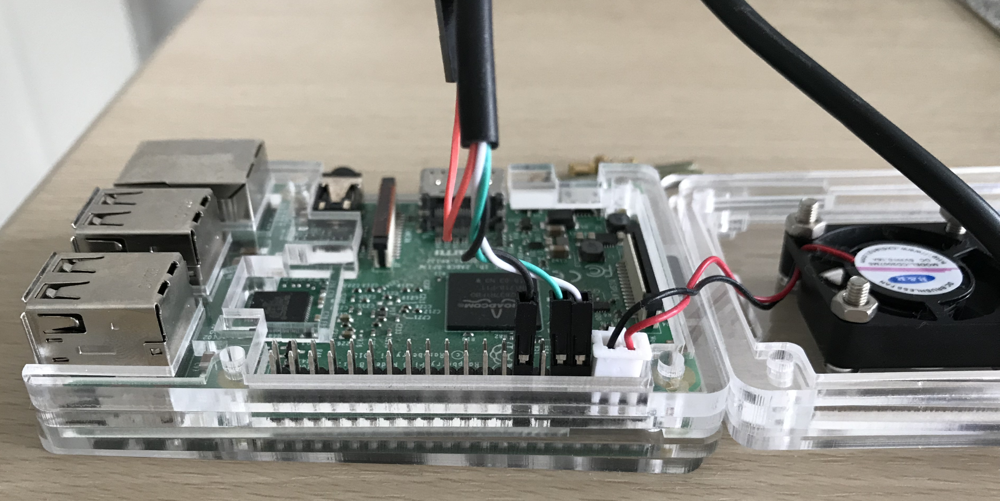

> [Raspberry Pi：透過序列埠登入系統](http://yehnan.blogspot.com/2013/09/raspberry-pi.html)  
> [Getting Started with PL2303 USB to UART Converter](https://electrosome.com/pl2303-usb-to-uart-converter/)  
> [Setup and PL2303 Serial Console on your Raspberry PI 3B](https://www.raspberrypi.org/forums/viewtopic.php?f=41&t=148208#p974975)  
> [Read and Write From Serial Port With Raspberry Pi](http://www.instructables.com/id/Read-and-write-from-serial-port-with-Raspberry-Pi/)  
> [How to Work With USB to TTL Converters Using Minicom on Mac](http://tinaunglinn.com/blog/2016/04/04/how-to-work-with-usb-to-ttl-converters-using-minicom-on-mac/)  

# RPi 3B 启用串口
根据 Raspberry Pi 文档 [The Raspberry Pi UARTs](https://www.raspberrypi.org/documentation/configuration/uart.md) 中的描述。

```Shell
pi@raspberrypi:~$ ls /dev/tty*

/dev/ttyAMA0
/dev/ttyprintk
/dev/ttyS0

```

```Shell
pi@raspberrypi:~$ ls /dev/serial*
/dev/serial0  /dev/serial1
```

```Shell
pi@raspberrypi:~$ ls -ls /dev

0 lrwxrwxrwx 1 root root           5 Sep 29 01:18 serial0 -> ttyS0
0 lrwxrwxrwx 1 root root           7 Sep 29 01:18 serial1 -> ttyAMA0

```

> [Pi3-Serial_notes](https://github.com/DexterInd/Raspbian_For_Robots/blob/291f949eb40d329f62ca23b5299a51d66c743abb/pi3/Pi3-Serial_notes.txt)  
> [Raspberry Pi 3 UART Boot Overlay Part Two](http://www.briandorey.com/post/Raspberry-Pi-3-UART-Boot-Overlay-Part-Two)  
> [UART for Serial Console or HAT on Raspberry Pi 3](https://www.hackster.io/fvdbosch/uart-for-serial-console-or-hat-on-raspberry-pi-3-5be0c2)  
> [树莓派3串口使用问题的解决](http://ukonline2000.com/?p=880)  
> [树莓派3硬件串口的使用及编程](http://etrd.org/2017/01/29/%E6%A0%91%E8%8E%93%E6%B4%BE3%E7%A1%AC%E4%BB%B6%E4%B8%B2%E5%8F%A3%E7%9A%84%E4%BD%BF%E7%94%A8%E5%8F%8A%E7%BC%96%E7%A8%8B/)  
> [树莓派3B设置通用串口的方法](http://blog.csdn.net/berryfish/article/details/60147631)  
> [树莓派3B中串口设置成外接控制器](http://www.geek-workshop.com/archiver/tid-27060.html)  

## enable_uart
旧版的 RPi 需要一系列的配置命令才能启用串口，最新版的 RPi 3B 在通过 USB 连接鼠标键盘、HDMI 连接显示屏后，进入系统界面即可设置使能串口。  
进入操作系统的图形界面后，左侧第一个系统菜单 `System Menu | Raspberry Pi Configuration | Interfaces`，默认 Camera、SSH、VNC、SPI、I2C、Serial、1-Write、Remote GPIO 等设备均为禁用（Disabled）状态，可在此启用串口（Serial）。同时建议开启 SSH 和 VNC 服务。  

> - **SSH**: Enable remote access to this Pi via SSH  
> - **VNC**: Enable remote access to thie Pi using RealVNC  
> - **Serial**: Enable shell and kernel messages on the serial connection  

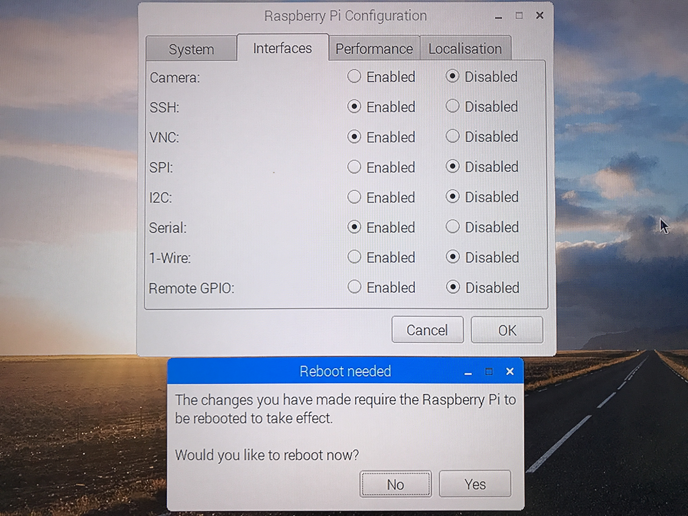

将 Serial 设置为 *Enabled* ，对应系统配置文件 `/boot/config.txt` 中将会增加一行 **`enable_uart=1`**。

> `enable_uart`: Enable the primary/console UART (ttyS0 on a Pi 3, ttyAMA0 otherwise)

重启 RPi 3B/raspbian，若 macOS 通过 PL2303 USB2TTL 串口板连接上 RPi 3B 之后，设备树下（`/dev/`）多出节点 `tty.usbserial` 和 `cu.usbserial`，则表明串口连接成功。  

```Shell
⇒  ls /dev/*.usbserial
/dev/cu.usbserial  /dev/tty.usbserial
```

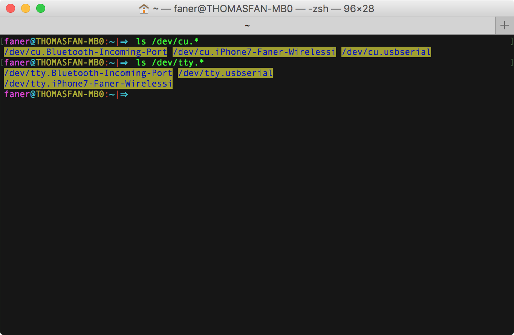

关于 TTY 和 Terminal 的相关概念可参考 [Console-TTY-Terminal.md](./Console-TTY-Terminal.md)。

> 如果没有现成的键鼠屏，我们可以将安装 raspbian 系统的 microSD 卡从 RPi 取出，重新放入读卡器插入 mac USB 口。
> 此时，macOS 会自动加载 SD 卡，在 finder 中可进入 MS-DOS FAT32 格式的 boot 文件夹，为配置文件 config.txt 添加一行 `enable_uart=1`，重新将 SD 卡插入 Raspberry Pi 3B 上电重启即可启用串口。

### tty vs cu
> The difference between the two is that a **TTY** device is used to call into a device/system, and the **CU** device (call-up) is used to call out of a device/system. Thus, this allows for two-way communication at the same time (full-duplex). 
> 
> You might notice that each serial device shows up twice in `/dev`, once as a `tty.*` and once as a `cu.*`. So, what's the difference? Well, **TTY** devices are for <u>calling into</u> UNIX systems, whereas CU (Call Up) devices are for <u>calling out</u> from them (eg, modems). We want to *call out* from our Mac, so `/dev/cu.*` is the correct device to use.  
> The technical difference is that `/dev/tty.*` devices will wait (or listen) for DCD (data carrier detect), eg, someone calling in, before responding. `/dev/cu.*` devices do not assert DCD, so they will always connect (respond or succeed) immediately.  

以下配置使用 screen 和 minicom 串口终端时，以 `/dev/tty.usbserial` 为主，相对 cu 而言，支持 [DCD](https://en.wikipedia.org/wiki/Data_Carrier_Detect)（Data Carrier Detect，数据载波检测）。  
启动配置的 Serial Device 建议使用 `/dev/cu.usbserial`。  

> [MacOS: what's the difference between /dev/tty.* and /dev/cu.*?](https://stackoverflow.com/questions/8632586/macos-whats-the-difference-between-dev-tty-and-dev-cu)  
> [choosing between /dev/tty.usbserial vs /dev/cu.usbserial](https://stackoverflow.com/questions/37688257/choosing-between-dev-tty-usbserial-vs-dev-cu-usbserial)  
> [Difference between cu.* and tty.*](https://pastebin.com/WCC5qqav)  

> [Linux 中 tty、pty、pts 的概念区别](http://7056824.blog.51cto.com/69854/276610)  
> [Terminal，Shell，tty 和 console 的区别](https://www.zhihu.com/question/21711307)  

## dtoverlay
很多资料中都会提到，要配置 dtoverlay(device tree overlay) 才能使用串口。  
实际我手头的 RPi 3B/raspbian 只需在 GUI/CUI 中配置使能 UART（enable_uart=1），串口即工作正常。  
可以阅读 `/boot/overlays/README` 帮助文档，或执行 `dtoverlay -h ` 命令查看相应 [dtoverlay](https://techfantastic.wordpress.com/2013/11/15/beaglebone-black-device-tree-overlay/) 的作用。  

在 RPi 3 之前，硬串口 PL011 默认分配给控制台输出( Linux console output)。到了 RPi 3 集成板载蓝牙，硬串口 PL011 默认分配给了板载蓝牙模块，采用迷你串口（mini UART）作为 Linux console output。  
硬串口 PL011 UART 带有时钟源，可独立调整串口的速率和模式；mini UART 依赖内核提供的时钟参考，而内核的时钟频率本身是不稳定的，例如可能进入休眠导致导致 mini UART 无法正常使用。  

在 `/boot/config.txt` 中设置 dtoverlay=pi3‐miniuart‐bt 或 pi3-disable-bt 都可恢复硬串口（UART0/ttyAMA0）用作控制台输出。

- ***`pi3-miniuart-bt`***: **switches** the Raspberry Pi 3 and Raspberry Pi Zero W Bluetooth function to use the mini UART (ttyS0), and <u>restores UART0/ttyAMA0 to GPIOs 14 and 15</u>.  
- ***`pi3-disable-bt`***: **disables** the Bluetooth device and <u>restores UART0/ttyAMA0 to GPIOs 14 and 15</u>.  

### pi3‐miniuart‐bt

```Shell
pi@raspberrypi:~$ dtoverlay -h pi3-miniuart-bt
Name:   pi3-miniuart-bt

Info:   Switch Pi3 Bluetooth function to use the mini-UART (ttyS0) and restore
        UART0/ttyAMA0 over GPIOs 14 & 15. Note that this may reduce the maximum
        usable baudrate.
        N.B. It is also necessary to edit /lib/systemd/system/hciuart.service
        and replace ttyAMA0 with ttyS0, unless you have a system with udev rules
        that create /dev/serial0 and /dev/serial1, in which case use
        /dev/serial1 instead because it will always be correct. Furthermore,
        you must also set core_freq=250 in config.txt or the miniuart will not
        work.

Usage:  dtoverlay=pi3-miniuart-bt

Params: <None>
```

拆文解字顾名思义，`pi3-miniuart-bt` 意即将 pi3 上的 mini UART 口用作 BT(BlueTooth) 模块。

根据说明信息，通过设置 `dtoverlay=pi3-miniuart-bt` 可将 RPi 3B/raspbian 的 Linux Console 从 miniUART(ttyS0) 切换为 PL011 UART(ttyAMA0)，恢复 PL011(UART0/ttyAMA0) 用作 Linux console output。  

### pi3-disable-bt

```Shell
pi@raspberrypi:~$ dtoverlay -h pi3-disable-bt
Name:   pi3-disable-bt

Info:   Disable Pi3 Bluetooth and restore UART0/ttyAMA0 over GPIOs 14 & 15
        N.B. To disable the systemd service that initialises the modem so it
        doesn't use the UART, use 'sudo systemctl disable hciuart'.

Usage:  dtoverlay=pi3-disable-bt

Params: <None>
```

拆文解字顾名思义，`pi3-disable-bt` 意即将 pi3 上的 BT(BlueTooth) 模块禁用。

根据说明信息，通过设置 `dtoverlay=pi3-disable-bt` 禁用蓝牙之后，将恢复 PL011(UART0/ttyAMA0) 用作 Linux console output。  
如果关闭 BT 模块，建议在 systemd 服务中执行 `sudo systemctl disable hciuart` 禁用板载蓝牙。  
```Shell
pi@raspberrypi:~$ sudo systemctl is-enabled hciuart
enabled
```


# serial terminal
## [GNU Screen](https://www.gnu.org/software/screen/)
[screen](https://www.gnu.org/software/screen/manual/screen.html) 有点类似 [tmux](https://github.com/tmux/tmux/wiki)，可在一个终端窗口管理多个会话（[multiplex several virtual consoles](https://en.wikipedia.org/wiki/Tmux)）。   
例如我们可以在同一个 screen 终端窗口中与 Raspberry Pi 3 同时建立串口连接和 SSH 连接：

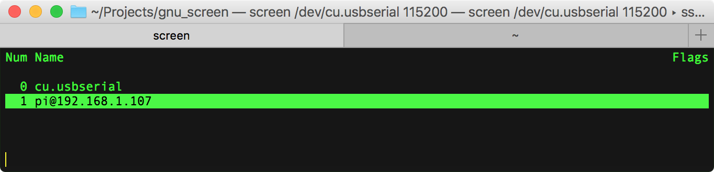

在 macOS 终端输入 `screen -v` 可查看 macOS 默认安装的 GNU [screen](https://ss64.com/osx/screen.html) 版本信息：

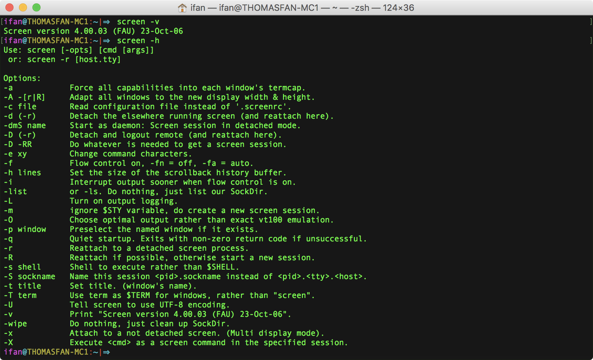

在终端输入 `screen`，即可打开 screen 会话窗口。

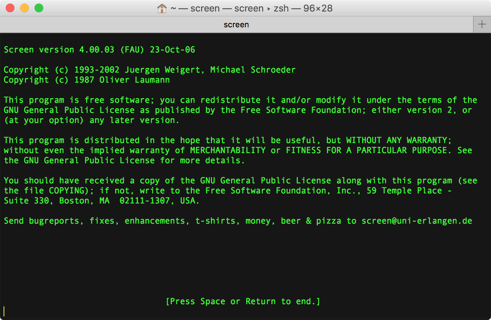

> [GNU Screen](http://lugatgt.org/content/gnu_screen/downloads/presentation.pdf)  
> [GNU Screen](https://wiki.archlinux.org/index.php/GNU_Screen#Use_256_colors) @archlinux  
> [Using Screen on Mac OS X ](http://www.kinnetica.com/2011/05/29/using-screen-on-mac-os-x/)  
> [Taking Command of the Terminal with GNU Screen](https://www.linux.com/learn/taking-command-terminal-gnu-screen)  
> [Use 'screen' as a serial terminal emulator](http://hints.macworld.com/article.php?story=20061109133825654)  

### .screenrc
启动 screen 时，默认加载配置文件 `~/.screenrc`，我们可以按需[定制配置文件](http://blog.csdn.net/asx20042005/article/details/7035115)，然后在启动 screen 时携带 `-c` 参数加载指定的配置文件。

```Shell
faner@THOMASFAN-MB0:~|⇒  screen -c rpi_uart.screenrc
```

### key bingdings
先按下 <kbd>ctrl</kbd>+<kbd>a</kbd>，再按下 <kbd>?</kbd> 可调出 Screen key bingdings 帮助页面。

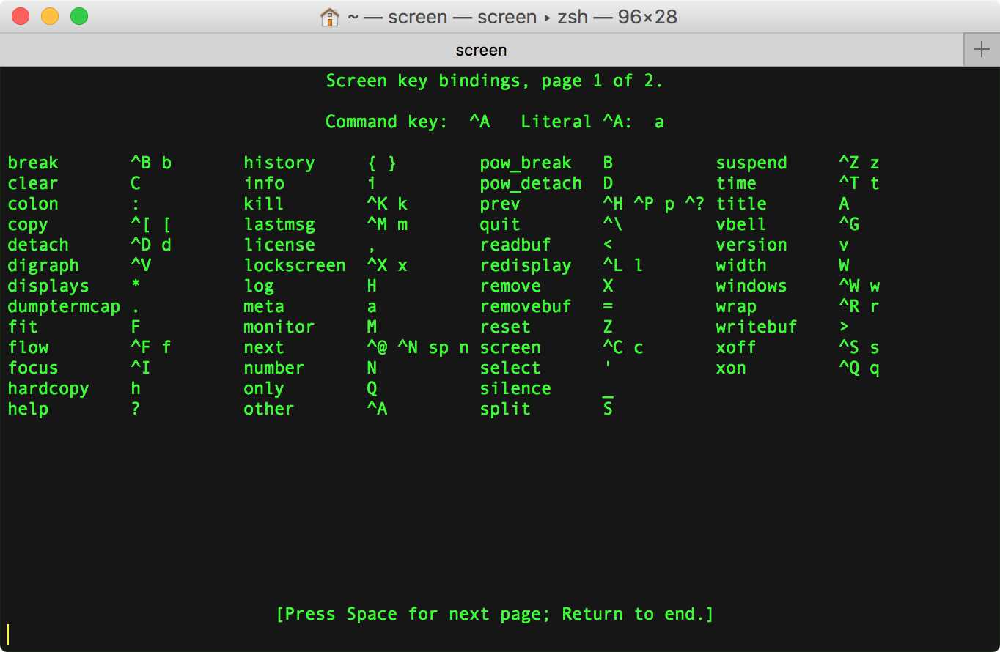

Command key:  <kbd>^</kbd><kbd>a</kbd>，前置引导键，意义同 minicom 的 Meta Key。  

在运行 screen 期间，为区分编辑模式，可通过 <kbd>ctrl</kbd>+<kbd>a</kbd>,<kbd>:</kbd> 快捷键明确进入命令行操作模式。

> [GNU Screen简单操作](http://blog.csdn.net/asx20042005/article/details/7035093)  
> [SCREEN Quick Reference](http://aperiodic.net/screen/quick_reference)  
> [GNU Screen cheat-sheet](http://arundelo.livejournal.com/390.html)  
> [How to scroll in GNU Screen](https://www.saltycrane.com/blog/2008/01/how-to-scroll-in-gnu-screen/)  

### screen 通过 PL2303 连接 RPi 3B
执行 `screen /dev/tty.usbserial 115200` 命令（可选 8N1）可以连接到串口板：

```Shell
screen /dev/tty.usbserial 115200
```

如果找不到设备（连接失败），则进入 screen 串口控制台窗口，底栏提示 `Cannot exec ‘/dev/tty.usbserial’:  No such file or directory`，过一会自动退出，mac 终端出现以下信息：

```Shell
faner@THOMASFAN-MB0:~|⇒  screen /dev/tty.usbserial 115200
[screen is terminating]
```

若连接串口成功，默认的窗口标题（window's title）是 `tty.usbserial`，启动时可指定 `-t` 参数；启动后可通过 <kbd>ctrl</kbd>+<kbd>a</kbd>,<kbd>shift</kbd>+<kbd>a</kbd>（也即<kbd>A</kbd>）修改。  

进入 screen 控制台终端窗口，将出现以下信息：

```Shell
Raspberry GNU/Linux 9 raspberrypi ttyS0
raspberrypi login:
```

输入默认账户 `pi`，再输入默认密码 `raspberry`，即可登录进入系统终端控制台。

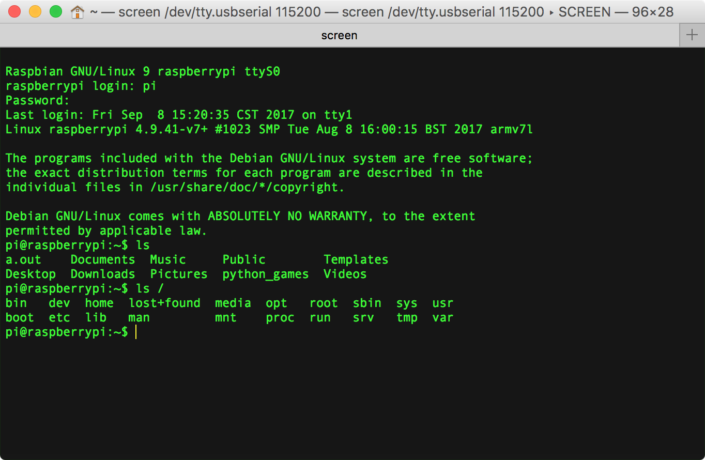

为了回滚查看历史输出 verbose，可在 screen 窗口中按 **Ctrl-a H** 启动日志输出，再按一次关闭日志输出。

### kill & quit
仅仅通过 <kbd>ctrl</kbd>+<kbd>w</kbd> 关闭 screeen 窗口，并不会真正退出 screen 会话（session is still attached）。正确的退出姿势是调用 kill 或 quit 命令。  

- **kill**: 先按下 <kbd>ctrl</kbd>+<kbd>a</kbd>，再按下 <kbd>ctrl</kbd>+<kbd>K</kbd>（或直接 literal <kbd>k</kbd>）杀死当前会话。  

> 状态栏将弹窗提示：`Really kill this window  [y/n]`，按下 <kbd>y</kbd> 键确定杀死当前会话。  
> 如果还有其他会话，screen窗口不会退出；如果当前为最后一个会话，则退回到标准终端提示 `[screen is terminating]`。  

- **quit**: 先按下 <kbd>ctrl</kbd>+<kbd>a</kbd>，再按下 <kbd>ctrl</kbd>+<kbd>\\</kbd> [退出 screen](https://www.packetgeek.net/2016/02/using-a-serial-console-on-mac-os-x/)。  

> 状态栏将弹窗提示：`Really quit and kill all your windows [y/n]`，按下 <kbd>y</kbd> 键确定杀死所有会话并退出，回到标准终端提示 `[screen is terminating]`。  

```Shell
faner@THOMASFAN-MB0:~|⇒  screen /dev/tty.usbserial 115200
[screen is terminating]
```

#### zobime session
执行 kill 或 quit 命令后，有些 screen 会话无法正常关闭，仍处于 Attached 或 Detached 僵尸状态。此时，可通过终端命令 `ps | grep screen` 或 `ps | grep tty` 找到串口连接进程，再执行 (p)kill 杀死进程。

有时甚至无法强杀 screen 僵尸会话进程，也无法重新创建新的 screen 连接串口会话。此时，如果直接拔掉 USB 串口板，会造成 macOS 重启或无法正常关机。

尽管 GNU screen 是非常优秀的终端会话管理器，但还是建议使用 minicom 或 SecureCRT、PuTTY 作为串口连接控制终端。

## [minicom](https://en.wikipedia.org/wiki/Minicom)
[Minicom Project for debian](https://alioth.debian.org/projects/minicom/)  
man pages：[Linux](https://linux.die.net/man/1/minicom) / [Debian](https://manpages.debian.org/unstable/manpages-zh/minicom.1.zh_CN.html) / [Ubuntu](http://manpages.ubuntu.com/manpages/trusty/man1/minicom.1.html)  

Minicom is a text-based modem control and terminal emulation program for Unix-like operating systems, modeled after the popular MS-DOS program Telix.  
Minicom is a *menu-driven* communications program. It also has an auto [ZMODEM](https://en.wikipedia.org/wiki/ZMODEM) download.  

### install
在 macOS 下，可通过 `brew install minicom` 命令安装 minicom。

```Shell
faner@THOMASFAN-MB0:~/Projects/git/FuturismSchedule|master⚡ 
⇒  brew install minicom
Updating Homebrew...
==> Downloading https://homebrew.bintray.com/bottles/minicom-2.7.1.sierra.bottle.tar.gz
######################################################################## 100.0%
==> Pouring minicom-2.7.1.sierra.bottle.tar.gz
==> Caveats
Terminal Compatibility
======================
If minicom doesn't see the LANG variable, it will try to fallback to
make the layout more compatible, but uglier. Certain unsupported
encodings will completely render the UI useless, so if the UI looks
strange, try setting the following environment variable:

  LANG="en_US.UTF-8"

Text Input Not Working
======================
Most development boards require Serial port setup -> Hardware Flow
Control to be set to "No" to input text.
==> Summary
🍺  /usr/local/Cellar/minicom/2.7.1: 17 files, 345.3KB
```

安装完成后，执行 `minicom -v` 命令可查看 minicom 版本；执行 `minicom -h`（或 `minicom --help`、`man minicom`） 命令查看 minicom Usage 帮助说明。

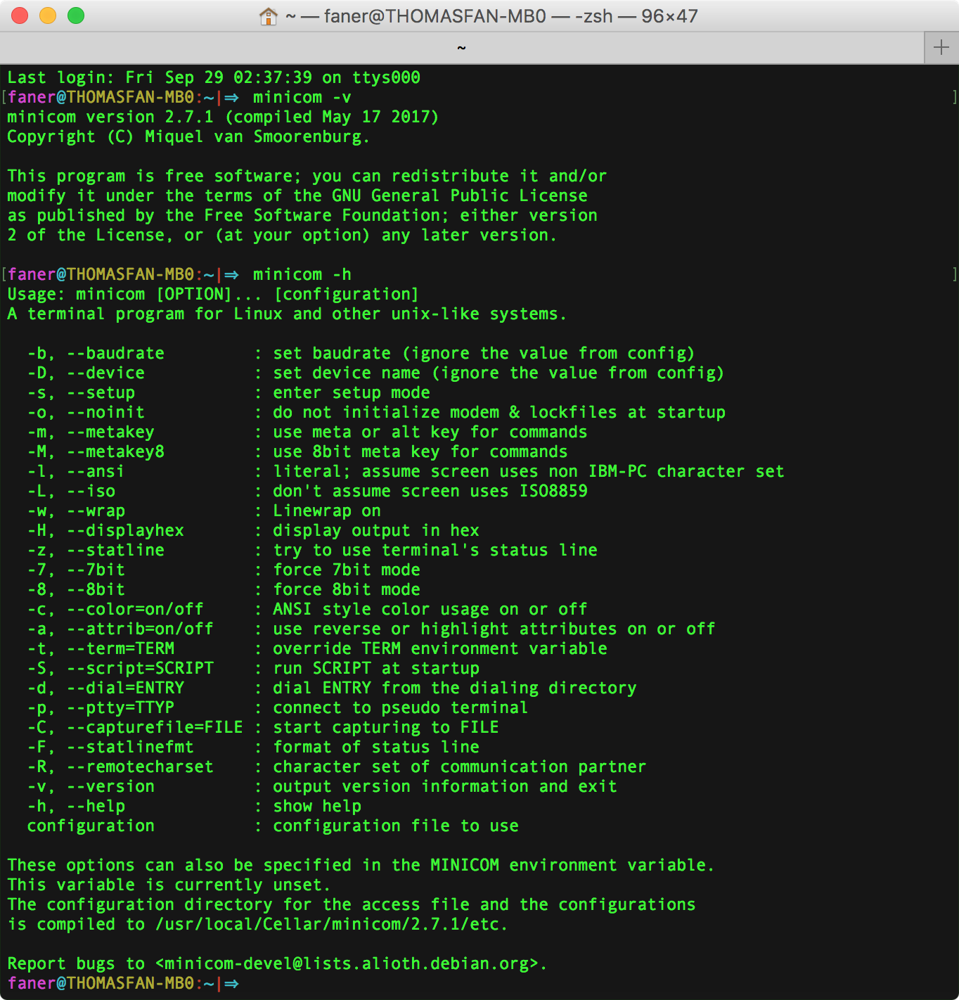

> [minicom实现串口通信](http://tianwaifeixian.leanote.com/post/f6e3e669d3a0)  
> [usb转串口minicom配置](http://blog.csdn.net/bxd1314/article/details/15839721)  
> minicom [安装](http://blog.csdn.net/zy799894671/article/details/16846817) 与 [配置](http://www.cnblogs.com/jingzhishen/p/4367733.html) 及 [使用笔记](http://note.yurenchen.com/archives/minicom_note.html)  
> [Linux / UNIX minicom Serial Communication Program](https://www.cyberciti.biz/tips/connect-soekris-single-board-computer-using-minicom.html)  
> [How to Work With USB to TTL Converters Using Minicom on Mac](http://tinaunglinn.com/blog/2016/04/04/how-to-work-with-usb-to-ttl-converters-using-minicom-on-mac/)  

### Setup
在 macOS 终端运行命令 `minicom -s`，将弹出 minicom 的配置菜单页。  
通过上下箭头定位到 Serial port setup 项：  

![1-[minicom_-s]-configuration-Serial_port_setup](./3-serial_connection/minicom/1-[minicom-s]-configuration-Serial_port_setup.png)

按下 <kbd>enter</kbd> 键，进入配置界面：

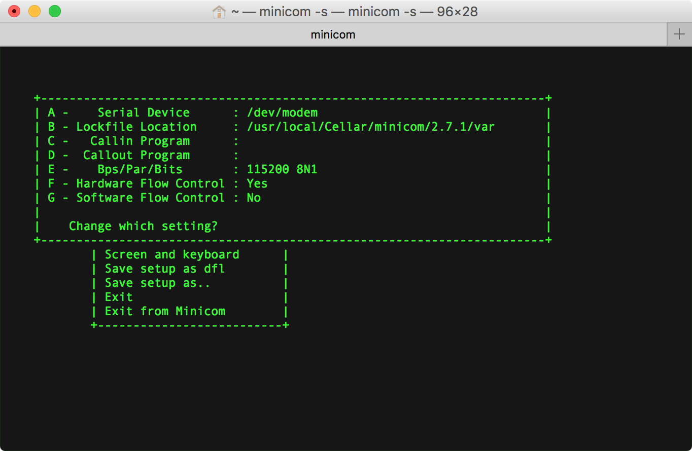

- 按下 <kbd>a</kbd>  - 聚焦 **Serial Device** 编辑模式，需改为 `/dev/tty.usbserial`。  
- 按下 <kbd>f</kbd> - 聚焦 **Hardware Flow Control**  编辑模式，修改为 `NO` 关闭流控。
	> 安装的第2条 Caveats：Text Input Not Working 的解决方案是关闭硬件流控，否则只有打印输出，无法按键输入。  

![3-minicom-Serial_port_setup-[A]-[F]-modified](./3-serial_connection/minicom/3-minicom-Serial_port_setup-[A]-[F]-modified.png)

按下 <kbd>enter</kbd> 键，返回选择 `Set save as dfl` 再按 <kbd>enter</kbd> 键，将提示保存成功（Configuration Saved）。

![4-minicom-Serial_port_setup-[A]-[F]-save](./3-serial_connection/minicom/4-minicom-Serial_port_setup-[A]-[F]-save.png)

回到 minicom 配置菜单，点选 Exit 将按按默认配置 dfl 启动运行 minicom；点选 Exit from Minicom 将退出 Minicom。

#### minirc
minicom 的默认配置dfl(default)存储为 `/usr/local/Cellar/minicom/2.7.1/etc` 下的 `minirc.dfl`。  
也可以选择 `Save setup as..`，例如 `RPi.usbserial`，将存储为 `/usr/local/Cellar/minicom/2.7.1/etc` 下的 `minirc.RPi.usbserial`。  
下次启动 minicom 可带上 configuration 参数（无需 `minirc.` 前缀）指定加载配置文件 `RPi.usbserial`：

```Shell
minicom configuration RPi.usbserial
```
  
### Meta-Z for help
底部状态栏显示 `Meta-Z for help`，那么到底啥是 Meta 键呢？

在 macOS 终端运行命令 `minicom -s`，将弹出 minicom 的配置菜单页。  
通过上下箭头定位到 Screen and keyboard 项：  

![7-[minicom-s]-configuration-Screen_and_keyboard](./3-serial_connection/minicom/7-[minicom-s]-configuration-Screen_and_keyboard.png)

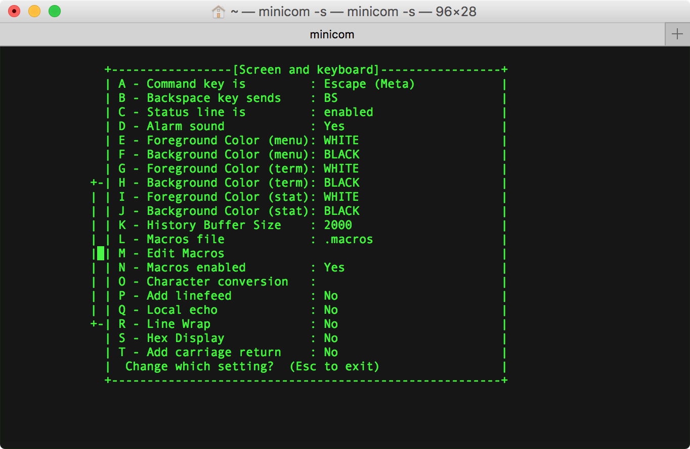

可以看到 Command key is: Escape(Meta)，所谓 Meta 键即指 Escape（<kbd>esc</kbd>），此处可配置修改。  
非 mac 普通键盘下的 Meta Key 一般默认为 <kbd>ctrl</kbd>+<kbd>a</kbd>，同 screen 的 Command key。  

在 minicom 窗口，按下 <kbd>esc</kbd>+<kbd>Z</kbd> 组合键可调出 Minicom Command Summary 帮助页面一览功能热键：

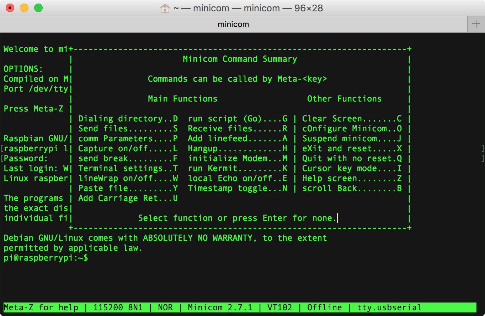

<kbd>esc</kbd>+<kbd>O</kbd> 可重新打开 Configuration 页面。

### minicom 通过 PL2303 连接 RPi 3B
上面执行 `minicom -s` 配置好 Configuration | Serial port setup 之后，在 macOS 终端运行 `minicom` 命令将加载默认配置文件 dfl（`minirc.dfl`），按照 dfl 配置的参数启动 minicom 串口连接。

如果找不到设备（连接失败），则不会进入 minicom 串口控制台窗口，mac 终端出现以下信息：

```Shell
faner@THOMASFAN-MB0:~|⇒  minicom configuration RPi.usbserial
minicom: cannot open /dev/tty.usbserial: No such file or directory
```

若连接串口成功，则进入 minicom 串口控制台窗口会出现以下信息：

```Shell
Welcome to minicom 2.7.1

OPTIONS:
compiled on May 17 2017, 15:29:14.
Port /dev/tty.usbserial, 21:12:29

Press Meta-Z for help on special keys
```

![5-minicom-[minicom]-connect-welcome](./3-serial_connection/minicom/5-minicom-[minicom]-connect-welcome.png)

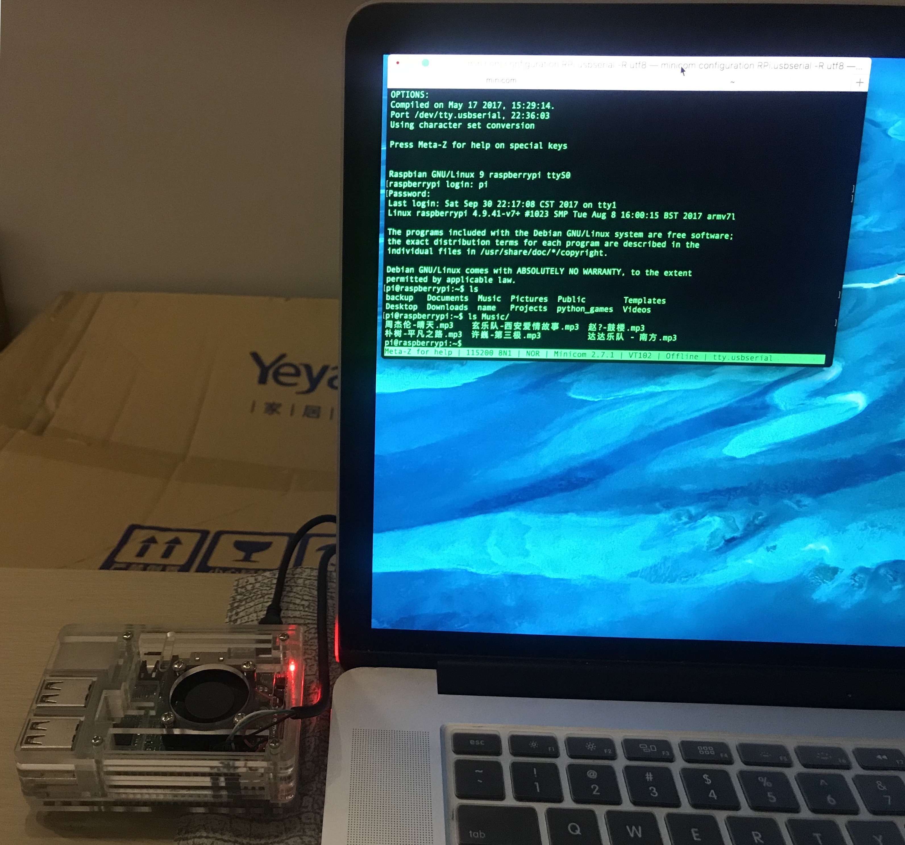

按下 <kbd>enter</kbd> 键，将会出现引导登录信息：

```Shell
Raspberry GNU/Linux 9 raspberrypi ttyS0
raspberrypi login:
```

输入默认账户 `pi`，再输入默认密码 `raspberry`，即可登录进入系统终端控制台。


### [LANG & charset](http://www.unixresources.net/linux/clf/embedded/archive/00/00/52/46/524666.html)
minicom 连接上 RPi 3B 之后，ls 列举中文目录或文件名显示乱码（screen 没有问题）。  

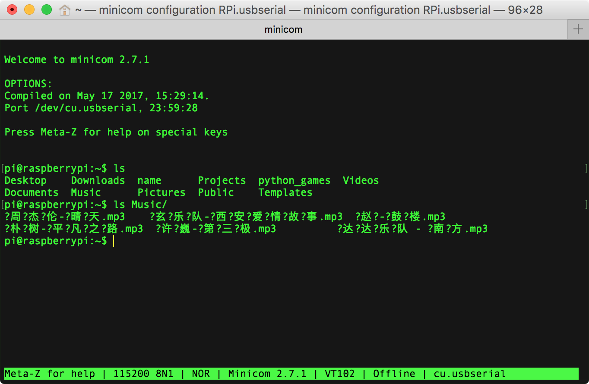

#### charset
退出 minicom，重新启动可带 -R utf8 参数指定采用  UTF8 编码通信：  

`-R`, --remotecharset: character set of communication partner

```Shell
minicom configuration RPi.usbserial -R utf8
```

未完全解决，偶尔还是出现乱码。

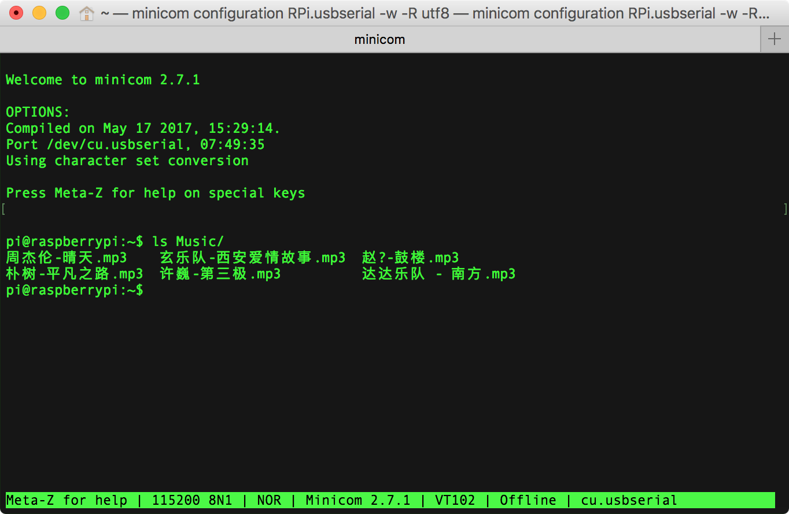

#### LANG
安装的第1条 Caveats：Terminal Compatibility 提到终端的显示兼容问题可通过设置 LANG 环境变量来解决。  

用 echo 打印 raspbian 的系统环境变量 LANG：

```Shell
pi@raspberrypi:~$ echo $LANG
en_US.UTF-8
```

用 echo 打印 macOS 的系统环境变量 LANG：

```Shell
faner@THOMASFAN-MB0:~|⇒  echo $LANG          
zh_CN.UTF-8
```

尝试以下两种解决方案。

- 在执行 minicom 连接之前，设置 LANG 为空：

```Shell
export LANG=''
minicom
```

> 或更简洁一行：`LANG='' minicom`，但是回显并没有自行 fallback compatible。  

- 在执行 minicom 连接之前，设置 LANG="en_US.UTF-8"：

```Shell
env LANG=en_US.UTF-8 minicom
```

> 无显著效果，基本同 `-R utf8`，仍存在部分中文乱码。  

> [minicom-lang](https://pkgs.alpinelinux.org/package/edge/main/x86/minicom-lang)  
> [minicom does not live well with multicol characters](https://bugs.debian.org/cgi-bin/bugreport.cgi?bug=821936;msg=7)  

### Capture Log
minicom 默认的 History Buffer Size 为 2000，如果想记录回看所有的运行命令，则需要 screen log 那样的日志功能。

在 macOS 终端输入 `minicom -h` 可查看帮助，其中 `-C` 选项可指定日志文件的名称（--capturefile=FILE）。

```Shell
-C, --capturefile=FILE : start capturing to FILE
```

例如，以下 minicom 启动通过 PL2303 USB2TTL 串口板连接 Raspberry Pi 串口，捕获日志增加了[日期时间后缀](http://blog.csdn.net/vichie2008/article/details/48440535)，保存到类似名为 `minicom_rpi_log-2017-09-23_11/50/27.log` 。

```Shell
minicom configuration RPi.usbserial -w -R utf8 -C minicom_rpi_log-$(date +%Y-%m-%d_%H:%M:%S).log
```

其他启动可选项：

- **-c**, --color=on/off     : ANSI style color usage on or off  
- **-w**, --wrap             : Linewrap on ;建议开启自动换行  
- **-z**, --statline         : try to use terminal's status line ;默认已开启  
- **-F**, --statlinefmt      : format of status line ;定制底栏状态显示格式  

---

如果启动 minicom 时没有指定 `-C` 选项参数，那么默认不保存运行日志。  
在 minicom 启动之后，在 `Meta-Z for help` - Minicom Command Summary 帮助页中，有一项 [`Capture on/off.....L`](http://blog.csdn.net/mcgrady_tracy/article/details/46350121) 即是 minicom 与 screenlog 对应的日志功能启动开关。

按下 <kbd>esc</kbd>+<kbd>L</kbd>，可将当前 minicom 会话的实时流水日志保存到当前工作目录下。
弹出如下确认 prompt ：

```Shell
+-----------------------------------------+
|Capture to which file?                   |
|> minicom.cap                            |
+-----------------------------------------+
```

默认日志名为 minicom.cap，保存到当前用户目录下（~/）。可编辑重命名，按 <enter> 键确认开启。  

再次按下 <kbd>esc</kbd>+<kbd>L</kbd>，可关闭或暂停日志。
弹出如下确认 prompt ：

```Shell
+--------------------------------+
|          Capture file          |
|    Close    Pause      Exit    |
+--------------------------------+
```

- Close：关闭；  
- Pause：暂停；  
- Exit：放弃，退出。  

### exit minicom
[minicom disconnect](https://www.linuxquestions.org/questions/linux-newbie-8/minicom-disconnect-209775/) / [How to exit minicom?](https://www.raspberrypi.org/forums/viewtopic.php?f=91&t=75493)  

在 Minicom Command Summary 帮助页面可以看到 `eXit and reset.....X`。  
通过 <kbd>esc</kbd>+<kbd>X</kbd> 组合键调出 Leave Minicom 对话框：

```Shell
+----------------------+
|    Leave Minicom?    |
|     Yes       No     |
+----------------------+
```

点选 Yes 确认断开 minicom 串口连接；或通过 tab 键控点选 No 放弃退出。  
