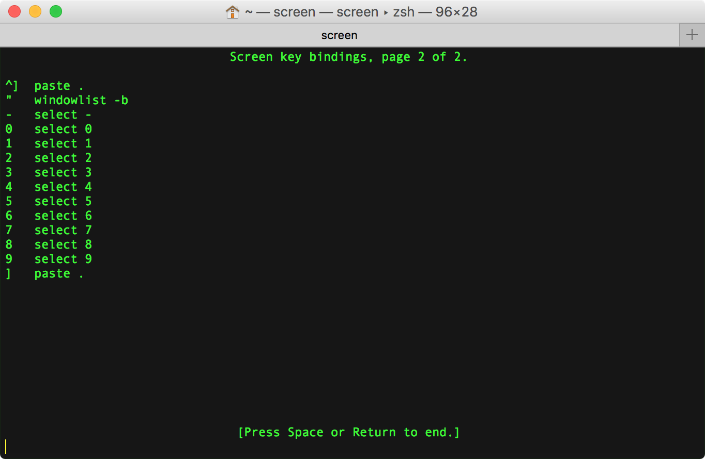
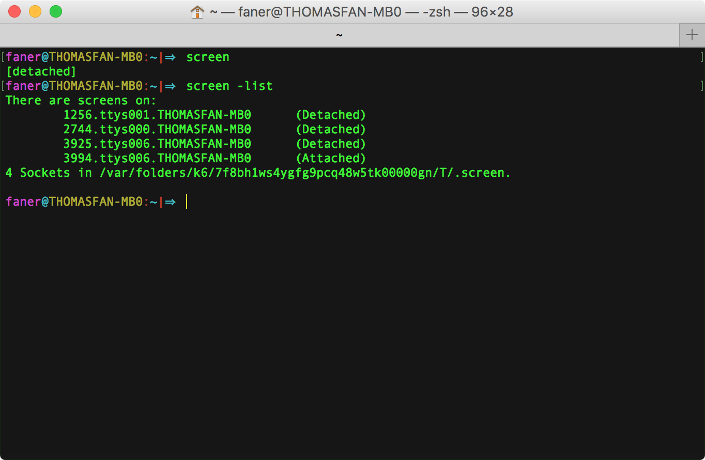

[Serial Terminal Basics](https://learn.sparkfun.com/tutorials/terminal-basics/tips-and-tricks)  
[Mac's and serial TTY's](https://pbxbook.com/other/mac-tty.html)  

[UART](https://en.wikipedia.org/wiki/Universal_asynchronous_receiver-transmitter) / [UART接口](http://blog.chinaunix.net/uid-24148050-id-170849.html) / [UART串行通信](http://www.51hei.com/bbs/dpj-22296-1.html) / [认识UART接口](http://blog.csdn.net/junyeer/article/details/46761853)  

[RPi Serial Connection](http://elinux.org/RPi_Serial_Connection)  
[THE RASPBERRY PI UARTS](https://www.raspberrypi.org/documentation/configuration/uart.md)  

# mac 安装 PL2303 USB2TTL 驱动
下载安装 [PL2303 Mac OS X Driver](http://www.prolific.com.tw/US/ShowProduct.aspx?p_id=229&pcid=41)，安装完成要求重启。  
macOS 安装好 PL2303 USB2TTL 驱动后，网络偏好设置中将会多出一项名为 `USB-Serial Controller` 的服务配置项。  


# PL2303 接 RPi 串口通信 GPIO 引脚
PL2303 USB2TTL 转换串口板的四根线如下图：


右边的模块即对应树莓派的 GPIO 串口引脚。


面对 RASPBERRY PI 3 MODEL B 的 USB 和网口的 GPIO 引脚顺序：

- 第3根为 GND，接 PL2303 黑线（GND）；  
- 第4根 GPIO14 为 TXD0，接 PL2303 白线（RXD）；  
- 第5根 GPIO15 为 RXD0，接 PL2303 绿线（TXD）；  


> [Raspberry Pi：透過序列埠登入系統](http://yehnan.blogspot.com/2013/09/raspberry-pi.html)  
> [Getting Started with PL2303 USB to UART Converter](https://electrosome.com/pl2303-usb-to-uart-converter/)  
> [Setup and PL2303 Serial Console on your Raspberry PI 3B](https://www.raspberrypi.org/forums/viewtopic.php?f=41&t=148208#p974975)  
> [Read and Write From Serial Port With Raspberry Pi](http://www.instructables.com/id/Read-and-write-from-serial-port-with-Raspberry-Pi/)  
> [How to Work With USB to TTL Converters Using Minicom on Mac](http://tinaunglinn.com/blog/2016/04/04/how-to-work-with-usb-to-ttl-converters-using-minicom-on-mac/)  

# RPi 3B 启用串口
根据 Raspberry Pi 文档 [The Raspberry Pi UARTs](https://www.raspberrypi.org/documentation/configuration/uart.md) 中的描述。

```Shell
pi@raspberrypi:~$ ls /dev/serial*
/dev/serial0  /dev/serial1
```

```Shell
pi@raspberrypi:~$ ls /dev/tty*
/dev/tty    /dev/tty19  /dev/tty3   /dev/tty40  /dev/tty51  /dev/tty62
/dev/tty0   /dev/tty2   /dev/tty30  /dev/tty41  /dev/tty52  /dev/tty63
/dev/tty1   /dev/tty20  /dev/tty31  /dev/tty42  /dev/tty53  /dev/tty7
/dev/tty10  /dev/tty21  /dev/tty32  /dev/tty43  /dev/tty54  /dev/tty8
/dev/tty11  /dev/tty22  /dev/tty33  /dev/tty44  /dev/tty55  /dev/tty9
/dev/tty12  /dev/tty23  /dev/tty34  /dev/tty45  /dev/tty56  /dev/ttyAMA0
/dev/tty13  /dev/tty24  /dev/tty35  /dev/tty46  /dev/tty57  /dev/ttyprintk
/dev/tty14  /dev/tty25  /dev/tty36  /dev/tty47  /dev/tty58  /dev/ttyS0
/dev/tty15  /dev/tty26  /dev/tty37  /dev/tty48  /dev/tty59
/dev/tty16  /dev/tty27  /dev/tty38  /dev/tty49  /dev/tty6
/dev/tty17  /dev/tty28  /dev/tty39  /dev/tty5   /dev/tty60
/dev/tty18  /dev/tty29  /dev/tty4   /dev/tty50  /dev/tty61
```

> [Raspberry Pi 3 UART Boot Overlay Part Two](http://www.briandorey.com/post/Raspberry-Pi-3-UART-Boot-Overlay-Part-Two)  
> [树莓派3串口使用问题的解决](http://ukonline2000.com/?p=880)  
> [树莓派3硬件串口的使用及编程](http://etrd.org/2017/01/29/%E6%A0%91%E8%8E%93%E6%B4%BE3%E7%A1%AC%E4%BB%B6%E4%B8%B2%E5%8F%A3%E7%9A%84%E4%BD%BF%E7%94%A8%E5%8F%8A%E7%BC%96%E7%A8%8B/)  
> [树莓派3B设置通用串口的方法](http://blog.csdn.net/berryfish/article/details/60147631)  
> [树莓派3B中串口设置成外接控制器](http://www.geek-workshop.com/archiver/tid-27060.html)  

## 方式1：修改配置文件
此时，我们还没有进入 raspbian 系统，没法直接配置。  
实际上，我们可以将安装 raspbian 系统的 microSD 卡从 RPi 再次取出，放入读卡器插入 mac USB 口。此时，macOS 会自动加载 SD 卡，在 finder 中可进入 MS-DOS FAT32 格式的 boot 文件夹，修改对应的引导配置文件。

根据 [How do I make serial work on the Raspberry Pi3](https://raspberrypi.stackexchange.com/questions/45570/how-do-i-make-serial-work-on-the-raspberry-pi3) 中 naseer mohamad 的回答：

Add device tree to `/boot/config.txt` to disable the Raspberry Pi 3 bluetooth.

```Shell
sudo vi /boot/config.txt
```

Add at the end of the file 

- if you want to change the blutooth to miniuart port(bad)

```Shell
dtoverlay=pi3‐miniuart‐bt
```

- if you want to disable the blutooth(good)

```Shell
dtoverlay=pi3‐disable‐bt
```

根据 Arnout 的回答，只需要在 `/boot/config.txt` 末尾增加一行禁用蓝牙：

```Shell
dtoverlay=pi3‐disable‐bt
```

## 方式2：进入GUI修改系统设置
旧版的 RPi 需要一系列的配置命令才能启用串口，最新版在通过 USB 连接键盘鼠标、HDMI 接上显示屏后，进入系统界面即可设置。  
进入操作系统的图形界面后，左侧第一个系统菜单 `System Menu | Raspberry Pi Configuration | Interfaces`，默认 Camera、SSH、VNC、SPI、I2C、Serial、1-Write、Remote GPIO 等设备均为禁用（Disabled）状态，可在此启用串口（Serial）。同时建议开启 SSH 和 VNC 服务。  

> - **SSH**: Enable remote access to this Pi via SSH  
> - **VNC**: Enable remote access to thie Pi using RealVNC  
> - **Serial**: Enable shell and kernel messages on the serial connection  


将 Serial 设置为 **Enabled** 状态后，重启进入系统，`/boot/config.txt` 中会多出 `enable_uart=1` 项。  
同时设备树下（`/dev/`）将会多出节点 `tty.usbserial` 和 `cu.usbserial`，此即表明  PL2303 串口板连接成功。  


关于 TTY 和 Terminal 的相关概念可参考 [Console-TTY-Terminal.md](./Console-TTY-Terminal.md)。

## tty vs cu
> The difference between the two is that a **TTY** device is used to call into a device/system, and the **CU** device (call-up) is used to call out of a device/system. Thus, this allows for two-way communication at the same time (full-duplex). 
> 
> You might notice that each serial device shows up twice in `/dev`, once as a `tty.*` and once as a `cu.*`. So, what's the difference? Well, **TTY** devices are for <u>calling into</u> UNIX systems, whereas CU (Call Up) devices are for <u>calling out</u> from them (eg, modems). We want to *call out* from our Mac, so `/dev/cu.*` is the correct device to use.  
> The technical difference is that `/dev/tty.*` devices will wait (or listen) for DCD (data carrier detect), eg, someone calling in, before responding. `/dev/cu.*` devices do not assert DCD, so they will always connect (respond or succeed) immediately.  

以下配置使用 screen 和 minicom 串口终端时，以 `/dev/tty.usbserial` 为主，相对 cu 而言，支持 [DCD](https://en.wikipedia.org/wiki/Data_Carrier_Detect)（Data Carrier Detect，数据载波检测）。  
启动配置的 Serial Device 建议使用 `/dev/cu.usbserial`。  

> [MacOS: what's the difference between /dev/tty.* and /dev/cu.*?](https://stackoverflow.com/questions/8632586/macos-whats-the-difference-between-dev-tty-and-dev-cu)  
> [choosing between /dev/tty.usbserial vs /dev/cu.usbserial](https://stackoverflow.com/questions/37688257/choosing-between-dev-tty-usbserial-vs-dev-cu-usbserial)  
> [Difference between cu.* and tty.*](https://pastebin.com/WCC5qqav)  

> [Linux 中 tty、pty、pts 的概念区别](http://7056824.blog.51cto.com/69854/276610)  
> [Terminal，Shell，tty 和 console 的区别](https://www.zhihu.com/question/21711307)  

# serial terminal
## [GNU Screen](https://www.gnu.org/software/screen/)
[**Screen**](https://en.wikipedia.org/wiki/GNU_Screen)  is  a text version of full-screen graphical <u>window manager</u> that ***multiplexes*** a physical terminal between several processes (typically interactive shells).

[screen](https://www.gnu.org/software/screen/manual/screen.html) 有点类似 [tmux](https://github.com/tmux/tmux/wiki)，可在一个终端窗口管理多个会话（[multiplex several virtual consoles](https://en.wikipedia.org/wiki/Tmux)）。 
例如我们可以在同一个 screen 终端窗口中与 Raspberry Pi 3 同时建立串口连接和 SSH 连接：


  0 cu.usbserial
  1 pi@192.168.1.107   

GNU Screen 目前最新版本为 [v.4.3.0](https://savannah.gnu.org/forum/forum.php?forum_id=8293)；在 macOS 终端输入 `screen -v` 可查看 macOS 默认安装的是比较旧的 [screen](https://ss64.com/osx/screen.html) 4.00.03：


在终端输入 `screen`，即可打开 screen 会话窗口。


> [GNU Screen](http://lugatgt.org/content/gnu_screen/downloads/presentation.pdf)  
> [Using Screen on Mac OS X ](http://www.kinnetica.com/2011/05/29/using-screen-on-mac-os-x/)  
> [Taking Command of the Terminal with GNU Screen](https://www.linux.com/learn/taking-command-terminal-gnu-screen)  
> [Use 'screen' as a serial terminal emulator](http://hints.macworld.com/article.php?story=20061109133825654)  
> [使用 GNU Screen 管理终端会话](https://meiriyitie.com/2015/07/15/using-gnu-screen-to-manage-persistent-terminal-sessions/)  
> [使用 Screen 创建并管理多个 shell](https://www.ibm.com/developerworks/cn/aix/library/au-gnu_screen/index.html)  
> [使用 Screen 指令操控 UNIX/Linux 終端機的教學與範例](https://blog.gtwang.org/linux/screen-command-examples-to-manage-linux-terminals/)  

### .screenrc
启动 screen 时，默认加载配置文件 `~/.screenrc`（如果存在的话），`~/.screenrc` 是当前用户目录下的一个隐藏文件，类似 vim 的配置文件 `~/.vimrc`。

启动 screen 时，可携带 `-c` 参数加载指定的配置文件（Read configuration file instead of '.screenrc'.）。

如果不存在 `~/.screenrc`，可以手动创建一个。例如我们创建名为 `rpi_uart.screenrc` 的配置文件，用于连接 Raspberry Pi 串口。  
在配置文件中增加一行 `startup_message off`，则下次执行 `screen -c rpi_uart.screenrc` 启动 screen，将不再出现欢迎介绍页面。  

```Shell
faner@THOMASFAN-MB0:~|⇒  cat .screenrc 
startup_message off
#starting screen for Raspberry Pi's UART
screen -fn -t "rpi_uart" /dev/cu.usbserial 115200 8N1

faner@THOMASFAN-MB0:~|⇒  screen -c rpi_uart.screenrc
```

> [screenrc简单设置](http://blog.csdn.net/asx20042005/article/details/7035115)  

### Screen key bingdings
先按下 <kbd>ctrl</kbd>+<kbd>a</kbd>，再按下 <kbd>?</kbd> 可调出 Screen key bingdings 帮助页面。


Command key:  <kbd>^</kbd><kbd>a</kbd>，前置引导键，意义同 minicom 的 Meta Key。  

按下 space 键翻页：



- **version**: 先按下 <kbd>ctrl</kbd>+<kbd>a</kbd>，再按下 <kbd>v</kbd> 在 bottom prompt 显示版本。  
	> 注意：如果按下 <kbd>ctrl</kbd>+<kbd>V</kbd> 键，则成了 digraph 命令！  
- **time**: 先按下 <kbd>ctrl</kbd>+<kbd>a</kbd>，再按下 <kbd>ctrl</kbd>+<kbd>T</kbd>（此处可省略 <kbd>ctrl</kbd>，直接 literal <kbd>t</kbd>）在 bottom prompt 显示时间。  
- **title**: 先按下 <kbd>ctrl</kbd>+<kbd>a</kbd>，再按下 <kbd>shift</kbd>+<kbd>a</kbd>（也即<kbd>A</kbd>）在 bottom prompt 显示 `Set window’s title to: ~`，可修改会话标题（默认为 ~）。  
	> 注意：如果不按下 <kbd>shift</kbd> 键，则成了 meta 命令！  
- **clear**: 先按下 <kbd>ctrl</kbd>+<kbd>a</kbd>，再按下 <kbd>shift</kbd>+<kbd>c</kbd>（也即大写<kbd>C</kbd>） 执行清屏。  
- **screen**: 先按下 <kbd>ctrl</kbd>+<kbd>a</kbd>，再按下 <kbd>ctrl</kbd>+<kbd>C</kbd>（此处可省略 <kbd>ctrl</kbd>，直接 literal <kbd>c</kbd>）新建 screen 会话窗口。  
	- 查看所有已打开的 screen session(window) 编号：<kbd>ctrl</kbd>+<kbd>a</kbd>，<kbd>ctrl</kbd>+<kbd>W</kbd>（或直接 literal <kbd>w</kbd>），带*号标识当前会话窗口编号；  
	-  切换到上一 screen session(window)：<kbd>ctrl</kbd>+<kbd>a</kbd>，<kbd>ctrl</kbd>+<kbd>P</kbd>（或直接 literal <kbd>p</kbd>）；  
	-  切换到下一 screen session(window)：<kbd>ctrl</kbd>+<kbd>a</kbd>，<kbd>space</kbd>（或  <kbd>ctrl</kbd>+<kbd>N</kbd>，或直接 literal <kbd>n</kbd>）；  
	-  切换到指定编号 screen session(window)：<kbd>ctrl</kbd>+<kbd>a</kbd>，<kbd>number</kbd>（number 可为 [0,..,9]）；  
	-  切换到指定编号 screen session(window)：<kbd>ctrl</kbd>+<kbd>a</kbd>，<kbd>’</kbd>。在 bottom prompt 出现 `Switch to window: ` ，输入想要跳转的窗口编号再按 <kbd>enter</kbd> 键确认切换。   
	-  切换到指定编号 screen session(window)：<kbd>ctrl</kbd>+<kbd>a</kbd>，<kbd>”</kbd>（<kbd>shift</kbd>+<kbd>’</kbd>）。出现 Num Name 窗格列表提示，按<kbd>↑</kbd><kbd>↓</kbd>选择或输入想要跳转的窗口编号再按 <kbd>enter</kbd> 键确认切换。   
	-  切换到其他 screen session(window)：<kbd>ctrl</kbd>+<kbd>a</kbd>，<kbd>ctrl</kbd>+<kbd>a</kbd>。  
- **reset**: 先按下 <kbd>ctrl</kbd>+<kbd>a</kbd>，再按下 <kbd>Z</kbd>（<kbd>shift</kbd>+<kbd>z</kbd>） 执行重置，退回到标准终端提示 `[1]  + 5265 suspended  screen`。  
- **detach**: 先按下 <kbd>ctrl</kbd>+<kbd>a</kbd>，再按下 <kbd>ctrl</kbd>+<kbd>D</kbd>（或直接 literal <kbd>d</kbd>） 执行detach（所有会话），退回到标准终端提示 `[detached]`。  
- **kill**: 先按下 <kbd>ctrl</kbd>+<kbd>a</kbd>，再按下 <kbd>ctrl</kbd>+<kbd>K</kbd>（或直接 literal <kbd>k</kbd>）杀死当前会话。  
- **quit**: 先按下 <kbd>ctrl</kbd>+<kbd>a</kbd>，再按下 <kbd>ctrl</kbd>+<kbd>\\</kbd> 杀死所有会话并退出 screen，回到标准终端提示 `[screen is terminating]`。  

按下 <kbd>enter</kbd> 键退出帮助页面。

detach screen 回到标准终端，可运行 `screen -list` 命令查看打开过和正在活跃（Attached）的 screen session。  
包括 detach、reset 和关闭（<kbd>ctrl</kbd>+<kbd>w</kbd>）的 Detached 会话；不包括 kill 和 quit 至 terminated 的会话。  

```Shell
⇒  screen -ls                 
There is a screen on:
	660.ttys000.THOMASFAN-MB0	(Attached)
1 Socket in /var/folders/k6/7f8bh1ws4ygfg9pcq48w5tk00000gn/T/.screen.
```



关于 screen session 的状态，可参考 [GNU Screen](http://lugatgt.org/content/gnu_screen/downloads/presentation.pdf) | Screen Modes。  
执行 `screen -r <PID>` 可恢复（reattach）已经 Detached 的会话；-R 为尝试恢复，否则新建会话。

在运行 screen 期间，为区分编辑模式，可通过 <kbd>ctrl</kbd>+<kbd>a</kbd>,<kbd>:</kbd> 快捷键明确进入命令行操作模式。

> [GNU Screen简单操作](http://blog.csdn.net/asx20042005/article/details/7035093)  
> [SCREEN Quick Reference](http://aperiodic.net/screen/quick_reference)  
> [GNU Screen cheat-sheet](http://arundelo.livejournal.com/390.html)  
> [How to scroll in GNU Screen](https://www.saltycrane.com/blog/2008/01/how-to-scroll-in-gnu-screen/)  

### screen 通过 PL2303 连接 RPi
执行 `screen /dev/tty.usbserial 115200` 命令（可选 8N1）可以连接到串口板：

```Shell
screen /dev/tty.usbserial 115200
```

如果找不到设备（连接失败），则进入 screen 串口控制台窗口，底栏提示 `Cannot exec ‘/dev/tty.usbserial’:  No such file or directory`，过一会自动退出，mac 终端出现以下信息：

```Shell
faner@THOMASFAN-MB0:~|⇒  screen /dev/tty.usbserial 115200
[screen is terminating]
```

若连接串口成功，默认的窗口标题（window's title）是 `tty.usbserial`，启动时可指定 `-t` 参数；启动后可通过 <kbd>ctrl</kbd>+<kbd>a</kbd>,<kbd>shift</kbd>+<kbd>a</kbd>（也即<kbd>A</kbd>）修改。  
在 `screen -list` 中显示的是 `<pid>.<tty>.<host>`，启动时可指定 `-S` 参数设置 sockname，会话标题将定制为 `<pid>.sockname`，方便辨识。  

进入 screen 控制台终端窗口，将出现以下信息：

```Shell
Raspberry GNU/Linux 9 raspberrypi ttyS0
raspberrypi login:
```

输入默认账户 `pi`，再输入默认密码 `raspberry`，即可登录进入系统终端控制台。


### hardcopy & screenlog
#### hardcopy to note session
先按下 <kbd>ctrl</kbd>+<kbd>a</kbd>，再按下 <kbd>h</kbd>，可将当前 screen 会话内容复制保存到当前工作目录下。

> 弹出 bottom prompt 提示 `Screen image written to "hardcopy.n".`。

保存的文本文件命名格式为 `hardcopy.n`（n为会话编号，=[0,...,9]）。  

#### scrollback softcopy
screen 中滚动鼠标默认响应并非滚屏，而是显示过往敲击过的历史命令。

**Ctrl-a h** 执行 hardcopy 只能拷贝当前屏幕的内容，如果运行内容较长（如执行 `sudo apt-get dist-upgrade` 更新软件），之前滚屏的部分无法读取（拷贝）。  

启动 screen 时可携带 `-h lines` 参数，指定可翻滚历史缓存大小（Set the size of the scrollback history buffer）。  

若要拷贝之前执行过的内容，则需要进入选择拷贝模式：

1. <kbd>ctrl</kbd>+<kbd>a</kbd>,<kbd>[</kbd>：进入 copy/scrollback 模式，类似 vi text editor，可进行滚屏选择。  
2. 通过上下左右方向键或 vi 方向键（hjkl）移动光标到选择起点。  
3. 按下空格键开始选择。  
4. 通过上下左右方向键或 vi 方向键（hjkl）移动光标到选择终点。  
5. 再次按下空格键确认拷贝所选。  
6. <kbd>ctrl</kbd>+<kbd>a</kbd>,<kbd>]</kbd>：将拷贝的 buffer 粘贴到当前光标处。  
	> <kbd>ctrl</kbd>+<kbd>a</kbd>,<kbd>></kbd>：writebuf，将拷贝的 buffer 重定向输出到 `/tmp/screen-exchange` 文件，以便阅读分析之用。  
7. 按下 <kbd>esc</kbd> 退出选择拷贝模式。  


#### screenlog  to log session
先按下 <kbd>ctrl</kbd>+<kbd>a</kbd>，再按下 <kbd>shift</kbd>+<kbd>h</kbd>（<kbd>H</kbd>），可将当前 screen 会话的实时流水日志保存到输入启动 screen 时终端所在的工作目录下。

> 弹出 bottom prompt 提示 `Appending to logfile "screenlog.n".`。

保存的日志文件命名格式为`screenlog.n`（n为会话编号，=[0,...,9]）。

再次按下 **Ctrl-a H** 则关闭日志输出。

> 弹出 bottom prompt 提示 `Logfile "screenlog.n" closed.`

macOS 自带系统终端一般受限于缓存buffer限制或内存大小限制，可回滚查看命令行数有限。  
因此 screen 的 log 功能非常适用于执行大型的命令流水需要记录的场景，如需记录编译内核的完整过程输出方便日后查阅。

### kill screen session or quit
- **kill**: 先按下 <kbd>ctrl</kbd>+<kbd>a</kbd>，再按下 <kbd>ctrl</kbd>+<kbd>K</kbd>（或直接 literal <kbd>k</kbd>）杀死当前会话。  

> 状态栏将弹窗提示：`Really kill this window  [y/n]`，按下 <kbd>y</kbd> 键确定杀死当前会话。  
> 如果还有其他会话，screen窗口不会退出；如果当前为最后一个会话，则退回到标准终端提示 `[screen is terminating]`。  

- **quit**: 先按下 <kbd>ctrl</kbd>+<kbd>a</kbd>，再按下 <kbd>ctrl</kbd>+<kbd>\\</kbd> [退出 screen](https://www.packetgeek.net/2016/02/using-a-serial-console-on-mac-os-x/)。  

> 状态栏将弹窗提示：`Really quit and kill all your windows [y/n]`，按下 <kbd>y</kbd> 键确定杀死所有会话并退出，回到标准终端提示 `[screen is terminating]`。  

```Shell
faner@THOMASFAN-MB0:~|⇒  screen /dev/tty.usbserial 115200
[screen is terminating]
```

### kill screen process
有串口板连接会话时，通过终端命令 `ps | grep tty` 可查找到串口连接进程号。

```Shell
Last login: Sun Sep 17 16:28:45 on ttys001
faner@THOMASFAN-MB0:~|⇒  ps | grep tty
  998 ttys000    0:00.22 -zsh
 1438 ttys000    0:00.02 screen /dev/tty.usbserial 115200
 2739 ttys001    0:00.12 -zsh
 2836 ttys001    0:00.00 grep --color=auto --exclude-dir=.bzr --exclude-dir=CVS --exclude-dir=.git --exclude-dir=.hg --exclude-dir=.svn tty
 1439 tty.usbserial   0:04.54 SCREEN /dev/tty.usbserial 115200
```

断开串口会话的正确方式是  kill 或 quit，串口 `/dev/tty.usbserial` 相关的进程 1438（screen）和 1439（SCREEN） 都会退出。

仅仅通过 <kbd>ctrl</kbd>+<kbd>w</kbd> 关闭 screeen 窗口（1438（screen）会退出），并不会自动断开串口连接（1439（SCREEN）残存）。  
此时，如果直接拔掉 USB 串口板，可能会造成系统重启。  

1. 通过 `screen -r 1439` 恢复 1438 串口通信会话，然后再执行正常的 kill or quit 操作。  
2. 通过 `kill pid`（pid=1439）命令强杀残留的 screen 进程，则不会导致 macOS 重启。  

```Shell
faner@THOMASFAN-MB0:~|⇒  kill 1439
```

窗口 screen 终端窗口会输出 terminated 信息：

```Shell
[1]    1438 terminated  screen /dev/tty.usbserial 115200
```

## [minicom](https://en.wikipedia.org/wiki/Minicom)
[Minicom Project for debian](https://alioth.debian.org/projects/minicom/)  
[minicom](https://linux.die.net/man/1/minicom) - friendly serial communication program  

Minicom is a text-based modem control and terminal emulation program for Unix-like operating systems, modeled after the popular MS-DOS program Telix.  
Minicom is a *menu-driven* communications program. It also has an auto [ZMODEM](https://en.wikipedia.org/wiki/ZMODEM) download.  

在 macOS 下，可通过 `brew install minicom` 命令安装 minicom。

```Shell
faner@THOMASFAN-MB0:~/Projects/git/FuturismSchedule|master⚡ 
⇒  brew install minicom
Updating Homebrew...
==> Downloading https://homebrew.bintray.com/bottles/minicom-2.7.1.sierra.bottle.tar.gz
######################################################################## 100.0%
==> Pouring minicom-2.7.1.sierra.bottle.tar.gz
==> Caveats
Terminal Compatibility
======================
If minicom doesn't see the LANG variable, it will try to fallback to
make the layout more compatible, but uglier. Certain unsupported
encodings will completely render the UI useless, so if the UI looks
strange, try setting the following environment variable:

  LANG="en_US.UTF-8"

Text Input Not Working
======================
Most development boards require Serial port setup -> Hardware Flow
Control to be set to "No" to input text.
==> Summary
🍺  /usr/local/Cellar/minicom/2.7.1: 17 files, 345.3KB
```

安装完成后，通过 `minicom -v` 可查看 minicom 版本。

```Shell
⇒  minicom -v
minicom version 2.7.1 (compiled May 17 2017)
Copyright (C) Miquel van Smoorenburg.
```

> [usb转串口minicom配置](http://blog.csdn.net/bxd1314/article/details/15839721)  
> [Linux / UNIX minicom Serial Communication Program](https://www.cyberciti.biz/tips/connect-soekris-single-board-computer-using-minicom.html)  
> [How to Work With USB to TTL Converters Using Minicom on Mac](http://tinaunglinn.com/blog/2016/04/04/how-to-work-with-usb-to-ttl-converters-using-minicom-on-mac/)  

### Setup 配置串口连接信息
在 macOS 终端运行命令 `minicom -s`，弹出 minicom 的配置控制台。  
通过上下箭头定位到 Serial port setup：  

![1-[minicom_-s]-configuration-Serial_port_setup](./3-serial_connection/minicom/1-[minicom-s]-configuration-Serial_port_setup.png)

按下 <kbd>enter</kbd> 键，进入配置界面：


- 按下 <kbd>a</kbd> 进入 - **Serial Device** 编辑模式，需改为 `/dev/tty.usbserial`。  
- 按下 <kbd>f</kbd> 进入 - **Hardware Flow Control**  编辑模式，修改为 `NO` 关闭流控。

![3-minicom-Serial_port_setup-[A]-[F]-modified](./3-serial_connection/minicom/3-minicom-Serial_port_setup-[A]-[F]-modified.png)

按下 <kbd>enter</kbd> 键，返回选择 Set save as dfl 再按 <kbd>enter</kbd> 键，保存修改退出重启。

![4-minicom-Serial_port_setup-[A]-[F]-save](./3-serial_connection/minicom/4-minicom-Serial_port_setup-[A]-[F]-save.png)

作为默认配置(default)将存储为 `/usr/local/Cellar/minicom/2.7.1/etc` 下的 `minirc.dfl`。  
也可以选择 Save setup as..，例如 `RPi(cu.usbserial)`，将存储为 `/usr/local/Cellar/minicom/2.7.1/etc` 下的 `minirc.RPi.usbserial`。  
下次启动 minicom 可带上 configuration 参数指定 `RPi.usbserial` 即可：

```Shell
minicom configuration RPi.usbserial
```

### Meta-Z for help
底部状态栏显示 `Meta-Z for help`，那么到底啥是 Meta 键呢？

在 macOS 终端运行命令 `minicom -s`，弹出 minicom 的配置控制台。  
通过上下箭头定位到 Screen and keyboard：  

![7-[minicom-s]-configuration-Screen_and_keyboard](./3-serial_connection/minicom/7-[minicom-s]-configuration-Screen_and_keyboard.png)


可以看到 Command key is: Escape(Meta)，所谓 Meta 键即指 Escape（<kbd>esc</kbd>），此处可配置修改。  
非 mac 普通键盘下的 Meta Key 一般默认为 <kbd>ctrl</kbd>+<kbd>a</kbd>，同 screen 的 Command key。  

在 minicom 窗口，按下 <kbd>esc</kbd>+<kbd>Z</kbd> 组合键可调出 Minicom Command Summary 帮助页面查看功能热键：


<kbd>esc</kbd>+<kbd>O</kbd> 可重新打开 Configuration 页面。

### minicom 通过 PL2303 连接 RPi
上面执行 -s 执行 Configuration | Serial port setup 配置之后，在 macOS 终端运行命令 `minicom` 即可按照上一步预设的参数启动串口连接 RPi。

如果找不到设备（连接失败），则不会进入 minicom 串口控制台窗口，mac 终端出现以下信息：

```Shell
faner@THOMASFAN-MB0:~|⇒  minicom
minicom: cannot open /dev/tty.usbserial: No such file or directory
```

若连接串口成功，则进入 minicom 串口控制台窗口会出现以下信息：

```Shell
Welcome to minicom 2.7.1

OPTIONS:
compiled on May 17 2017, 15:29:14.
Port /dev/tty.usbserial, 21:12:29

Press Meta-Z for help on special keys
```

![5-minicom-[minicom]-connect-welcome](./3-serial_connection/minicom/5-minicom-[minicom]-connect-welcome.png)

按下 <kbd>enter</kbd> 键，将会出现引导登录信息：

```Shell
Raspberry GNU/Linux 9 raspberrypi ttyS0
raspberrypi login:
```

输入默认账户 `pi`，再输入默认密码 `raspberry`，即可登录进入系统终端控制台。


#### [中文乱码问题](http://www.unixresources.net/linux/clf/embedded/archive/00/00/52/46/524666.html)
minicom 连接上 RPi 之后，ls 列举中文目录或文件名显示乱码（screen 没有问题）。  
退出 minicom，重新启动可带 -R utf8 参数指定采用  UTF8 编码通信，但未完全解决。  

```Shell
minicom configuration RPi.usbserial -c on -R utf8
```

为简便起见，macOS 下建议还是使用自带的 GNU screen 作为串口连接控制终端。

### Capture Log
minicom 默认的 History Buffer Size 为 2000，如果想记录回看所有的运行命令，则需要 screen log 那样的日志功能。

在 macOS 终端输入 `minicom -h` 可查看帮助，其中 `-C` 选项可指定日志文件的名称（--capturefile=FILE）。

```Shell
-C, --capturefile=FILE : start capturing to FILE
```

例如，以下 minicom 启动通过 PL2303 USB2TTL 串口板连接 Raspberry Pi 串口，捕获日志增加了[日期时间后缀](http://blog.csdn.net/vichie2008/article/details/48440535)，保存到类似名为 `minicom_rpi_log-2017-09-23_11/50/27.log` 。

```Shell
minicom configuration RPi.usbserial -c on -R utf8 -C minicom_rpi_log-$(date +%Y-%m-%d_%H:%M:%S).log
```

---

如果启动 minicom 时没有指定 `-C` 选项参数，那么默认不保存运行日志。  
在 minicom 启动之后，在 `Meta-Z for help` - Minicom Command Summary 帮助页中，有一项 [`Capture on/off.....L`](http://blog.csdn.net/mcgrady_tracy/article/details/46350121) 即是 minicom 与 screenlog 对应的日志功能启动开关。

按下 <kbd>esc</kbd>+<kbd>L</kbd>，可将当前 minicom 会话的实时流水日志保存到当前工作目录下。
弹出如下确认 prompt ：

```Shell
+-----------------------------------------+
|Capture to which file?                   |
|> minicom.cap                            |
+-----------------------------------------+
```

默认日志名为 minicom.cap，保存到当前用户目录下（~/）。可编辑重命名，按 <enter> 键确认开启。  

再次按下 <kbd>esc</kbd>+<kbd>L</kbd>，可关闭或暂停日志。
弹出如下确认 prompt ：

```Shell
+--------------------------------+
|          Capture file          |
|    Close    Pause      Exit    |
+--------------------------------+
```

- Close：关闭；  
- Pause：暂停；  
- Exit：放弃，退出。  

### exit minicom
[minicom disconnect](https://www.linuxquestions.org/questions/linux-newbie-8/minicom-disconnect-209775/) / [How to exit minicom?](https://www.raspberrypi.org/forums/viewtopic.php?f=91&t=75493)  

在 Minicom Command Summary 帮助页面可以看到 `eXit and reset.....X`。  
通过 <kbd>esc</kbd>+<kbd>X</kbd> 组合键调出 Leave Minicom 对话框：

```Shell
+----------------------+
|    Leave Minicom?    |
|     Yes       No     |
+----------------------+
```

点选 Yes 确认断开 minicom 串口连接；或通过 tab 键控点选 No 放弃退出。  

## [SecureCRT®](https://www.vandyke.com/products/securecrt/)
SecureCRT client for Windows, Mac, and Linux provides rock-solid terminal emulation for computing professionals.

[SecureCRT 8.1.4 一款终端仿真程序](http://xclient.info/s/securecrt.html?_=baf317d2a9932afca9b32c327f8a34c9)  
[mac 安装 SecureCRT 连接串口调试](http://blog.csdn.net/XieYupeng520/article/details/47285371)  

## [PuTTY](https://www.chiark.greenend.org.uk/~sgtatham/putty/)
PuTTY is a free implementation of SSH and Telnet for Windows and Unix platforms, along with an `xterm` terminal emulator.

- [Download PuTTY](https://www.chiark.greenend.org.uk/~sgtatham/putty/latest.html): latest release (0.70)  

> [What are SSH, Telnet and Rlogin?](https://the.earth.li/~sgtatham/putty/0.70/htmldoc/Chapter1.html#intro)
