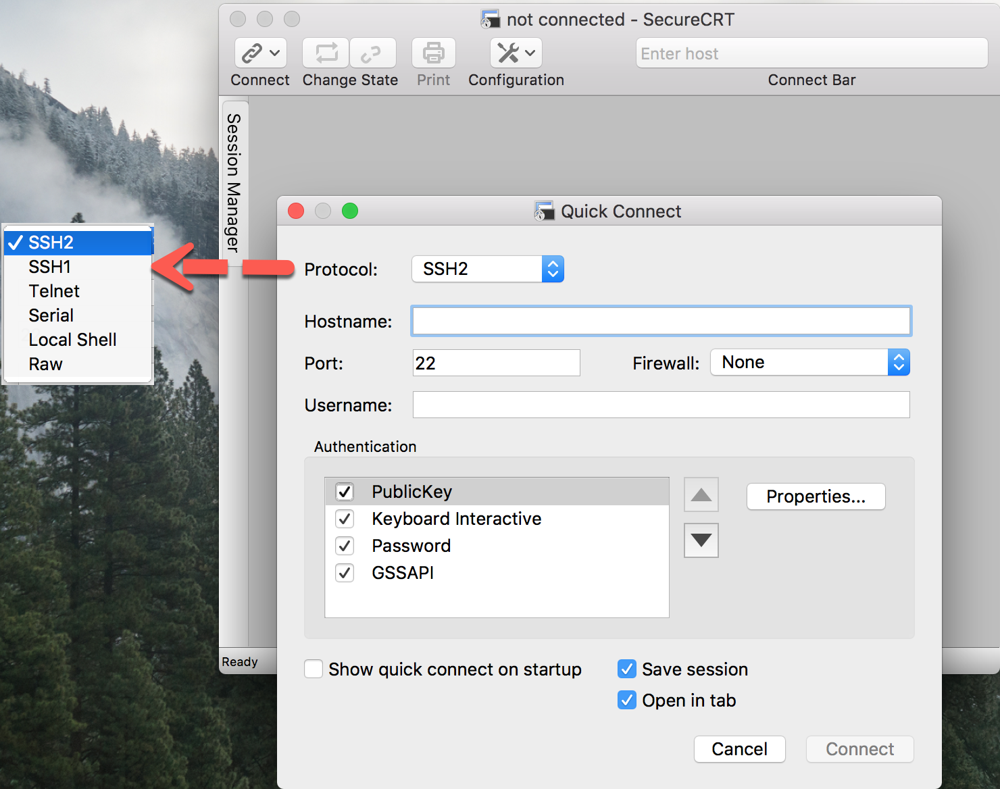
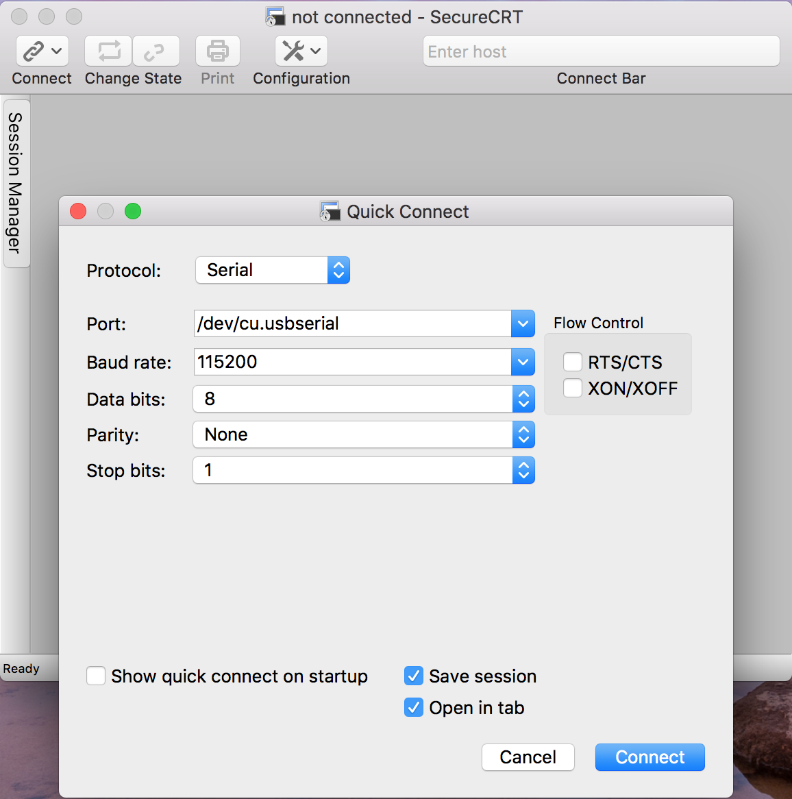
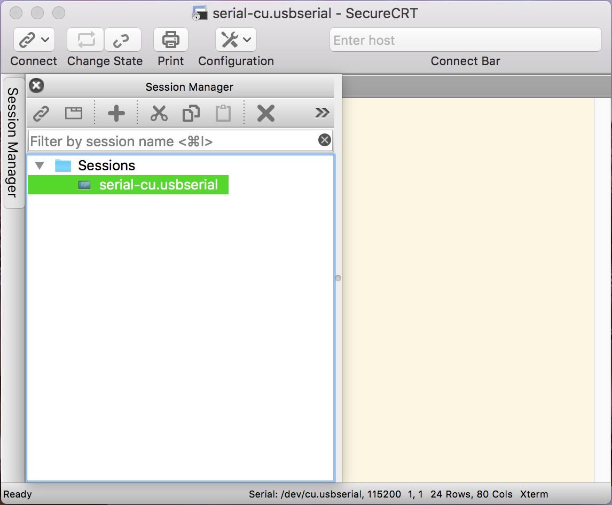
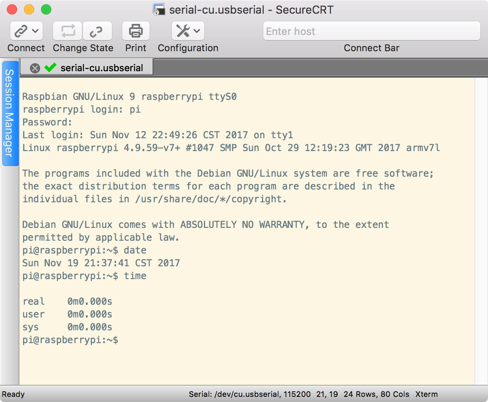

## 串口终端
[Putty、XShell、SecureCRT、SSH Secure Shell Slient哪个好用？](https://www.zhihu.com/question/25344597)  

### PuTTY
[PuTTY](https://www.chiark.greenend.org.uk/~sgtatham/putty/) is a free implementation of SSH and Telnet for Windows and Unix platforms, along with an `xterm` terminal emulator.

- [Download PuTTY](https://www.chiark.greenend.org.uk/~sgtatham/putty/latest.html): latest release (0.70)  

> [What are SSH, Telnet and Rlogin?](https://the.earth.li/~sgtatham/putty/0.70/htmldoc/Chapter1.html#intro)  
> [PUTTY FOR MAC OS X](https://www.ssh.com/ssh/putty/mac/)  
> [How to Install PuTTY on OS X](http://www.dotresults.com/2009/10/28/how-to-install-putty-on-os-x/)  

### Tera Term
http://ttssh2.osdn.jp/

[UTF-8 TeraTerm Pro with TTSSH2](http://ttssh2.sourceforge.jp/)  

[轻量级终端工具TeraTerm的脚本介绍](http://blog.csdn.net/xuyeyan/article/details/8138144)  
[用Tera Term取代Windows上的超级终端](http://blog.csdn.net/gxp/article/details/9169319)  

### Xshell
[Xshell 5](https://www.netsarang.com/products/xsh_overview.html) - Secure Terminal Emulator  

### ZOC
[ZOC • SSH Client and Terminal Emulator](https://www.emtec.com/zoc/) for macOS and Windows

ZOC is a professional ssh client and terminal emulator. With its impressive list of emulations and features, it is a reliable and elegant tool that connects you to hosts and mainframes via secure shell, telnet, serial cable and other methods of communication.

### MobaXterm
[MobaXterm](https://mobaxterm.mobatek.net/) - Enhanced terminal for Windows with X11 server, tabbed SSH client, network tools and much more  

[MobaXterm：“十项全能”的远程终端登录软件](https://segmentfault.com/a/1190000000483148)  
[Windows全能终端神器——MobaXterm](https://www.isharebest.com/mobaxterm.htm)  

### SecureCRT
[SecureCRT®](https://www.vandyke.com/products/securecrt/) client for Windows, Mac, and Linux provides rock-solid terminal emulation for computing professionals.

[SecureCRT 8.1.4 一款终端仿真程序](http://xclient.info/s/securecrt.html?_=baf317d2a9932afca9b32c327f8a34c9)  
[mac 安装 SecureCRT 连接串口调试](http://blog.csdn.net/XieYupeng520/article/details/47285371)  
[在windows本地用SecureCRT+SecureFX连接远程linux](http://blog.csdn.net/funboy11/article/details/52498145)  

