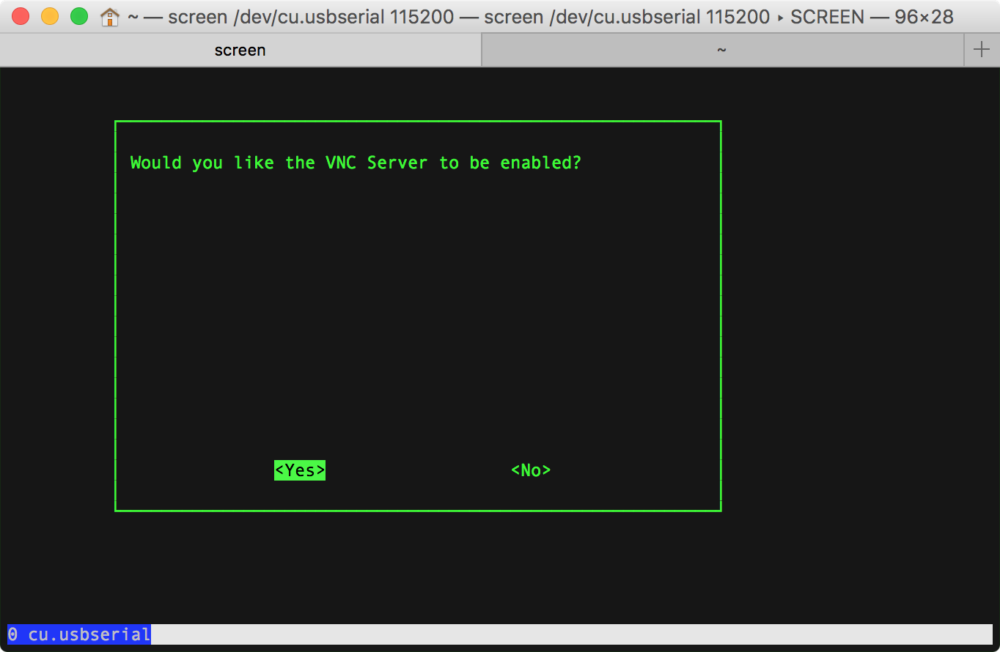

# SoC & OS

- **SoC**：`Raspberry Pi 3 Model B v1.2`(2015)  
- **OS**：`2017-09-07-raspbian-stretch.zip`

```Shell
pi@raspberrypi:~ $ cat /proc/version
Linux version 4.9.41-v7+ (dc4@dc4-XPS13-9333) (gcc version 4.9.3 (crosstool-NG crosstool-ng-1.22.0-88-g8460611) ) #1023 SMP Tue Aug 8 16:00:15 BST 2017

pi@raspberrypi:~ $ lsb_release -a
No LSB modules are available.
Distributor ID:	Raspbian
Description:	Raspbian GNU/Linux 9.1 (stretch)
Release:	9.1
Codename:	stretch
```

# Raspberry Pi Configuration(GUI)

在安装好 raspbian 系统后，通过 USB 接口为 Raspberry Pi 3 连接上键盘鼠标、通过 HDMI 接口接上显示屏后，可进入系统的图形用户界面（GUI）。

在系统偏好菜单 `Preferences | Raspberry Pi Configuration` 中可修改相关系统配置。


## System

  

## Interfaces

  

## Performance

  

## Localisation

  

# raspi-config(CUI)

除了进入图形用户界面（GUI）使用键鼠修改系统偏好设置，还可以在控制终端通过命令行（CUI）工具 `raspi-config` 修改配置参数。

无论是通过 GUI 还是 CUI 修改系统配置，都会同步修改 `/boot/config.txt` 和一些其他的 raspbian/Linux 系统配置文件。有些修改配置需要重启系统才能生效。

```Shell
sudo raspi-config

Raspberry Pi 3 Model B Rev 1.2

┌─────────┤ Raspberry Pi Software Configuration Tool (raspi-config) ├──────────┐
│                                                                              │
│    1 Change User Password           Change password for the current u        │
│    2 Hostname                       Set the visible name for this Pi         │
│    3 Boot Options                   Configure options for start-up           │
│    4 Localisation Options           Set up language and regional sett        │
│    5 Interfacing Options            Configure connections to peripher        │
│    6 Overclock                      Configure overclocking for your P        │
│    7 Advanced Options               Configure advanced settings              │
│    8 Update                         Update this tool to the latest ve        │
│    9 About raspi-config             Information about this configurat        │
│                                                                              │
│                                                                              │
│                                                                              │
│                     <Select>                     <Finish>                    │
│                                                                              │
└──────────────────────────────────────────────────────────────────────────────┘
```

**操作说明**：

<kbd>↑</kbd><kbd>↓</kbd>：选择选项。  
<kbd>←</kbd><kbd>→</kbd>：切换菜单（Select / Finish）。  


## 1 Change User Password

raspbian 默认账户为 pi，默认密码为 raspberry。  
菜单中的 `change_pass` 项可修改默认密码：


> [树莓派 - 修改pi账号密码,开启root账号](http://blog.csdn.net/yoie01/article/details/45115067)  

也可以在终端会话通过 passwd 命令来更换密码。

## 2 Hostname

raspbian 默认机器名称为 raspberrypi，该项可修改：


[Raspberry/Debian 修改主机名](http://blog.csdn.net/little_bobo/article/details/78341482)  

1. 临时修改主机名：`sudo hostname newHostName`；  
2. 永久修改主机名：主机名存储在两个地方，两个地方都有修改：  

	- sudo nano `/etc/hostname`，将原本的名称改为新的主机名  
	- sudo nano `/etc/hosts`，将 127.0.1.1 条目的设备名称改为新的主机名  

修改之后会在系统重启之后生效。

## 4 Localisation Options

此项可设置语言、时区、键盘布局 和 WiFi 国家等本地化配置：


- [] `en_GB.UTF-8 UTF-8`  
- [*] `en_US.UTF-8 UTF-8`  
- [*] `zh-CN GB2312`  
- [*] `zh_CN.GB18030 GB18030`  
- [*] `zh_CN.GBK GBK`  
- [*] `zh_CN.UTF-8 UTF-8`  


## 5 Interfacing Options

此项可配置一些接口选项，对应 GUI 图形界面的系统偏好菜单 `Preferences | Raspberry Pi Configuration | Interfaces`。

默认全部为 Disabled 状态，建议开启 SSH、VNC、Serial 三项。  
以下选择VNC进入设置为 enabled 状态：




## 7 Advanced Options

### A1 Expand Filesystem

之前的 Raspberry Pi 2，默认只能识别 4GB 的 SD 存储空间，需要 Expand Filesystem 才能识别整个 SD 卡的存储空间。


实际上，Raspberry Pi 3 默认已经能够识别整个 SD 卡的存储空间了，无需再执行此步骤。

### A3 Memory Split

依据 [VNC Connect and Raspberry Pi](https://www.realvnc.com/en/connect/docs/raspberry-pi.html) 的建议，可将 GPU 缓存从默认的 64 MB 扩大到 128 MB：


### A5 Resolution

raspbian 默认分辨率为 720x480，可以将其调整到支持的最高分辨率 —— 1080P（DMT Mode 82 1920x1080 60Hz 16:9）。


但是 1080P 分辨率太高，有可能会导致树莓派功率支持不住，屏幕闪或者出横线，建议折中设置成 720P（DMT Mode 85 1280x720 60Hz 16:9）。

# references

[树莓派配置](http://wiki.jikexueyuan.com/project/raspberry-pi/rasp-config.html)  
[树莓派综合配置](http://www.blogs8.cn/posts/bgce95)  
[Raspberry Pi + XBMC 配置](http://scateu.me/2015/02/15/xbmc-raspberry-pi.html)  
[Raspberry Pi安装配置和问题记录](http://tacy.github.io/blog/2013/02/10/raspberry-pi-notes/)  