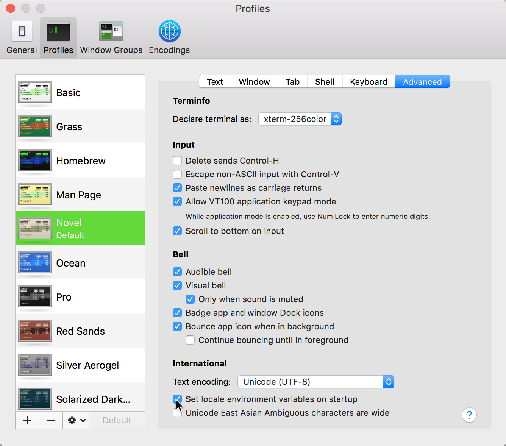

## locale
```shell
# man locale on raspbian
DESCRIPTION

The  locale  command displays information about the current locale, or all locales, on standard output.
```

```shell
# locale tab 查看 macOS 支持的命令
faner@THOMASFAN-MB0:~|⇒  locale
locale         localedef      localemanager
```

```shell
# locale tab 查看 Raspbian GNU/Linux 9.* (stretch) 支持的命令
pi@raspberrypi:~ $ locale
locale      localectl   localedef   locale-gen 
```

```shell
# locale tab 查看 CentOS Linux release 7.* 支持的命令
[root@vcentos ~]# locale
locale     localectl  localedef
```

macOS 终端执行 `locale -h` 或 `localedef -h` 可分别查看 *locale* 和 *localedef* 命令的简要说明。

```shell
# macOS
faner@THOMASFAN-MB0:~|⇒  locale -h
locale: illegal option -- h
usage: locale[-a|-m]
   or: locale [-cCk] name...

faner@THOMASFAN-MB0:~|⇒  localedef -h
Unknown option: h
usage: /usr/bin/localedef [-c] [-f charmap-file] [-u codesetname] [-i localdef-file] LOCALENAME
```

- locale `-?`(`--help`, `--usage`)  
- localedef `-?`(`--help`, `--usage`)  
- localectl `-h`(`--help`)  

执行 `man locale` 可查看命令语法（*SYNOPSIS*）和 LANG、LC_ALL、LC_CTYPE 等语系环境变量（*ENVIRONMENT*）的详细说明。

### macOS
macOS 系统的 `Language & Region` 选用 **Chinese**（简体中文） 作为首选语言（Primary），终端执行 `locale` 查看语系变量：

```shell
# display locale settings
faner@THOMASFAN-MB0:~|⇒  locale
LANG="zh_CN.UTF-8"
LC_COLLATE="zh_CN.UTF-8"
LC_CTYPE="zh_CN.UTF-8"
LC_MESSAGES="zh_CN.UTF-8"
LC_MONETARY="zh_CN.UTF-8"
LC_NUMERIC="zh_CN.UTF-8"
LC_TIME="zh_CN.UTF-8"
LC_ALL=
```

macOS 系统的 `Language & Region` 选用 **English**（英语） 作为首选语言（Primary），终端执行 `locale` 查看语系变量：

```shell
# display locale settings
faner@THOMASFAN-MB0:~|⇒  locale
LANG=
LC_COLLATE="C"
LC_CTYPE="UTF-8"
LC_MESSAGES="C"
LC_MONETARY="C"
LC_NUMERIC="C"
LC_TIME="C"
LC_ALL=
```

macOS 没有定义 LANG 环境变量，如果定义了，它将替代所有未定义的 `LC_*` 变量；也没有定义 LC_ALL 变量，如果定义了将覆盖所有其他的 `LC_*` 变量。

这里未定义 LANG 变量， LC_CTYPE 被 fallback 设为 UTF-8，其他 `LC_*` 变量则 fallback 为 `C`。

### raspbian & CentOS
通过 VNC 连接 raspbian，直接执行 `locale` 命令查看树莓派 raspbian 系统原生语系变量如下：

```shell
pi@raspberrypi:~ $ locale
LANG=en_US.UTF-8
LANGUAGE=
LC_CTYPE="en_US.UTF-8"
LC_NUMERIC="en_US.UTF-8"
LC_TIME="en_US.UTF-8"
LC_COLLATE="en_US.UTF-8"
LC_MONETARY="en_US.UTF-8"
LC_MESSAGES="en_US.UTF-8"
LC_PAPER="en_US.UTF-8"
LC_NAME="en_US.UTF-8"
LC_ADDRESS="en_US.UTF-8"
LC_TELEPHONE="en_US.UTF-8"
LC_MEASUREMENT="en_US.UTF-8"
LC_IDENTIFICATION="en_US.UTF-8"
LC_ALL=

```

英文版 CentOS 的 locale 输出同 raspbian，只定义了 LANG 环境变量（没有双引号），所有未定义的 `LC_*` 变量（有双引号）都采用该值。

> Values for variables set in the  environment are printed without double quotes, implied values are printed with double quotes.

### LC_CTYPE
可参考《鸟哥的linux私房菜》<11.2 shell 的变量功能> - 11.2.4 影响显示结果的语系变量（locale） 。

[locale的设定中LANG、LC_ALL、LANGUAGE环境变量的区别](http://blog.csdn.net/nick357/article/details/8513699)  
[Linux中Locale及shell编码问题](http://www.drupal001.com/2012/04/shell-utf8/)  

以下节选自 `man environ` 中的 LC_CTYPE 说明：

```shell
ENVIRON(7)           BSD Miscellaneous Information Manual           ENVIRON(7)

NAME
     environ -- user environment

SYNOPSIS
     extern char **environ;

DESCRIPTION

     LC_CTYPE     Locale to be used for character classification (letter, space,
                  digit, etc.) and for interpreting byte sequences as multibyte char-
                  acters.
```

以下节选自 `man setlocale` 中的 LC_CTYPE 说明：

```shell
SETLOCALE(3)             BSD Library Functions Manual             SETLOCALE(3)

NAME
     setlocale -- natural language formatting for C

LIBRARY
     Standard C Library (libc, -lc)

SYNOPSIS
     #include <locale.h>

     char *
     setlocale(int category, const char *locale);

DESCRIPTION

     LC_CTYPE     Set a locale for the ctype(3) and multibyte(3) functions.  This con-
                  trols recognition of upper and lower case, alphabetic or non-alpha-
                  betic characters, and so on.
```

以下查看以英文作为首选语言时的 LC_CTYPE 变量值：

```shell
# -c, --category-name
faner@THOMASFAN-MB0:~|⇒  locale -c LC_CTYPE
LC_CTYPE
UTF-8

# -k, --keyword-name
faner@THOMASFAN-MB0:~|⇒  locale -k LC_CTYPE
charmap="UTF-8"

faner@THOMASFAN-MB0:~|⇒  locale -ck LC_CTYPE
LC_CTYPE
charmap="UTF-8"
```

执行 `env | grep LC_CTYPE`、 `export | grep LC_CTYPE`、 `set | grep LC_CTYPE`（包括环境变量与自定义变量）  命令可将 env 结果通过管道传给 grep 过滤出 LC_CTYPE 变量。

## Cannot set LC_CTYPE & 中文乱码
当 macOS 首选语言设为英文时，存在以下问题：

在终端 SSH 会话中执行 `locale` 提示 `locale: Cannot set LC_CTYPE to default locale: No such file or directory`：

```shell
pi@raspberrypi:~ $ locale
locale: Cannot set LC_CTYPE to default locale: No such file or directory
locale: Cannot set LC_ALL to default locale: No such file or directory
LANG=en_US.UTF-8
LANGUAGE=
LC_CTYPE=UTF-8

# 省略...

LC_ALL=
```

执行 `sudo apt-get dist-upgrade` 时也会报类似警告：

```shell
pi@raspberrypi:~ $ sudo apt-get dist-upgrade

apt-listchanges: Can't set locale; make sure $LC_* and $LANG are correct!
Reading changelogs... Done
perl: warning: Setting locale failed.
perl: warning: Please check that your locale settings:
    LANGUAGE = (unset),
    LC_ALL = (unset),
    LC_CTYPE = "UTF-8",
    LANG = "en_US.UTF-8"
    are supported and installed on your system.
perl: warning: Falling back to a fallback locale ("en_US.UTF-8").
locale: Cannot set LC_CTYPE to default locale: No such file or directory
locale: Cannot set LC_ALL to default locale: No such file or directory

```

执行 `ls` 列举 raspbian 目录下的中文乱码：

```shell
pi@raspberrypi:~ $ ls Pictures/
4.JPG       ?????????-?????????.JPG   ?????????-?????????.JPG  ????????????.png
Scrot       ?????????-?????????2.JPG  ??????.JPG
System.png  ?????????-??????.JPG      ??????-2.png
pi@raspberrypi:~ $ 
```

当 macOS 首选语言为中文时，则无 Cannot set LC_CTYPE/Can't set locale 警告或中文显示乱码问题。

## analysis
OpenSSH 客户端在建立 SSH 会话连接时（两端读取 ssh/sshd 配置），客户端尝试发送本地语系环境变量（**SendEnv**）到远程 SSH 服务器，远程 SSH 服务器接收并为本次 SSH 会话设置客户端发送过来的语系环境变量（**AcceptEnv**）。

在 SSH 服务器（raspbian/CentOS）执行 `locale -a` 查看支持语系，发现没有 `UTF-8`。  

> 一般美式英文设置为 `es_US.utf8`，简体中文设置为 `zh_CN.utf8`。  

- 远程 SSH 服务器（raspbian）并未安装该 locale（UTF-8），导致执行 `sudo apt-get dist-upgrade` 发出警告：请检查本地（ssh服务端）语系是否已安装支持 LANG、LC_CTYPE 中配置的 locale。然后，将不支持的 LC_CTYPE fallback 回 `"en_US.UTF-8"`。

- 远程 SSH 服务器（CentOS）并未安装该 locale（UTF-8），导致 SSH 远程登录时出现告警：

```shell
-bash: warning: setlocale: LC_CTYPE: cannot change locale (UTF-8): No such file or directory
```

### ssh_config(SendEnv)
SSH 客户端（macOS）配置文件  ssh_config （OpenSSH SSH client configuration files）：

```shell
# man ssh_config on macOS
    ssh(1) obtains configuration data from the following sources in the following order:

           1.   command-line options
           2.   user's configuration file (~/.ssh/config)
           3.   system-wide configuration file (/etc/ssh/ssh_config)

     For each parameter, the first obtained value will be used.

     SendEnv
             Specifies what variables from the local environ(7) should be sent to the
             server.  The server must also support it, and the server must be config-
             ured to accept these environment variables.  Note that the TERM environ-
             ment variable is always sent whenever a pseudo-terminal is requested as
             it is required by the protocol.  Refer to AcceptEnv in sshd_config(5) for
             how to configure the server.  Variables are specified by name, which may
             contain wildcard characters.  Multiple environment variables may be sepa-
             rated by whitespace or spread across multiple SendEnv directives.  The
             default is not to send any environment variables.

```

```shell
faner@THOMASFAN-MB0:~|⇒  cat /etc/ssh/ssh_config
#	$OpenBSD: ssh_config,v 1.33 2017/05/07 23:12:57 djm Exp $

# This is the ssh client system-wide configuration file.  See
# ssh_config(5) for more information.

Host *
	SendEnv LANG LC_*
```

### sshd_config(AcceptEnv)
```shell
# man sshd_config on CentOS
     sshd(8) reads configuration data from /etc/ssh/sshd_config (or the file specified with
     -f on the command line).  The file contains keyword-argument pairs, one per line.  Lines
     starting with `#' and empty lines are interpreted as comments.  Arguments may optionally
     be enclosed in double quotes (") in order to represent arguments containing spaces.

     AcceptEnv
             Specifies what environment variables sent by the client will be copied into the
             session's environ(7).  See SendEnv in ssh_config(5) for how to configure the
             client.  Note that environment passing is only supported for protocol 2, and
             that the TERM environment variable is always sent whenever the client requests a
             pseudo-terminal as it is required by the protocol.  Variables are specified by
             name, which may contain the wildcard characters `*' and `?'.  Multiple environ-
             ment variables may be separated by whitespace or spread across multiple
             AcceptEnv directives.  Be warned that some environment variables could be used
             to bypass restricted user environments.  For this reason, care should be taken
             in the use of this directive.  The default is not to accept any environment
             variables.
```

SSH 服务器（raspbian）配置文件 sshd_config（OpenSSH SSH daemon configuration file）：

```shell
pi@raspberrypi:~ $ cat /etc/ssh/sshd_config
#	$OpenBSD: sshd_config,v 1.100 2016/08/15 12:32:04 naddy Exp $

# This is the sshd server system-wide configuration file.  See
# sshd_config(5) for more information.

# Allow client to pass locale environment variables
AcceptEnv LANG LC_*
```

SSH 服务器（CentOS）配置文件 sshd_config（OpenSSH SSH daemon configuration file）：

```shell
[root@vcentos ~]# cat /etc/ssh/sshd_config 
#	$OpenBSD: sshd_config,v 1.93 2014/01/10 05:59:19 djm Exp $

# This is the sshd server system-wide configuration file.  See
# sshd_config(5) for more information.

# Accept locale-related environment variables
AcceptEnv LANG LC_CTYPE LC_NUMERIC LC_TIME LC_COLLATE LC_MONETARY LC_MESSAGES
AcceptEnv LC_PAPER LC_NAME LC_ADDRESS LC_TELEPHONE LC_MEASUREMENT
AcceptEnv LC_IDENTIFICATION LC_ALL LANGUAGE
AcceptEnv XMODIFIERS
```

在 macOS 终端当前 SSH 会话中执行 `locale` 命令，可以发现 LC_CTYPE 已被修改为了 SSH 客户端的 LC_CTYPE（`UTF-8`，不带双引号）。

```shell
# macOS OpenSSH to raspbian

## macOS 首选语言为中文时，SSH 连接 raspbian 会话的 LANG 和 LC_CTYPE
pi@raspberrypi:~ $ env | grep LANG
LANG=en_US.UTF-8
pi@raspberrypi:~ $ env | grep LC_CTYPE
LC_CTYPE=zh_CN.UTF-8

## macOS 首选语言为英文时，SSH 连接 raspbian 会话的 LANG 和 LC_CTYPE
pi@raspberrypi:~ $ env | grep LANG
LANG=en_US.UTF-8
pi@raspberrypi:~ $ env | grep LC_CTYPE
LC_CTYPE=UTF-8
```

## solution
> [linux环境通过ssh连接控制台显示中文乱码问题](http://blog.csdn.net/songylwq/article/details/8842748)  
> [Mac OS X ssh登陆Linux是终端提示cannot change locale (UTF-8)](http://blog.huatai.me/2015/12/03/Mac-OS-X-ssh-to-Linux-prompt-setlocale-LC-CTYPE-cannot-change-locale-UTF-8/)  
> [Mac SSH 到 Linux 機器時，出現 cannot change locale (UTF-8) 訊息](http://ephrain.pixnet.net/blog/post/62410613)  

最直观的思路是在远程 SSH 服务器上调用 `localedef` 命令**安装**需要的 locale：

```shell
localedef -i en_US -f UTF-8 en_US.UTF-8
```

> [LC_CTYPE issue on OS X SOLVED!](https://sskaje.me/2014/01/lc-ctype-issue/)  
> [In OS X Lion, LANG is not set to UTF-8, how to fix it?](https://stackoverflow.com/questions/7165108/in-os-x-lion-lang-is-not-set-to-utf-8-how-to-fix-it)  
> [OS X Terminal: -bash: warning: setlocale: LC_CTYPE: cannot change locale (UTF-8): No such file or directory Fix](https://www.cyberciti.biz/faq/os-x-terminal-bash-warning-setlocale-lc_ctype-cannot-change-locale/)  

> [解决Debian SSH中文乱码](http://linji.cn/4015.html)  
> [Debian SSH乱码万能解决方案](http://www.zxsdw.com/index.php/archives/265/)  
> [Debian控制台中文为乱码，ssh登录乱码](http://forum.ubuntu.org.cn/viewtopic.php?t=247291)  

> [CentOS 下解决ssh登录 locale 警告](https://segmentfault.com/a/1190000004378075)  
> [Centos warning: setlocale: LC_CTYPE: cannot change locale (UTF-8): No such file or directory](http://www.cnblogs.com/xxoome/p/6559301.html)  
> gist [LC_CTYPE](https://gist.github.com/ibrahimlawal/bfec7092cb64d46d8f9d1fd2c0c3d9c8)  

### 方案1 - 禁止终端 Set locale environment variables on startup
在 macOS 终端偏好设置中定位到当前终端配置（Profile）的 Advanced tab 页：



最底下的 **International** 配置如下：

- Text Encoding: Unicode (UTF-8)  

- [x] Set locale environment variables on startup（启动时设置 locale 环境变量）

取消勾选 `Set locale environment variables on startup` 后，macOS 终端运行 locale 输出的 LANG 变量为空（unset），所有 `LC_*` 变量均未设置而 fallback 为默认的 `C`。

```shell
faner@THOMASFAN-MB0:~|⇒  locale
LANG=
LC_COLLATE="C"
LC_CTYPE="C"
LC_MESSAGES="C"
LC_MONETARY="C"
LC_NUMERIC="C"
LC_TIME="C"
LC_ALL=
```

SSH 会话 locale 中的 LC_CTYPE 变量值将为空（unset）。

> 不建议此方案，建议采用方案3。

### 方案2 - 修改 SSH 配置屏蔽 SendEnv/AcceptEnv
> [MAC OS X – SSH LC_CTYPE Warning](http://eduroll.eu/?p=119&cpage=1)  
> [OS X ssh 登录阿里云CentOS关于locale的警告处理](http://lishifu.me/mac,centos,aliyun/2015/10/22/mac-osx-setlocale-lc_ctype-.html)  

在 macOS 中打开 SSH 客户端配置文件 `/etc/ssh/ssh_config` ：

```shell
$ sudo vim /etc/ssh/ssh_config
```

注释掉 `SendEnv LANG LC_*` 禁止 OpenSSH 客户端向服务器发送 `LC_*` 变量。

```
# SendEnv LANG LC_*
```

当然，注释掉 OpenSSH 服务端配置（/etc/ssh/sshd_config） 中的 `AcceptEnv LANG LC_*` 行也可以解决问题。

> 不建议此方案，建议采用方案3。

### 方案3 - 修正 LC_CTYPE 一致
另外一种思路是在执行 ssh 连接后，在 macOS 终端的 SSH 会话中，尝试（export）恢复 LC_CTYPE 为 SSH 服务器接收 `LC_*` 变量覆盖之前的初始值 `en_US.UTF-8`（同 LANG）：

```shell
# export 可选
pi@raspberrypi:~ $ export LC_CTYPE="en_US.UTF-8"

# echo $ 打印环境变量
pi@raspberrypi:~ $ echo $LC_CTYPE 
en_US.UTF-8
```

重新执行 locale 命令可以看到 `LC_CTYPE=en_US.UTF-8`：

```shell
pi@raspberrypi:~ $ locale
LANG=en_US.UTF-8
LANGUAGE=
LC_CTYPE=en_US.UTF-8

```

重新执行 `ls Pictures/`，正常显示中文字符：

```shell
pi@raspberrypi:~ $ ls Pictures/
4.JPG  System.png         三角山-俯瞰图2.JPG  三角山-灵秀山.JPG  绿叶-2.png
Scrot  三角山-一枝杉.JPG  三角山-枯松.JPG     坳口.JPG           范式家训.png
```

但是这样每次都要修复覆盖后的 LC_CTYPE 值，比较麻烦。

---

在执行 ssh 连接前，在 macOS 终端执行 `LC_CTYPE="en_US.UTF-8"`，或  `export LC_CTYPE="en_US.UTF-8"`，或写入 bash 配置文件（`~/.bash_profile` 或 `~/.bashrc`）：

```shell
echo "export LC_CTYPE=en_US.UTF-8" >> $HOME/.bashrc
```

这样，本地和服务器上的 LC_CTYPE 一致，就不会出现覆盖警告。

当然，也可以修正 macOS 的语系变量 LANG 和 LC_ALL 的值都为 `en_US.utf-8`，将以下两行配置添加到 `/etc/environment` 或 [写入 bash 或 zsh 的配置文件](https://maoxian.de/2015/12/1364.html)：

```shell
# You may need to manually set your language environment for the new UTF-8
export LANG=en_US.UTF-8
export LC_CTYPE=en_US.UTF-8
```

这样 macOS 终端重新输入 locale 的输入如下：

```shell
faner@THOMASFAN-MB0:~|⇒  locale
LANG="en_US.UTF-8"
LC_COLLATE="en_US.UTF-8"
LC_CTYPE="en_US.UTF-8"
LC_MESSAGES="en_US.UTF-8"
LC_MONETARY="en_US.UTF-8"
LC_NUMERIC="en_US.UTF-8"
LC_TIME="en_US.UTF-8"
LC_ALL=
```

后续 SSH 连接 raspbian/CentOS 服务器就不会再出现警告了。
