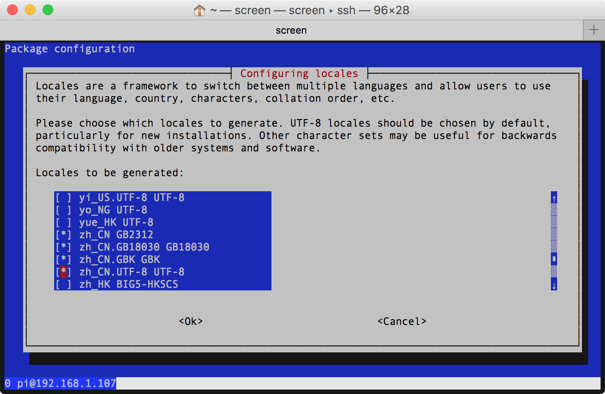

# localisation

## Change Locale
执行 `sudo raspi-config`，依次选择 4 Localisation Options | I1 Change Locale，


- 用空格键反选：[] `en_GB.UTF-8 UTF-8`  
- 用空格键选中：[*] `en_US.UTF-8 UTF-8`  
- 用空格键选中：[*] `zh-CN GB2312`  
- 用空格键选中：[*] `zh_CN.GB18030 GB18030`  
- 用空格键选中：[*] `zh_CN.GBK GBK`  
- 用空格键选中：[*] `zh_CN.UTF-8 UTF-8`  



依次用空格键选中5项后，tab键移到Ok确认，返回根据需要选择默认语言：

- [x] en_US.UTF-8 UTF-8  
- [ ] zh_CN.UTF-8 UTF-8  

为学习起见，这里选择英语作为首选语言。


重启则 raspbian 能正常支持中文字库的渲染显示。

## install fonts
1. 同步更新 apt 仓库列表信息：

```Shell
sudo apt-get update 
```

2. 为 raspbian 系统安装中文字体：[文泉驿正黑](http://wenq.org/wqy2/index.cgi?ZenHei) 和 [文泉驿微米黑](http://wenq.org/wqy2/index.cgi?MicroHei)

```Shell
sudo apt-get install ttf-wqy-zenhei ttf-wqy-microhei
```

3. 为 raspbian 安装 [Google Noto Fonts](http://www.google.com/get/noto/) 字体：  

```Shell
mkdir -p ~/.fonts
cp *otf *otc ~/.fonts
fc-cache -f -v
```

> [在樹莓派上安裝中文字型](http://studyraspberrypi.blogspot.com/2015/12/install-chinese-fonts.html)  
> [Ubuntu Linux 安装文泉驿微米黑教程](http://babybandf.blog.163.com/blog/static/6199353201051210729446/)  

### set fonts
raspbian 默认主题为 12 号 Piboto Light 字体，无法显示中文。需要到 References | Apperance Settings 下把字体选成 Arial 或其他兼容汉字字库。

## Input Method
[树莓派(Raspberry Pi 3) - Raspbian中文输入法安装及中文环境配置](http://blog.csdn.net/u012313335/article/details/53519302)  

### [scim](https://en.wikipedia.org/wiki/Smart_Common_Input_Method)
安装 scim 及拼音输入法：

```Shell
sudo apt-get install scim
sudo apt-get install scim-pinyin
```

如需加装五笔输入法：

```Shell
sudo apt-get install scim-tables-zh
```

### [fcitx](https://fcitx-im.org/wiki/Fcitx)
[Raspbian系统中文化](http://www.guokr.com/post/520901/) 建议使用 [fcitx](https://en.wikipedia.org/wiki/Fcitx)（小企鹅输入法）。

安装 fcitx 及五笔：

```Shell
sudo apt-get install fcitx
sudo apt-get install fcitx-tables-wbpy
```

## references
[树莓派设置支持中文](http://www.jianshu.com/p/00fc5725d3fc)  
[如何让树莓派显示中文？](http://shumeipai.nxez.com/2016/03/13/how-to-make-raspberry-pi-display-chinese.html)  
[树莓派中文支持(中文显示和中文输入法)](http://blog.csdn.net/rocklee/article/details/50083031)  
[树莓派 中文乱码 解决方法](http://blog.csdn.net/y511374875/article/details/73548195)  
[树莓派(Raspberry Pi 3) - Raspbian中文输入法安装及中文环境配置](http://blog.csdn.net/u012313335/article/details/53519302)  
