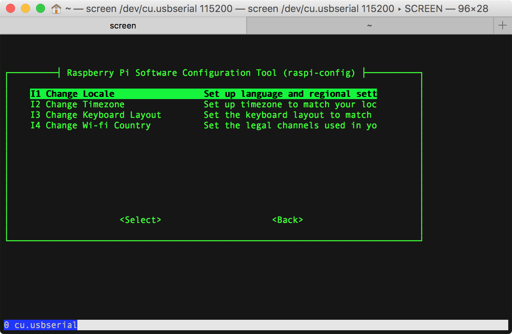
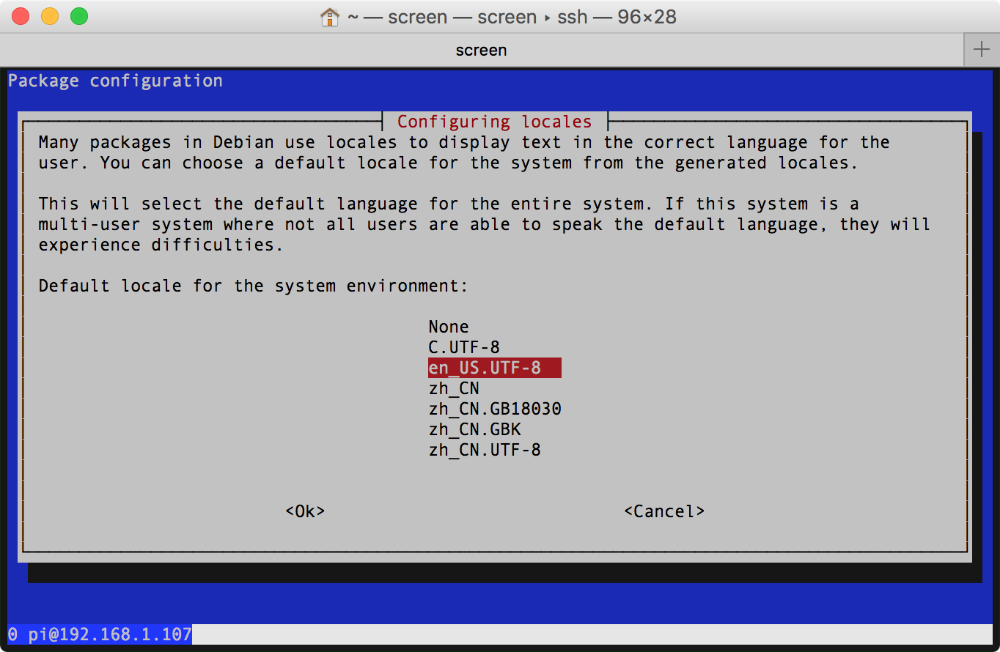
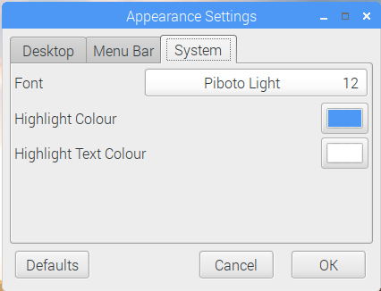

# localisation

## Change Locale
执行 `sudo raspi-config`，依次选择 4 Localisation Options | I1 Change Locale，



- 用空格键反选：[] `en_GB.UTF-8 UTF-8`  
- 用空格键选中：[*] `en_US.UTF-8 UTF-8`  
- 用空格键选中：[*] `zh-CN GB2312`  
- 用空格键选中：[*] `zh_CN.GB18030 GB18030`  
- 用空格键选中：[*] `zh_CN.GBK GBK`  
- 用空格键选中：[*] `zh_CN.UTF-8 UTF-8`  

执行 `locale -a` 命令可查看当前支持的语系：

```Shell
pi@raspberrypi:~$ locale -a
C
C.UTF-8
en_US.utf8
POSIX
zh_CN
zh_CN.gb18030
zh_CN.gb2312
zh_CN.gbk
zh_CN.utf8
```


依次用空格键选中5项后，tab键移到Ok确认，返回根据需要选择默认语言：

- [x] en_US.UTF-8 UTF-8  
- [ ] zh_CN.UTF-8 UTF-8  

为学习起见，这里选择英语作为首选语言。



执行 `echo $LANG` 命令可查看当前选择的语言：

```Shell
pi@raspberrypi:~$ echo $LANG
en_US.UTF-8
```

重启则 raspbian 能正常支持中文字库的渲染显示。

## install ttf-wqy-*
同步更新 apt 仓库列表信息：

```Shell
sudo apt-get update 
```

执行 `apt-cache search ttf-wqy*` 从本地软件源索引缓存中搜索 `ttf-wqy*`（文泉驿字体）：

```Shell
pi@raspberrypi:~$ apt-cache search ttf-wqy*
fonts-wqy-microhei - Sans-serif style CJK font derived from Droid
fonts-wqy-zenhei - "WenQuanYi Zen Hei" A Hei-Ti Style (sans-serif) Chinese font
ttf-wqy-microhei - transitional dummy package
ttf-wqy-zenhei - transitional dummy package
```

执行 `apt-get install` 命令为 raspbian 系统安装 [文泉驿微米黑](http://wenq.org/wqy2/index.cgi?MicroHei) 和 [文泉驿正黑](http://wenq.org/wqy2/index.cgi?ZenHei)。

```Shell
sudo apt-get install ttf-wqy-zenhei ttf-wqy-microhei
```

> [在樹莓派上安裝中文字型](http://studyraspberrypi.blogspot.com/2015/12/install-chinese-fonts.html)  

### Appearance System Font
raspbian 默认系统字体为 12 号 Piboto Light 字体，无法显示中文。

打开 Preferences | Apperance Settings | System，需要修改系统字体为 Arial 或其他兼容汉字字库。



### Terminal font
LXTerminal | Edit | Preferences | Style | Terminal font 将字体调整为 Noto Mono | Regular | 11：


### Leafpad Font
Leafpad | Options | Font 将 Leafpad 文本编辑器的字体调整为 Monospace | Regular | 12：


### Chrome Font
Chrome 浏览器字体 font size 默认 16，调整最小为 12。

- Standard font：WenQuanYi Micro Hei Mono；  
- Serif font：DejaVu Serif；  
- Sans-serif font：Noto Mono；  
- Fixed-width font：Monospace；  


## Input Method
[树莓派(Raspberry Pi 3) - Raspbian中文输入法安装及中文环境配置](http://blog.csdn.net/u012313335/article/details/53519302)  

### [scim](https://en.wikipedia.org/wiki/Smart_Common_Input_Method)
安装 scim 及拼音输入法：

```Shell
sudo apt-get install scim
sudo apt-get install scim-pinyin
```

如需加装五笔输入法：

```Shell
sudo apt-get install scim-tables-zh
```

### [fcitx](https://fcitx-im.org/wiki/Fcitx)
[Raspbian系统中文化](http://www.guokr.com/post/520901/) 建议使用 [fcitx](https://en.wikipedia.org/wiki/Fcitx)（小企鹅输入法）。

安装 fcitx 及拼音和五笔：

```Shell
sudo apt-get install fcitx
sudo apt-get install fcitx-pinyin
sudo apt-get install fcitx-tables-wbpy
```

## references
[树莓派设置支持中文](http://www.jianshu.com/p/00fc5725d3fc)  
[如何让树莓派显示中文？](http://shumeipai.nxez.com/2016/03/13/how-to-make-raspberry-pi-display-chinese.html)  
[树莓派 中文乱码 解决方法](http://blog.csdn.net/y511374875/article/details/73548195)  
[树莓派中文支持(中文显示和中文输入法)](http://blog.csdn.net/rocklee/article/details/50083031)  
[树莓派学习笔记（6）：让Raspbian支持中文、禁用休眠](http://www.cnblogs.com/xiaowuyi/p/4063323.html)  
[树莓派(Raspberry Pi 3) - Raspbian中文输入法安装及中文环境配置](http://blog.csdn.net/u012313335/article/details/53519302)  
