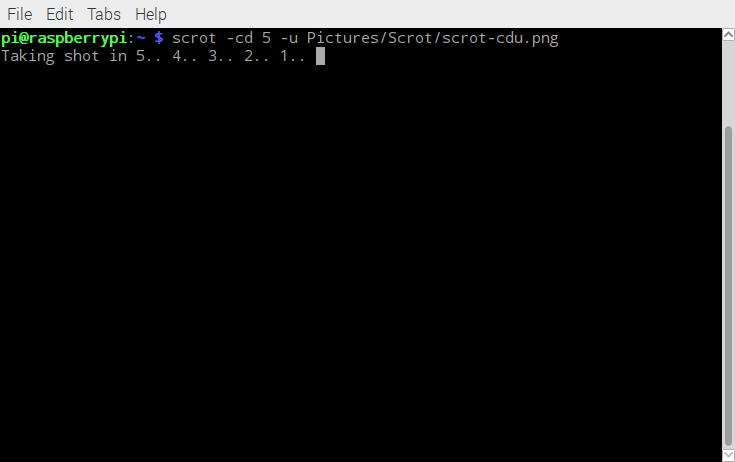

[**Raspberry Pi Screenshots**](http://www.instructables.com/id/Raspberry-Pi-Screenshots/)

[How To Take Screenshots On The Raspberry Pi](https://www.raspberrypi-spy.co.uk/2013/10/how-to-take-screenshots-on-the-raspberry-pi/) OCTOBER 5, 2013  
[How to take a screenshot on Raspberry Pi](https://www.imore.com/how-take-screenshot-raspberry-pi) Mar 14, 2016  
[How to take a screenshot on the Raspberry Pi](https://www.cnet.com/how-to/how-to-take-a-screenshot-on-the-raspberry-pi/) MAY 26, 2016  

[Scrot配合openbox使用快捷键](https://www.liyanfeng.com/post/61.html)  

## SoC & OS

- **SoC**：`Raspberry Pi 3 Model B v1.2`(2015)  
- **OS**：`2017-09-07-raspbian-stretch.zip`

```Shell
pi@raspberrypi:~ $ cat /proc/version
Linux version 4.9.41-v7+ (dc4@dc4-XPS13-9333) (gcc version 4.9.3 (crosstool-NG crosstool-ng-1.22.0-88-g8460611) ) #1023 SMP Tue Aug 8 16:00:15 BST 2017

pi@raspberrypi:~ $ lsb_release -a
No LSB modules are available.
Distributor ID:	Raspbian
Description:	Raspbian GNU/Linux 9.1 (stretch)
Release:	9.1
Codename:	stretch
```

## Step 2: Instal Scrot
```Shell
pi@raspberrypi:~$ sudo apt-get install scrot
Reading package lists... Done
Building dependency tree       
Reading state information... Done
scrot is already the newest version (0.8-18).
scrot set to manually installed.
0 upgraded, 0 newly installed, 0 to remove and 0 not upgraded.
pi@raspberrypi:~$ 
```

## Step 3: Basic Usage
```Shell
scrot
```

Scrot's default name convention will give you a date, time and resolution stamped file like:

`2014-10-05-132309_1824x984_scrot.png`

You can specify the file name by typing

```Shell
scrot example.png
```

The image will now be called "example", rather than “2014-10-05-132309_1824x984_scrot.png”.  
This command will not work if you do not specify a file extension (for example ".png").  
Change the output file format by changing the extension (for example ".jpeg", ".gif", etc).

scrot 截图默认保存到家目录（~）下，可执行以下复合命令将截拍快照移动到 `~/Pictures/Scrot/` 目录下：

```Shell
scrot '%Y-%m-%d-%H%M%S_$wx$h_scrot.png' -e 'mv $f ~/Pictures/Scrot/'
```

## Step 4: Specify File Location
Specify where screenshots are saved with the command

```Shell
scrot /home/pi/Desktop/example.png
```

where, for example, "`/home/pi/Desktop/`" is the file path and "`example.png`" is the screenshot.

## Step 5: Delay a Screen Shot
To delay a screenshot, type

```Shell
scrot -d 10
```

where 10 is the number of seconds before capturing an image. 

To display a countdown, add the `-c` option

```Shell
scrot -cd 10
```

复合截屏及移动命令：

```Shell
scrot -cd 10 '%Y-%m-%d-%H%M%S_$wx$h_scrot.png' -e 'mv $f ~/Pictures/Scrot/'
```

## Step 6: Capture Only Part of the Screen
Capture sections of the screen with the `-s` option, as can be seen in the image included, with the commands

```Shell
scrot -s
```

or

```Shell
scrot -s /home/pi/Desktop/example.png
```

to specify the file path. 

Then click and **drag** a box over the area you want to capture.

Capture the current window with the `-u` option

```Shell
scrot -u
```


