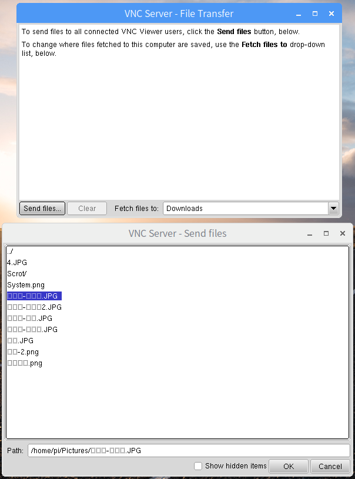
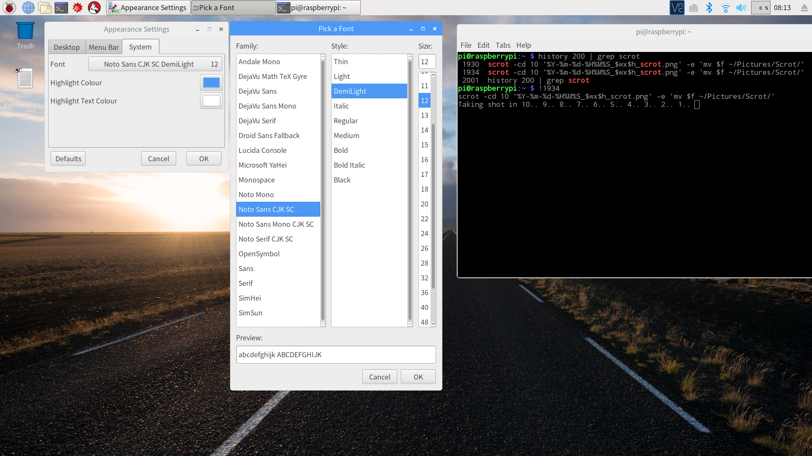
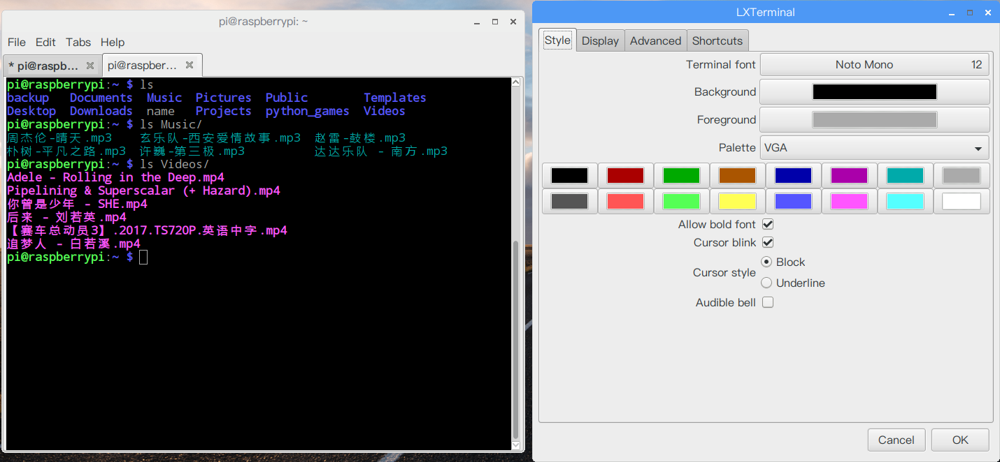
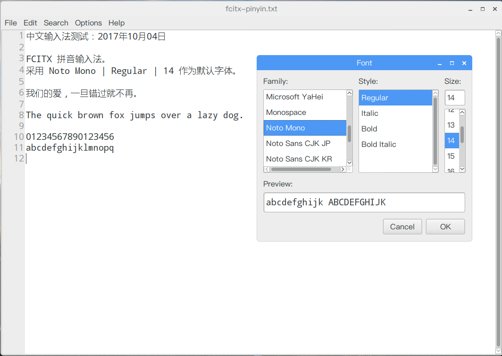

# SoC & OS
- **Host**：MacBookPro11,3/macOS 10.12.6 (16G1023)/Darwin 16.7.0  

- **SoC**：`Raspberry Pi 3 Model B v1.2`(2015)  
- **OS**：`2017-09-07-raspbian-stretch.zip`  

```Shell
pi@raspberrypi:~ $ cat /proc/version
Linux version 4.9.41-v7+ (dc4@dc4-XPS13-9333) (gcc version 4.9.3 (crosstool-NG crosstool-ng-1.22.0-88-g8460611) ) #1023 SMP Tue Aug 8 16:00:15 BST 2017

pi@raspberrypi:~ $ lsb_release -a
No LSB modules are available.
Distributor ID:	Raspbian
Description:	Raspbian GNU/Linux 9.1 (stretch)
Release:	9.1
Codename:	stretch
```

# fonts on raspbian
在 raspbian stretch 终端执行 `cat /etc/fonts/fonts.conf` 查看 `fonts.conf` 文件，可知字体存放目录主要在 `/usr/share/fonts`：

```Shell
pi@raspberrypi:~$ cat /etc/fonts/fonts.conf

<!-- Font directory list -->

        <dir>/usr/share/fonts</dir>
        <dir>/usr/X11R6/lib/X11/fonts</dir> <dir>/usr/local/share/fonts</dir>
        <dir prefix="xdg">fonts</dir>
        <!-- the following element will be removed in the future -->
        <dir>~/.fonts</dir>

<!--
```

ls 查看 `/usr/share/fonts/` 及其子目录 `truetype/` 可知，默认安装了 freefont、dejavu、liberation2、arphic 系列字体：

```Shell
pi@raspberrypi:/usr/share/fonts$ ls
cmap  truetype  type1  X11

pi@raspberrypi:/usr/share/fonts$ ls truetype/
arphic           dejavu    lato         openoffice
arphic-bsmi00lp  droid     liberation2  piboto
arphic-gbsn00lp  freefont  noto

```

- [GNU FreeFont](https://en.wikipedia.org/wiki/GNU_FreeFont) 系列字体：FreeSans、FreeMono、FreeSerif；  
- [DejaVu](https://dejavu-fonts.github.io/) 系列字体：DejaVu Sans、DejaVu Sans Mono、DejaVu Serif；  
- [Liberation fonts](https://en.wikipedia.org/wiki/Liberation_fonts) 系列字体：Liberation Sans、Liberation Mono、Liberation Serif；  
- arphic（[文鼎开放字体](http://wiki.ubuntu.org.cn/%E5%85%8D%E8%B4%B9%E4%B8%AD%E6%96%87%E5%AD%97%E4%BD%93)）系列：AR PL SungtiL GB（文鼎PL简报宋）、AR PL UKai CN（文鼎PL简中楷）、AR PL UMing CN（文鼎PL简明体）；  
- Piboto、[OpenSymbol](https://www.free-fonts.com/opensymbol)、[Droid](http://www.droidfonts.com/)、[Lato](http://www.latofonts.com/)、[Noto](https://packages.debian.org/stretch/fonts-noto) [Mono](https://en.wikipedia.org/wiki/Monospaced_font) 字体...

raspbian 默认安装了 NotoMono-hinted（truetype/NotoMono-Regular.ttf），本文记录了安装思源字体（Google Noto CJK SC）完整版的步骤。

# install Noto CJK
Noto CJK: Beautiful and free fonts for all languages

## 关于 Noto/思源 字体
如果操作系统并没有合适的字体来显示对应的字符，它就会被显示成“豆腐块”（[tofu](http://www.1001fonts.com/noto-serif-font.html)），如下图所示。



Google 原来就有 Noto 字形计划，希望通过让开源 Noto 字体家族覆盖所有 Unicode 字符的方式来彻底告别“豆腐块”的存在。

就英文名来看，`Noto` = No Tofu，目的是要消灭豆腐块。  

Google Noto 字体项目的目标是为所有现代设备开发一款涵盖所有语言的和谐、优质的字体系列，“思源”系列字体是 Noto 字体家族针对中文、日文和韩文（Chinese、Japanese、Korean，CJK）的重要子集。

Google Noto Sans CJK 和 Adobe Source Han Sans 字体中的西文部分采用的是 Adobe 的无衬线西文字符集 [Source Sans Pro](https://github.com/adobe-fonts/source-sans-pro)， CJK 部分则采用的是无衬线 [思源黑体](https://zh.wikipedia.org/wiki/%E6%80%9D%E6%BA%90%E9%BB%91%E9%AB%94)。  
Google Noto Serif 和 Adobe Source Han Serif 字体中的西文部分采用的是 Adobe 的有衬线西文字符集 [Source Serif Pro](https://github.com/adobe-fonts/source-serif-pro)，CJK 部分则采用的是有衬线 [思源宋体](https://zh.wikipedia.org/wiki/%E6%80%9D%E6%BA%90%E5%AE%8B%E4%BD%93)。  

> [Noto Sans CJK & Source Han Sans](http://acrossbeta.blogspot.com/2014/09/blog-post_8.html)  
> [Source Han Sans 与 Noto Sans 的区别](https://qdan.me/list/VLPe5sfsxkFWYMmX)  

### [Noto CJK](https://www.google.com/get/noto/help/cjk/)
Google 方面的需求是制作一款覆盖四个 CJK locale 的 pan-CJK 字体，与其 [Roboto](https://github.com/google/fonts/tree/master/apache/roboto) 和 [Noto](https://www.google.com/get/noto/) 字体家族完美配合，用于 Web 网页端 和 Chrome OS 等场合。  

Google 推出了这一字体的自有版本，取名为 [Noto CJK](https://www.google.com/get/noto/help/cjk/)，并将其归入他们的 Noto pan-Unicode 字体家族。

Github Repository：[googlei18n](https://github.com/googlei18n)/[noto-cjk](https://github.com/googlei18n/noto-cjk)：

- NotoSansCJK（无衬线）；  
	- NotoSansMonoCJK（无衬线等宽）；  
- NotoSerifCJK（有衬线）。  

由于Google Noto Sans CJK 字体中的西文部分使用的是 Adobe Source 家族字体，因此如果想要搭配 Noto 字体家族使用，需要明确声明在西文部分使用 Noto 字体（NotoSans 或 NotoSerif）。

### [Noto Han](http://blogs.adobe.com/conversations/tag/noto-sans)

> [Adobe TypeKit](https://typekit.com/fonts?licenses=desktop&sort=newest)  
> [AN OPEN SOURCE PAN-CJK TYPEFACE](http://blogs.adobe.com/conversations/2014/07/introducing-source-han-sans-an-open-source-pan-cjk-typeface.html)  

至于 Adobe 自己的 Source Sans Pro，是一个开放的多功能字型家族，Source Han Sans 开发过程中也纳入 Source Sans 的拉丁文字符、希腊文和斯拉夫文字符。

Adobe Source Han Sans 发布版字符比较完备，建议用作桌面端显示字体。

Github Repository：[adobe-fonts](https://github.com/adobe-fonts)

- [source-han-sans](https://github.com/adobe-fonts/source-han-sans)（无衬线）；  
- [source-han-serif](https://github.com/adobe-fonts/source-han-serif)（有衬线）。  

### [思源黑体](http://blog.typekit.com/alternate/source-han-sans-chs/)
思源黑体（Noto Sans CJK/Source Han Sans） 是 Google 和 Adobe 在 2014 年联合发布的供桌面使用的开源 Pan-CJK 字体家族。  
其中 CJK 为中文（Chinese）、日文（Japanese）和韩文（Korean）的缩写，完美支持日文、韩文、繁体中文和简体中文。

该项目的规模在 CJK 领域应该也是史无前例的：它由 Google 委托 Adobe，并联合日本 Iwata（主要负责字符集扩充）、中国常州华文（SinoType，主要负责字形的中国大陆标准与台湾「国字标准字体」本地化）、韩国 Sandoll（主要负责韩文设计）共同完成。

- Google 将其纳入 **Noto** pan-Unicode 字体家族，推出的这一字体系列称为 `Noto Sans CJK`；  
- Adobe 则把它包含进了自家的 **Source Sans** 家族，推出的这一字体系统称为 `Source Han Sans`。 

思源黑体是重心置中、字面稍大的现代黑体。它空间取向均称，以一般用家们耳熟能详的字体去比喻，则可以归类成兰亭黑、俪黑一类**中宫外放**。

思源黑体与「黑体－简」走相反路线，给人感觉较轻松友善，或许是当今质量最高的现代开源汉字字体。

> [思源黑体的各个版本有什么不同](https://www.zhihu.com/question/24639343)  
> [如何评价思源黑体 (Source Han Sans) 字族？](https://www.zhihu.com/question/24499749)  

### [思源宋体](https://source.typekit.com/source-han-serif/cn/)
思源宋体是 Adobe Type 发布的最新泛 CJK 字体，它是对应于思源黑体的宋体字体；Google & Adobe 联合发布这两种字体是为了响应统一设计的需求，以服务于东亚 15 亿人口。

完整 Source Han 字体系列远远超出了普通 “超系列” 字体的范畴，它是 Adobe 与 Google 之间的大量合作以及合作伙伴公司（中国的常州华文、韩国的 [Sandoll Communications](http://www.sandoll.co.kr/)、日本的 [Iwata Corporation](http://www.iwatafont.com/en/)）参与的成果。

思源宋体也和它的兄弟字体思源黑体一样针对屏幕显示进行了优化，但前者具有截然不同的风格，适合用于文学性较强的文本或优雅、时尚的标题。

> [如何评价思源宋体（Source Han Serif）字族？](https://www.zhihu.com/question/58002706)  
> [思源宋体，如何评价，以及如何正确使用](https://www.septillion.cn/archives/2560) @[sspai](https://sspai.com/post/38705)  

## 选择安装 Noto CJK 字体
### 字体类型：TrueType & OpenType
TrueType 字体主要分为两大类：

- TrueType format with TrueType outline(`*.ttf`, `*.ttc`)；  
- TrueType format with PS outline(CFF)(`*.otf`) 或称为 CFF OpenType font。  

OpenType 标准定义了文件名称的后缀名：

1. 包含 TureType 字体的 OpenType 文件后缀名为 `.ttf`；  
2. 如果是包含一系列 TrueType 字体的字体包文件，那么后缀名为 `.ttc`；  

	> 参见 [Noto CJK](https://www.google.com/get/noto/help/cjk/) 的 Super OpenType/CFF Collection (Super OTC) 以及 OpenType/CFF Collection (OTC)。

3. 包含 PostScript 字体的文件后缀名为 `.otf`  。

	> 参见 [Noto CJK](https://www.google.com/get/noto/help/cjk/) 的 Language-specific OpenType/CFF (OTF) 以及 Region-specific Subset OpenType/CFF (Subset OTF)。

### 下载 Noto CJK 字体包
[Google Noto Fonts](https://www.google.com/get/noto/help/cjk/) 官网（[GitHub repositories](https://github.com/googlei18n?query=noto)）给出了四种可选的下载包组合：

- Super OpenType/CFF Collection (Super OTC)：`NotoSansCJK.ttc.zip` & `NotoSerifCJK.ttc.zip`  
- OpenType/CFF Collection (OTC)：`NotoSansCJK-*.ttc` & `NotoSerifCJK-*.ttc`  
- Language-specific OpenType/CFF (OTF)：`NotoSansCJKsc-hinted.zip` & `NotoSerifCJKsc-hinted.zip`  
- Region-specific Subset OpenType/CFF (Subset OTF)：`NotoSansSC.zip` & `NotoSerifSC.zip`  

Adobe 提供了 [下载指南](http://www.adobe.com/content/dam/Adobe/en/products/type/pdfs/download-guide-source-han.pdf#page=4)，以下为 Recommended use flow chart:


根据指南，Raspbian GNU/Linux 9.1 (stretch) 应下载安装 Subset OTF：`NotoSansSC.zip` & `NotoSerifSC.zip` —— 针对简体中文（SC，Simple Chinese）单一语言版本的 otf 字体包。

我这里选择下载涵盖 Pan CJK（中繁、中简、日、韩）四种语言和 Mono 字体的 Language-specific OpenType/CFF (OTF) ：

- `NotoSansCJKsc-hinted.zip`：[思源黑体](https://blog.typekit.com/alternate/source-han-sans-chs/)集成Adobe的西文字符集 Source Sans Pro。  
	- Noto Sans CJK SC：无衬线字体，支持7种字重（Black、Bold、DemiLight、Light、Medium、Regular、Thin）  
	- Noto Sans Mono CJK SC：无衬线等宽字体，支持2种字重（Bold、Regular）  
- `NotoSerifCJKsc-hinted.zip`：[思源宋体](https://source.typekit.com/source-han-serif/cn/)集成Adobe的西文字符集 Source Serif。  
	- Noto Serif CJK SC：衬线字体，支持7种字重（Black、Bold、DemiLight、Light、Medium、Regular、Thin）  

### 安装 Noto CJK 字体
假设 `NotoSansCJKsc-hinted.zip` 和 `NotoSerifCJKsc-hinted.zip` 被下载解压到目录`~/Downloads/`，将这17个字体文件拷贝到既有目录 `/usr/share/fonts/truetype/noto/` 下：

```Shell
pi@raspberrypi:~$ cd Downloads/
pi@raspberrypi:~/Downloads$ sudo cp *.otf /usr/share/fonts/truetype/noto/
```

cd 到 `/usr/share/fonts/truetype/noto/` 目录下，执行 `sudo chmod 644`（or 755），修改字体文件的权限为 `-rw-r--r--`（`-rwxr-xr-x`）：owner：可读可写（可执行）；group：可读（可执行）；others：可读（可执行）。

```Shell
pi@raspberrypi:~/Downloads$ cd /usr/share/fonts/truetype/noto/
pi@raspberrypi:/usr/share/fonts/truetype/noto$ sudo chmod 644 ./*
```

> 此步至关重要，只有执行此步后，所有用户才能读取使用该字体；  
> 否则，字体选择器中将不会出现安装的字体，或者字体预览输出为方块（tofu）。  

然后依次执行 `mkfontscale`、`mkfontdir`、`fc-cache -fv .` 重建字体索引信息，更新字体缓存：

```Shell
pi@raspberrypi:/usr/share/fonts/truetype/noto$ sudo mkfontscale
pi@raspberrypi:/usr/share/fonts/truetype/noto$ sudo mkfontdir
pi@raspberrypi:/usr/share/fonts/truetype/noto$ sudo fc-cache -fv .
/usr/share/fonts/truetype/noto: caching, new cache contents: 17 fonts, 0 dirs
/usr/share/fonts/truetype/noto: caching, new cache contents: 17 fonts, 0 dirs
/var/cache/fontconfig: cleaning cache directory
/root/.cache/fontconfig: not cleaning non-existent cache directory
/root/.fontconfig: not cleaning non-existent cache directory
fc-cache: succeeded
```

>  `noto/` 目录下将新增两个文件：fonts.scale 和 fonts.dir。

**参考**：

> [Linux中安装字体](https://yq.aliyun.com/articles/24218)、[添加字体](http://jingyan.baidu.com/article/48206aeae78824216ad6b3d5.html)  
> [Ubuntu Linux 安装文泉驿微米黑教程](http://babybandf.blog.163.com/blog/static/6199353201051210729446/)  
> [linux安装中文字体](https://www.ilanni.com/?p=11746) / [在樹莓派上安裝中文字型](http://studyraspberrypi.blogspot.com/2015/12/install-chinese-fonts.html)  
> [Try Debian with Raspberry Pi Desktop](http://oppekepe.org/date/2017/08)  
> [在debian中安装中文字体](http://www.360doc.com/content/16/1223/10/16021371_617020560.shtml) / [Debian下使用google的noto字体](http://mosir.org/html/y2014/201.html)  
> [Android 7 添加全套字重的 Noto Sans CJK](https://zhuanlan.zhihu.com/p/25027320)  

#### apt install fonts-noto-cjk
当然，除了从 Google/Adobe 官网或 GitHub 上下载字体包手动安装 Noto CJK/Source Han 字体外，还可以通过 apt search 命令从 source.list 搜索 fonts-noto，然后执行 `apt install fonts-noto-cjk` 命令自动下载安装 Noto CJK 字体。

> raspbian 默认已安装 fonts-noto-mono 字体（truetype/NotoMono-Regular.ttf）

```Shell
pi@raspberrypi:~$ apt-cache search fonts-noto*
fonts-noto - metapackage to pull in all Noto fonts
fonts-noto-cjk - "No Tofu" font families with large Unicode coverage (CJK)
fonts-noto-hinted - "No Tofu" font families with large Unicode coverage (hinted)
fonts-noto-mono - "No Tofu" monospaced font family with large Unicode coverage
fonts-noto-unhinted - "No Tofu" font families with large Unicode coverage (unhinted)
```

- 执行 `apt-cache showpkg fonts-noto-cjk` 可查看 fonts-noto-cjk 软件源信息；                        
- 执行 `apt-cache show fonts-noto-cjk` 可查看 fonts-noto-cjk 安装包信息；  
- 执行 `apt-cache showsrc fonts-noto-cjk` 可查看 fonts-noto-cjk 源代码信息；  
- 执行 `apt-cache depends fonts-noto-cjk` 命令可查看 fonts-noto-cjk 软件包依赖关系；  
- 执行 `apt-cache rdepends fonts-noto-cjk` 命令可查看 fonts-noto-cjk 软件包被依赖关系； 

```Shell
pi@raspberrypi:~$ apt-cache show fonts-noto-cjk
Package: fonts-noto-cjk
Version: 1:1.004+repack2-2
Installed-Size: 123088
Maintainer: Debian Fonts Task Force <pkg-fonts-devel@lists.alioth.debian.org>
Architecture: all
Size: 76871912
SHA256: 87c5a2a4061746ae51c6a1cf50c533bab0f6670fc6b14efecc00562c7224e74c
SHA1: 6578b57429fd56729ea0ec165b1319023837ccd8
MD5sum: 717fb1563bdb9d671f167e10c2b78353
Description: "No Tofu" font families with large Unicode coverage (CJK)
 Noto is a collection of font families, each visually harmonized across
 scripts.
 .
 This package contains Noto font families for Traditional Chinese,
 Simplified Chinese, Japanese and Korean:
 .
  * Noto Sans CJK JP
  * Noto Sans CJK KR
  * Noto Sans CJK SC
  * Noto Sans CJK TC
  * Noto Sans Mono CJK JP
  * Noto Sans Mono CJK KR
  * Noto Sans Mono CJK SC
  * Noto Sans Mono CJK TC
 .
 These fonts are derived from the font family Source Han Sans.
 .
 The name "Noto" is short for "No Tofu", describing the aim of covering
 all living Unicode scripts.
 .
 Tofu (豆腐) is Japanese jargon for unicode replacement character "�"
 (U+FFFD) often displayed as replacement for unassigned or unknown
 characters.
Description-md5: 4afcdb09b57b1e759b1aa5e15af67e5d
Multi-Arch: foreign
Homepage: https://github.com/googlei18n/noto-cjk
Section: fonts
Priority: optional
Filename: pool/main/f/fonts-noto-cjk/fonts-noto-cjk_1.004+repack2-2_all.deb

pi@raspberrypi:~$ apt-cache rdepends fonts-noto-cjk                                             
fonts-noto-cjk
Reverse Depends:
  carettah
  signing-party
  openstreetmap-carto-common
  fonts-noto
```

# migrate MSYaHei & PingFang
> [为Debian添加微软雅黑字体](http://www.linuxdiyf.com/viewarticle.php?id=103070)  
> [Ubuntu安装微软雅黑](http://inewup.com/ubuntu-install-microsoft-yahei.html)  

一种最简单的方法是，在 Windows 或 macOS 中找到微软雅黑字体的 *.ttf 文件，将其拷贝到 `/usr/local/share/fonts` 目录下，然后运行 `sudo fc-cache` 即可安装。

## 移植 Microsoft Yahei 字体
通过 scp 命令将 macOS 中部分 Microsoft 经典字体 雅黑、中易黑体、中易宋体 文件拷贝到 raspbian 的 `~/Downloads/` 目录下：

```Shell
faner@THOMASFAN-MB0:~|⇒  cd /Library/Fonts/Microsoft/
faner@THOMASFAN-MB0:/Library/Fonts/Microsoft|
⇒  scp Microsoft\ Yahei.ttf SimHei.ttf SimSun.ttf Lucida\ Console.ttf pi@192.168.1.128:Downloads
```

将 雅黑、中易黑体、中易宋体 字体文件从 `~/Downloads/` 目录下移动到  `/usr/share/fonts/truetype/microsoft/` 目录下：

```Shell
pi@raspberrypi:~$ sudo mkdir -p /usr/share/fonts/truetype/microsoft
pi@raspberrypi:~$ cd Downloads/
pi@raspberrypi:~/Downloads$ sudo mv Microsoft\ Yahei.ttf SimHei.ttf SimSun.ttf Lucida\ Console.ttf /usr/share/fonts/truetype/microsoft
```

cd 到 `/usr/share/fonts/truetype/microsoft/` 目录下，先执行 `sudo chmod 644` 修改字体文件权限，然后依次执行 `mkfontscale`、`mkfontdir`、`fc-cache -fv .` 创建字体索引信息，更新字体缓存：

```Shell
pi@raspberrypi:~/Downloads$ cd /usr/share/fonts/truetype/microsoft/
# 修改 microsoft/ 下所有字体权限为 -rwxr-xr-x
pi@raspberrypi:/usr/share/fonts/truetype/microsoft$ sudo chmod 644 ./*
pi@raspberrypi:/usr/share/fonts/truetype/microsoft$ sudo mkfontscale
pi@raspberrypi:/usr/share/fonts/truetype/microsoft$ sudo mkfontdir
pi@raspberrypi:/usr/share/fonts/truetype/microsoft$ sudo fc-cache -fv .
/usr/share/fonts/truetype/microsoft: caching, new cache contents: 3 fonts, 0 dirs
/usr/share/fonts/truetype/microsoft: caching, new cache contents: 3 fonts, 0 dirs
/var/cache/fontconfig: cleaning cache directory
/root/.cache/fontconfig: not cleaning non-existent cache directory
/root/.fontconfig: not cleaning non-existent cache directory
fc-cache: succeeded
```

## 移植 macOS PingFang 字体
参照移植 Microsoft Yahei 字体的方法步骤，可将 macOS 中的 PingFang、Andale Mono、LucidaGrande、Gill Sans、Georgia 等经典字体移植到 raspbian 的 `/usr/share/fonts/truetype/mac/` 目录下。

# Change Fonts
> [Linux字体美化实战(Fontconfig配置)](http://www.jinbuguo.com/gui/linux_fontconfig.html)  
> [ubuntu gedit中文字体难看的解决办法](http://www.cnblogs.com/rockuw/archive/2010/12/22/1914193.html)  
> [Ubuntu下中文完美解决方案](http://www.cnblogs.com/jacker1979/p/4695176.html)  
> [一条命令搞定Linux字体渲染](https://www.lulinux.com/archives/278)  
> [Linux字体配置](http://www.cnblogs.com/lyuyangly/p/6371854.html) /[Debian Sid 下的中文字体配置](http://hukelicn.blogspot.com/2006/05/debian-sid.html)  
> [配置 fontconfig 使 Noto CJK 中文字体不会被显示为日文字型？](https://www.zhihu.com/question/47141667)  

安装完 Noto CJK 及 [Microsoft Core Fonts](https://helpdeskgeek.com/linux-tips/delete-unnecessary-fonts-and-install-ms-core-fonts-in-ubuntu/)  字体后，可将[默认中文字体从文泉驿切换为思源字体](https://lists.debian.org/debian-chinese-gb/2017/05/msg00000.html)。

## Appearance System Font
raspbian 默认系统字体为 12 号 Piboto Light 字体，无法显示中文。

打开 Preferences | Apperance Settings | System，修改系统字体为思源黑体 Noto Sans CJK SC | [DemiLight/Normal](https://www.zhihu.com/question/24607502) | 12。



## Terminal font
LXTerminal | Edit | Preferences | Style | Terminal font 将字体从 Noto Mono 11 调大一号：



可选 *Andale Mono*、*DejaVu Sans Mono* 等宽（MonoSpace）字体作为[终端字体](http://blog.csdn.net/shaoguangleo/article/details/6434674)。

## Leafpad Font
Leafpad | Options | Font 将 Leafpad 文本编辑器的字体从 Monospace | Regular | 12 调整为系统字体：Noto Mono | Regular | 14。



- SimHei | Regular | 14  
- Andale Mono | Regular | 14  

## Chrome Font
Chrome 浏览器字体 font size 默认 16，调整最小为 12。

- Standard font：Noto Sans CJK SC；  
- Serif font：Noto Serif CJK SC(DejaVu Serif)；  
- Sans-serif font：Noto Sans CJK SC；  
- Fixed-width font：Noto Sans Mono CJK SC(Noto Mono,Andale Mono,DejaVu Sans Mono)；  


# Remove Fonts
[How to delete fonts in ubuntu](https://askubuntu.com/questions/371213/how-to-delete-fonts-in-ubuntu)  
[How to install or remove fonts in Linux](http://f1geek.com/linux/how-to-install-or-remove-fonts-in-linux)  
[How to install and remove FONTS in Linux; UTF-8](http://fuel-efficient-vehicles.org/pwsdb/?p=172)  
[Delete Unnecessary Fonts and Install MS Core Fonts In Ubuntu](https://helpdeskgeek.com/linux-tips/delete-unnecessary-fonts-and-install-ms-core-fonts-in-ubuntu/)  
[How can I remove fonts that I never use, from libreoffice and linux in general?](https://askubuntu.com/questions/214950/how-can-i-remove-fonts-that-i-never-use-from-libreoffice-and-linux-in-general)  

CTeX [强烈建议去除对商业字体的应用](https://github.com/ctex-org/ctex-kit/issues/29)  
