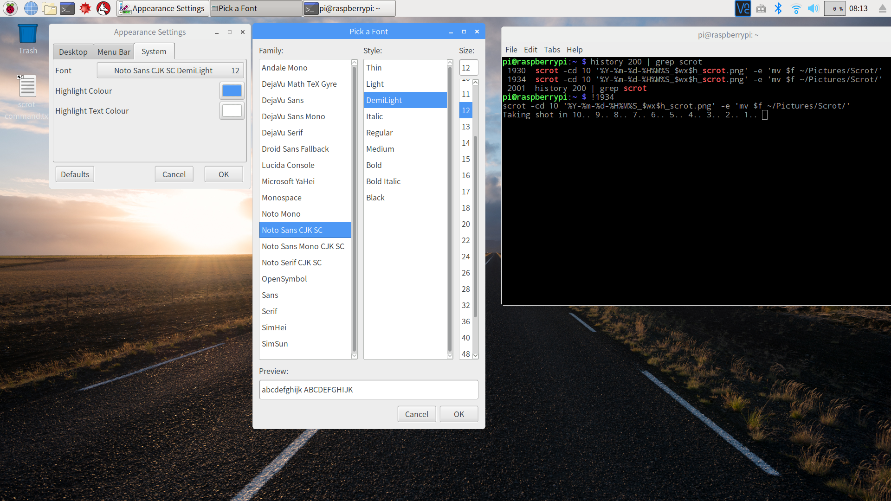
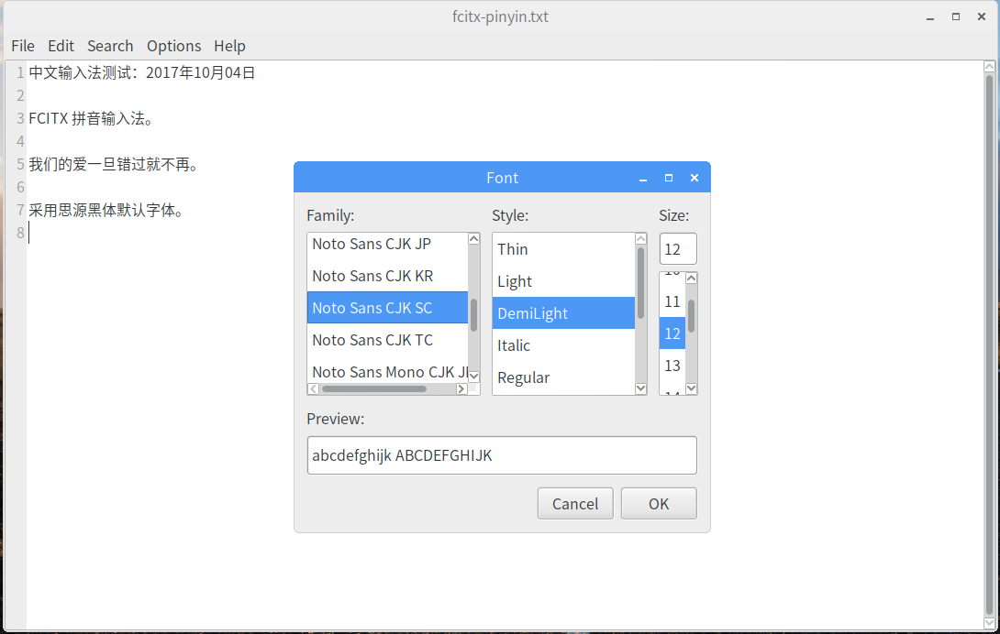

raspbian stretch 默认安装了 [Noto](https://packages.debian.org/stretch/fonts-noto) Mono 字体，本文记录了安装思源黑体（Google Noto CJK）完整版（All-in-one super OTC）的步骤。

## about Google Noto
> Beautiful and free fonts for all languages

### [思源黑体](http://blog.typekit.com/alternate/source-han-sans-chs/)（[Noto Sans CJK & Source Han Sans](http://acrossbeta.blogspot.com/2014/09/blog-post_8.html)）
思源黑体（Noto Sans CJK/Source Han Sans） 是 Google 和 Adobe 在 2014 年联合发布的供桌面使用的开源 Pan-CJK 字体家族。  
其中 CJK 为中文（Chinese）、日文（Japanese）和韩文（Korean）的缩写，完美支持日文、韩文、繁体中文和简体中文。

该项目的规模在 CJK 领域应该也是史无前例的：它由 Google 委托 Adobe，并联合日本 Iwata（主要负责字符集扩充）、中国常州华文（SinoType，主要负责字形的中国大陆标准与台湾「国字标准字体」本地化）、韩国 Sandoll（主要负责韩文设计）共同完成。

- Google 将其纳入 **Noto** pan-Unicode 字体家族，推出的这一字体系列称为 `Noto Sans CJK`；  
- Adobe 则把它包含进了自家的 **Source Sans** 家族，推出的这一字体系统称为 `Source Han Sans`。 

思源黑体是重心置中、字面稍大的现代黑体。它空间取向均称，以一般用家们耳熟能详的字体去比喻，则可以归类成兰亭黑、俪黑一类**中宫外放**。

思源黑体与「黑体－简」走相反路线，给人感觉较轻松友善，或许是当今质量最高的现代开源汉字字体。

> [思源黑体的各个版本有什么不同](https://www.zhihu.com/question/24639343)  
> [Source Han Sans 与 Noto Sans 的区别](https://qdan.me/list/VLPe5sfsxkFWYMmX)  

### [Google Noto Fonts](https://www.google.com/get/noto/) - [S Chinese](https://www.google.com/get/noto/help/cjk/) / [Noto-Sans-CJK-SC](https://noto-website-2.storage.googleapis.com/pkgs/NotoSansCJKsc-hinted.zip)
就英文名（Noto Sans CJK、Source Han Sans）来看：Google 原来就有 Noto 字形计划，目的就是要消灭豆腐块（[tofu](http://www.1001fonts.com/noto-serif-font.html)，是指文章因为缺字出现如豆腐方块的情形）。所谓 Noto 其实就是 No Tofu（没豆腐）的意思。


Google 方面的需求是制作一款覆盖四个 CJK locale 的 pan-CJK 字体，与 Noto 搭配用于 Chrome OS 等场合。

Google 要求该字体与其 Roboto 和 Noto Sans 字体家族完美配合，Web 网页端使用较多。

### [Adobe Category: Noto Sans](http://blogs.adobe.com/conversations/tag/noto-sans) -  [Source Han Sans](https://github.com/adobe-fonts/source-han-sans)

> [AN OPEN SOURCE PAN-CJK TYPEFACE](http://blogs.adobe.com/conversations/2014/07/introducing-source-han-sans-an-open-source-pan-cjk-typeface.html)  
> [Adobe TypeKit](https://typekit.com/fonts?licenses=desktop&sort=newest)  

至于 Adobe 自己的 Source Sans Pro，是一个开放的多功能字型家族，Source Han Sans 开发过程中也纳入 Source Sans 的拉丁文字符、希腊文和斯拉夫文字符。

Adobe Source Han Sans 发布版字符比较完备，建议用作桌面端显示字体。

## install Google Noto
### TrueType & OpenType
TrueType 字体主要分为两大类：

- TrueType format with TrueType outline(`*.ttf`, `*.ttc`)；  
- TrueType format with PS outline(CFF)(`*.otf`) 或称为 CFF OpenType font。  

OpenType 标准定义了文件名称的后缀名：

1. 包含 TureType 字体的 OpenType 文件后缀名为 `.ttf`；  
2. 如果是包含一系列 TrueType 字体的字体包文件，那么后缀名为 `.ttc`；  

	> 参见 [Noto CJK](https://www.google.com/get/noto/help/cjk/) 的 Super OpenType/CFF Collection (Super OTC) 以及 OpenType/CFF Collection (OTC)。

3. 包含 PostScript 字体的文件后缀名为 `.otf`  。

	> 参见 [Noto CJK](https://www.google.com/get/noto/help/cjk/) 的 Language-specific OpenType/CFF (OTF) 以及 Region-specific Subset OpenType/CFF (Subset OTF)。

关于 [Noto CJK](https://www.google.com/get/noto/help/cjk/) 的选择安装，可参考 Recommended use flow chart:


根据上图，raspbian 应该下载安装 Subset OTF。

这里下载包含 CJK 完整字体库的 All-in-one super OTC：无衬线字体库 `NotoSansCJK.ttc` 和 衬线字体库  `NotoSerifCJK.ttc`。当然也可选择下载 adobe 提供的更完备的 `SourceHanSans.ttc` 字体库。

如果嫌 All-in-one super OTC 字体包太大下载较慢，可只下载简体中文（SC，Simple Chinese）单一版本的 ttf 字体包：

 - Noto Sans CJK SC：无衬线字体  
 - Noto Sans Mono CJK SC：无衬线等宽字体  
 - Noto Serif CJK SC：衬线字体  

> [Android 7 添加全套字重的 Noto Sans CJK](https://zhuanlan.zhihu.com/p/25027320)  
> [配置 fontconfig 使 Noto CJK 中文字体不会被显示为日文字型？](https://www.zhihu.com/question/47141667)  

### install
假设 无衬线字体库 `NotoSansCJK.ttc` 和 衬线字体库  `NotoSerifCJK.ttc` 被下载存放在目录`~/Downloads/` 。

```Shell
pi@raspberrypi:~$ cd /usr/share/fonts
pi@raspberrypi:/usr/share/fonts$ sudo mkdir Noto
pi@raspberrypi:/usr/share/fonts$ sudo cp ~/Downloads/*.ttc ./Noto/
pi@raspberrypi:/usr/share/fonts$ ls Noto/
NotoSansCJK.ttc  NotoSerifCJK.ttc
pi@raspberrypi:/usr/share/fonts$ cd Noto/
pi@raspberrypi:/usr/share/fonts/Noto$ sudo chmod 555 ./*
pi@raspberrypi:/usr/share/fonts/Noto$ sudo mkfontscale
pi@raspberrypi:/usr/share/fonts/Noto$ sudo mkfontdir
pi@raspberrypi:/usr/share/fonts/Noto$ sudo fc-cache -fv
/usr/share/fonts/Noto: caching, new cache contents: 0 fonts, 5 dirs
/usr/share/fonts/Noto: caching, new cache contents: 64 fonts, 0 dirs
```

- `sudo chmod 555`：修改每个字体文件的权限为 `-r-x`（可读可执行），使所有用户都能使用该字体。  
- `sudo fc-cache -fv`：建立字体信息缓存。  

最好将 `NotoSansCJK.ttc` 和 `NotoSerifCJK.ttc` 拷贝到既有目录 `/usr/share/fonts/truetype/noto/` 下！

> [在樹莓派上安裝中文字型](http://studyraspberrypi.blogspot.com/2015/12/install-chinese-fonts.html)  
> [**Ubuntu Linux 安装文泉驿微米黑教程**](http://babybandf.blog.163.com/blog/static/6199353201051210729446/)  
> [Try Debian with Raspberry Pi Desktop](http://oppekepe.org/date/2017/08)  
> [Debian下使用google的noto字体](http://mosir.org/html/y2014/201.html)  

## install MSYaHei&PingFang
一种最简单的方法是，在 Windows 或 macOS 中找到微软雅黑字体的 *.ttf 文件，将其拷贝到 `/usr/local/share/fonts` 目录下，然后运行 `sudo fc-cache` 即可安装。

通过 scp 命令将 macOS 中部分 Microsoft 经典字体 仿宋、雅黑、中易黑体、中易宋体 拷贝到 raspbian 的 `~/Downloads/` 目录下：

```Shell
faner@THOMASFAN-MB0:~|⇒  scp Microsoft/SimSun.ttf Microsoft/Fangsong.ttf Microsoft/SimHei.ttf Microsoft/Microsoft\ Yahei.ttf pi@192.168.1.128:Downloads
```

通过 scp 命令将 macOS 中经典字体 PingFang、LucidaGrande、Gill Sans、Georgia、[SF-UI](https://www.free-fonts.com/sfui-text) 拷贝到 raspbian 的 `~/Downloads/` 目录下：

```Shell
faner@THOMASFAN-MB0:~|⇒  scp PingFang.ttc LucidaGrande.ttc GillSans.ttc Georgia*.ttf ~SF-UI-Display-*.otf ~SF-UI-Text-*.otf pi@192.168.1.128:Downloads
```

将 仿宋、雅黑、中易黑体、中易宋体 字体文件从 `~/Downloads/` 目录下移动到  `/usr/share/fonts/truetype/microsoft/` 目录下，并修改其下所有字体权限为 755（-rwxr-xr-x）：

```Shell
pi@raspberrypi:~$ sudo mkdir -p /usr/share/fonts/truetype/microsoft
pi@raspberrypi:~/Downloads$ sudo mv SimSun.ttf Fangsong.ttf SimHei.ttf Microsoft\ Yahei.ttf /usr/share/fonts/truetype/microsoft
pi@raspberrypi:~/Downloads$ sudo chmod 755 /usr/share/fonts/truetype/microsoft/*
```

将 PingFang、LucidaGrande、Gill Sans、Georgia、SF-UI 字体文件从 `~/Downloads/` 目录下移动到  `/usr/share/fonts/truetype/mac/` 目录下，并修改其下所有字体权限为 755（-rwxr-xr-x）：

```
pi@raspberrypi:~$ sudo mkdir -p /usr/share/fonts/truetype/mac
pi@raspberrypi:~/Downloads$ sudo mv PingFang.ttc LucidaGrande.ttc GillSans.ttc Georgia*.ttf SF-UI-Display-*.otf SF-UI-Text-*.otf /usr/share/fonts/truetype/mac
# 修改 mac/ 下所有字体权限为 -rwxr-xr-x
pi@raspberrypi:~/Downloads$ sudo chmod 755 /usr/share/fonts/truetype/mac/*
```

重建字体索引信息，更新字体缓存：

```Shell
pi@raspberrypi:~/Downloads$ sudo mkfontscale
pi@raspberrypi:~/Downloads$ sudo mkfontdir
pi@raspberrypi:~/Downloads$ sudo fc-cache -fv
```

> [为Debian添加微软雅黑字体](http://www.linuxdiyf.com/viewarticle.php?id=103070)  
> [Ubuntu安装微软雅黑](http://inewup.com/ubuntu-install-microsoft-yahei.html)  

## Change Fonts
### Appearance System Font
raspbian 默认系统字体为 12 号 Piboto Light 字体，无法显示中文。

打开 Preferences | Apperance Settings | System，修改系统字体为思源黑体 Noto Sans CJK SC | [DemiLight/Normal](https://www.zhihu.com/question/24607502) | 12。



建议采用 PingFang SC | Regular | 12 替换 Noto Sans CJK SC | DemiLight | 12  作为 raspbian 系统字体。

### Terminal font
LXTerminal | Edit | Preferences | Style | Terminal font 将字体从 Noto Mono 11 修改为 Noto Sans Mono CJK SC | Regular | 12。


根据实际显示效果，建议采用 Noto Mono | Regular | 12 字体作为终端字体。

### Leafpad Font
Leafpad | Options | Font 将 Leafpad 文本编辑器的字体从 Monospace | Regular | 12 调整为系统字体：Noto Sans CJK SC | DemiLight | 12。



可将 SF UI Text | Regular | 13 替换 Noto Sans CJK SC | DemiLight | 12  作为 Leafpad 的字体。

### Chrome Font
Chrome 浏览器字体 font size 默认 16，调整最小为 12。

- Standard font：WenQuanYi Micro Hei Mono -> Noto Sans CJK SC，可修改为 PingFang SC；  
- Serif font：DejaVu Serif -> Noto Serif CJK SC；  
- Sans-serif font：Noto Mono →  Noto Sans CJK SC；  
- Fixed-width font：Monospace → Noto Sans Mono CJK SC；  


