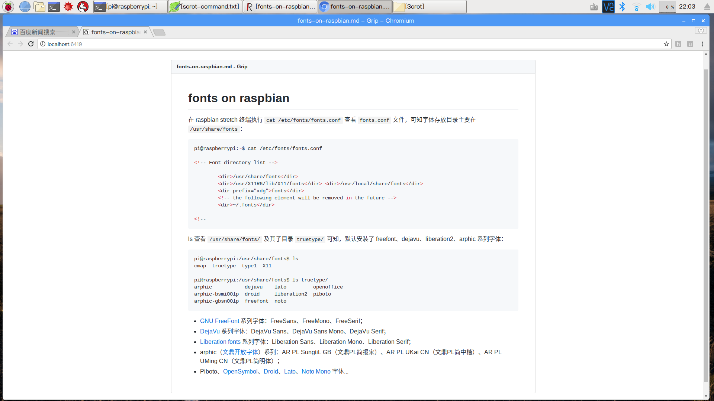
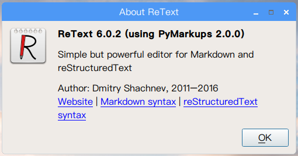
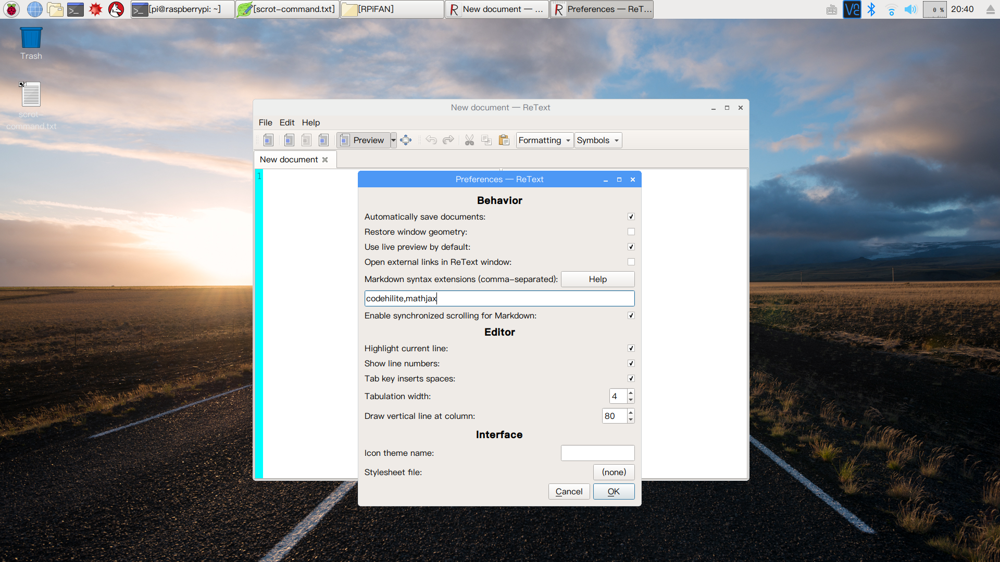
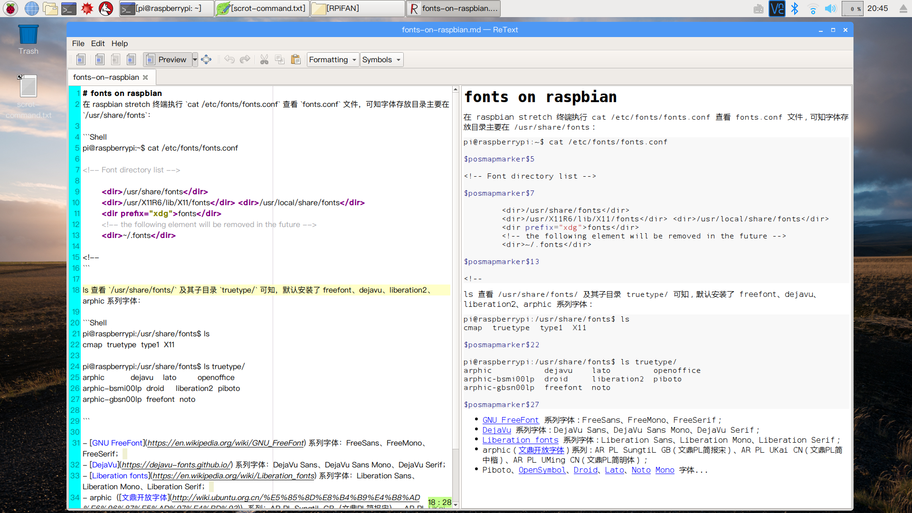

# [开源 Markdown 编辑器](http://blog.csdn.net/linuxprobe2017/article/details/72859240)
debian - markdown (1.0.1-9) - [Text-to-HTML conversion tool](https://packages.debian.org/sid/markdown)  

## SoC & OS

- **SoC**：`Raspberry Pi 3 Model B v1.2`(2015)  
- **OS**：`2017-09-07-raspbian-stretch.zip`  

```Shell
pi@raspberrypi:~ $ cat /proc/version
Linux version 4.9.41-v7+ (dc4@dc4-XPS13-9333) (gcc version 4.9.3 (crosstool-NG crosstool-ng-1.22.0-88-g8460611) ) #1023 SMP Tue Aug 8 16:00:15 BST 2017

pi@raspberrypi:~ $ lsb_release -a
No LSB modules are available.
Distributor ID:	Raspbian
Description:	Raspbian GNU/Linux 9.1 (stretch)
Release:	9.1
Codename:	stretch
```

### apt-cache search markdown

执行 `apt-cache search markdown` 命令模糊匹配搜索 debian 软件源本地索引列表中 markdown 相关的软件包。
以下为 markdown parser/converter/render 相关的工具包：

```Shell
pi@raspberrypi:~/Projects/retext$ apt-cache search markdown
...

cmark - CommonMark parsing and rendering program
discount - implementation of the Markdown markup language in C

grip - Preview GitHub Markdown files like Readme locally

libghc-cmark-dev - fast, accurate CommonMark (Markdown) parser and renderer
libghc-pandoc-dev - general markup converter - libraries

libmarkdown2 - implementation of the Markdown markup language in C (library)
libmarkdown2-dev - implementation of the Markdown markup language in C (dev files)

lua-discount - Discount library for the Lua language

markdown - Text-to-HTML conversion tool
mdpress - creation of Impress.js slideshows with Markdown
mmark - Markdown processor in Go geared for the IETF (executable)

pandoc - general markup converter
pandoc-data - general markup converter - data files

python-commonmark-bkrs - Python parser for the CommonMark Markdown spec -- Python
python-html2text - Python module for converting HTML to Markdown text
python-landslide - Lightweight markup language-based html5 slideshow generator
python-markdown - text-to-HTML conversion library/tool (Python 2 version)
python-mistune - Markdown parser for Python 2
python-pandocfilters - python bindings for Pandoc's filters

python3-commonmark-bkrs - Python parser for the CommonMark Markdown spec -- Python 3
python3-html2text - Python module for converting HTML to Markdown text (Python3 version)
python3-markdown - text-to-HTML conversion library/tool (Python 3 version)
python3-mistune - Markdown parser for Python 3
python3-pandocfilters - python3 bindings for Pandoc's filters

retext - Simple text editor for Markdown and reStructuredText

ruby-github-markdown - Markdown parser for GitHub.com
ruby-github-markup - GitHub Markup rendering

ruby-kramdown - Fast, pure-Ruby Markdown-superset converter
ruby-maruku - Markdown-superset interpreter written in Ruby

ruby-rdiscount - Discount Markdown Processor for Ruby
ruby-redcarpet - Fast, safe and extensible Markdown to (X)HTML parser for Ruby

ruby-task-list - GitHub-flavored-Markdown TaskList components

...
```

> 如果执行 `aptitude search markdown` 命令，将只搜索包含匹配。

- 执行 `apt-cache showpkg markdown` 可查看 markdown 软件源信息；  
- 执行 `apt-cache show markdown` 可查看 markdown 安装包信息；  
- 执行 `apt-cache showsrc markdown` 可查看 markdown 源代码信息；  
- 执行 `apt-cache depends markdown` 命令可查看 markdown 软件包依赖关系；  
- 执行 `apt-cache rdepends markdown` 命令可查看 markdown 软件包被依赖关系；  

## [cmark](https://github.com/jgm/cmark)
cmark - CommonMark parsing and rendering program

```Shell
pi@raspberrypi:~$ apt-cache depends cmark
cmark
  Depends: libc6
```

可学习C语言解析 markup 标记语言。

## [markdown](http://daringfireball.net/projects/markdown/)
markdown - Text-to-HTML conversion tool

```Shell
pi@raspberrypi:~$ apt-cache depends markdown
markdown
  Depends: perl
```

raspbian stretch 默认已安装 perl v5.24.1：

```Shell
pi@raspberrypi:~$ perl -v

This is perl 5, version 24, subversion 1 (v5.24.1) built for arm-linux-gnueabihf-thread-multi-64t
(with 75 registered patches, see perl -V for more detail)

Copyright 1987-2017, Larry Wall

Perl may be copied only under the terms of either the Artistic License or the
GNU General Public License, which may be found in the Perl 5 source kit.

Complete documentation for Perl, including FAQ lists, should be found on
this system using "man perl" or "perldoc perl".  If you have access to the
Internet, point your browser at http://www.perl.org/, the Perl Home Page.

```

markdown 基础语法渲染（不支持 GFM 扩展语法），有较多 Reverse Depends，建议安装。

以下命令将 fonts-on-raspbian.md 转换为 fonts-on-raspbian.html 文件：

```Shell
pi@raspberrypi:~/Documents/RPiFAN$ markdown fonts-on-raspbian.md > fonts-on-raspbian.html
```

## [pandoc](http://pandoc.org/)
pandoc - general markup converter  
pandoc-data - general markup converter - data files  
python-pandocfilters - python bindings for Pandoc's filters  
python3-pandocfilters - python3 bindings for Pandoc's filters  

```Shell
pi@raspberrypi:~$ apt-cache depends pandoc
pandoc
  Depends: libc6
  Depends: libffi6
  Depends: libgmp10
  Depends: liblua5.1-0
  Depends: libluajit-5.1-2
  Depends: libpcre3
  Depends: libyaml-0-2
  Depends: zlib1g
  Depends: pandoc-data
  Depends: pandoc-data
  Suggests: texlive-latex-recommended
  Suggests: texlive-xetex
  Suggests: texlive-luatex
  Suggests: pandoc-citeproc
  Suggests: texlive-latex-extra
  Suggests: wkhtmltopdf
```

文档转换支持格式丰富，建议安装 pandoc 及其必要 Suggests 以及 python3-pandocfilters。

执行以下命令可将 markdown 文件转换为 html 文件：

```Shell
pi@raspberrypi:~/Documents/RPiFAN$ pandoc fonts-on-raspbian.md -o fonts-on-raspbian.html -c Github.css
```

> [Pandoc Tricks](https://github.com/jgm/pandoc/wiki/Pandoc-Tricks)  
> [Pandoc Extras](https://github.com/jgm/pandoc/wiki/Pandoc-Extras)  
> [神器Pandoc的安装与使用](http://zhouyichu.com/misc/Pandoc.html)  
> [Markdown写作进阶：Pandoc入门浅谈](http://www.yangzhiping.com/tech/pandoc.html)  
> [Markdown+Pandoc，打通写作界的任督二脉！](http://blog.csdn.net/duqi_yc/article/details/8974041)  

## [python-markdown](https://github.com/waylan/Python-Markdown)
python-markdown - text-to-HTML conversion library/tool (Python 2 version)  
python3-markdown - text-to-HTML conversion library/tool (Python 3 version)  

```Shell
pi@raspberrypi:~$ apt-cache depends python-markdown
python-markdown
  Depends: <python:any>
    python
  Depends: <python:any>
    python
  Recommends: python-pygments
  Recommends: python-yaml
  Suggests: python-markdown-doc

pi@raspberrypi:~$ apt-cache depends python3-markdown
python3-markdown
  Depends: <python3:any>
    python3
  Recommends: python3-pygments
  Recommends: python3-yaml
  Suggests: python-markdown-doc
```

raspbian stretch 上已经安装了 Python 2.7.13 和 Python 3.5.3：

```Shell
pi@raspberrypi:~$ python2 --version
Python 2.7.13

pi@raspberrypi:~$ python3 --version
Python 3.5.3
```

安装 python3-markdown 时将自动安装 Recommends，建议安装 Suggests；可选安装字体 ttf-bitstream-vera（可用 DejaVu Sans Mono 替换）。

> [python的markdown扩展开发](http://blog.csdn.net/five3/article/details/18010021)  
> [Python-Markdown Extra](https://pythonhosted.org/Markdown/extensions/extra.html)  
> [通过Python-markdown](http://blog.csdn.net/lyt_44/article/details/38614999) [将markdown转换成html](https://segmentfault.com/a/1190000008993413)  
> [Python 3 实现 Markdown 解析器](https://zhuanlan.zhihu.com/p/24489554)  

### [grip](https://github.com/joeyespo/grip)
grip - Preview GitHub Markdown files like Readme locally

```Shell
pi@raspberrypi:~$ apt-cache depends grip
grip
  Depends: python3-docopt
  Depends: python3-flask
  Depends: python3-markdown
  Depends: python3-path-and-address
  Depends: python3-pygments
  Depends: python3-requests
  Depends: <python3:any>
    python3
```

Usage：`grip [options] [<path>] [<address>]`

grip 后接 markdown 文件，即可开启本地 HTTP 服务，在浏览器中输入 `http://localhost:6419/` 即可查看 live preview。  
如果携带 -b(--browser) 参数，则自动在浏览器中新建tab页打开预览会话。  

```Shell
pi@raspberrypi:~ $ grip -b  Documents/RPiFAN/fonts-on-raspbian.md
 * Running on http://localhost:6419/ (Press CTRL+C to quit)
Created new window in existing browser session.
127.0.0.1 - - [07/Oct/2017 22:01:22] "GET / HTTP/1.1" 200 -
^C * Shutting down...
127.0.0.1 - - [07/Oct/2017 22:02:06] "GET /__/grip/refresh/ HTTP/1.1" 200 -

```



### [ReText](https://github.com/retext-project/retext)
> [Retext Download for Linux (deb, rpm, xz, all, any, noarch)](https://pkgs.org/download/retext)  
> [Linux下编辑转换Markdown](http://www.cnblogs.com/HectorHou/p/6113214.html)  

```Shell
pi@raspberrypi:~/Projects/retext$ apt-cache search retext
retext - Simple text editor for Markdown and reStructuredText

pi@raspberrypi:~$ apt-cache depends retext
retext
  Depends: python3-markups
  Depends: python3-pyqt5
  Depends: python3-pyqt5.qtwebkit
  Depends: python3-docutils
  Depends: python3-enchant
  Depends: python3-markdown
  Depends: python3-pygments
  Depends: <python3:any>
    python3
  Breaks: <retext-wpgen>
  Recommends: docutils-common
  Recommends: shared-mime-info
  Suggests: adwaita-icon-theme
  Suggests: gir1.2-glib-2.0
  Suggests: gsettings-desktop-schemas
  Replaces: <retext-wpgen>

```

从 github clone 源码执行 `setup.py` 脚本安装或通过 `sudo apt-get install retext` 命令安装。



#### Edit
change editor font：PingFang SC Regular  
change preview font：DejaVu Sans Mono Book  

##### Preferences
- Behavior

- [x] Automatically save documents  
- [x] Use live preview by default  

- Markdown syntax extensions: codehilite,mathjax

	- 安装 python3-markdown 时已经顺带安装上了 Recommends 的包 `python3-pygments` 和 `python3-yaml`，支持 YAML 语法高亮。  
	- 下载安装 `libjs-mathjax` 可支持 MathJax 数学公式渲染。  

- [x] Enable synchronized scrolling for Markdown(default)  

- Editor

- [x] Highlight current line  
- [x] Show line numbers  
- [x] Tab key inserts spaces(default)  

Tabulation width: 4  
Draw vertical line at Column: 80  





##### ReText.conf
> [Retext安装、样式配置及语法扩展](http://blog.csdn.net/yong_gao/article/details/50155305)  
> [给Retext进行配置：语法高亮、数学公式、自定义样式](http://www.cnblogs.com/lomper/p/4418269.html)  

查看 ReText 配置文件：`.config/ReText project/ReText.conf`

```Shell
pi@raspberrypi:~$ cat .config/ReText\ project/ReText.conf
[General]
autoSave=true
editorFont=PingFang SC
editorFontSize=12
font=DejaVu Sans Mono
fontSize=12
highlightCurrentLine=true
lineNumbersEnabled=true
livePreviewByDefault=true
recentFileList=/home/pi/Documents/RPiFAN/fonts-on-raspbian.md
rightMargin=80
```

可设置 CSS 样式：styleSheet=path/[github.css](https://github.com/nicolashery/markdownpad-github/blob/master/markdownpad-github.css)

## misc.etc
### [discount](http://www.pell.portland.or.us/~orc/Code/discount/)
discount - implementation of the Markdown markup language in C

```Shell
pi@raspberrypi:~$ apt-cache depends discount
discount
  Depends: libc6
  Depends: libmarkdown2
  Conflicts: libtext-markdown-perl
  Conflicts: markdown
```

不能和 libtext-markdown-perl、markdown 同时安装。

### ruby-github-markdown
ruby-github-markdown - Markdown parser for GitHub.com
ruby-github-markup - GitHub Markup rendering

### [Remarkable](https://remarkableapp.github.io/)
[Download](https://remarkableapp.github.io/linux/download.html)

```Shell
pi@raspberrypi:~/Projects/retext$ apt-cache search remarkable
hevea - translates from LaTeX to HTML, info, or text
ruby-samuel - automatic logger for HTTP requests in Ruby
```

未搜索到，可能暂无支持 ARM 架构。
