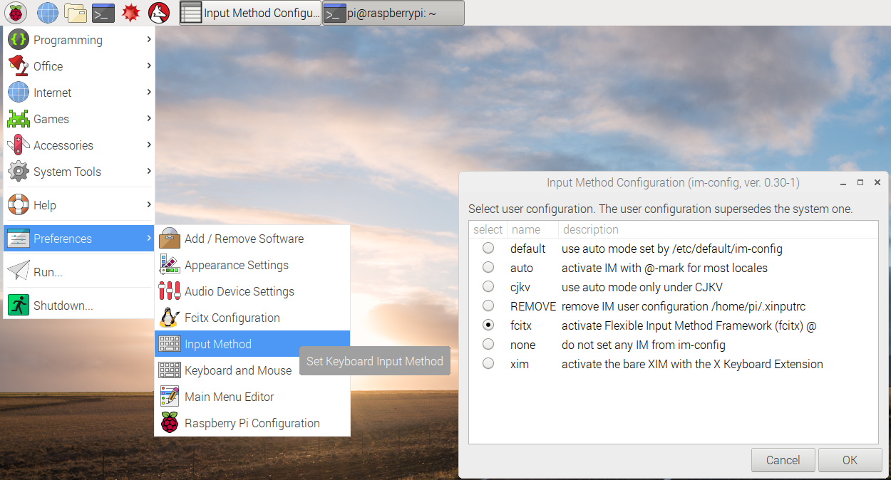
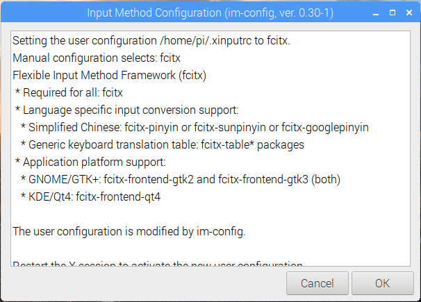
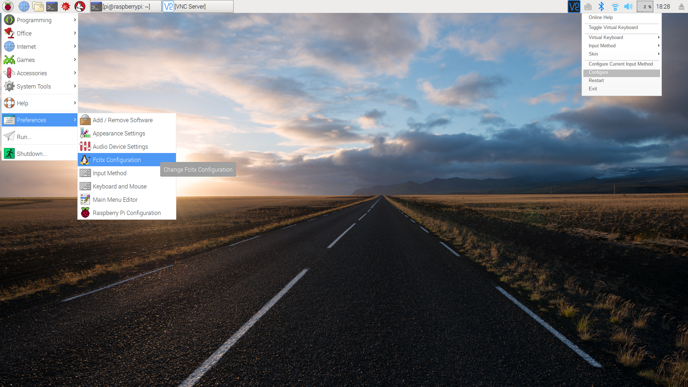
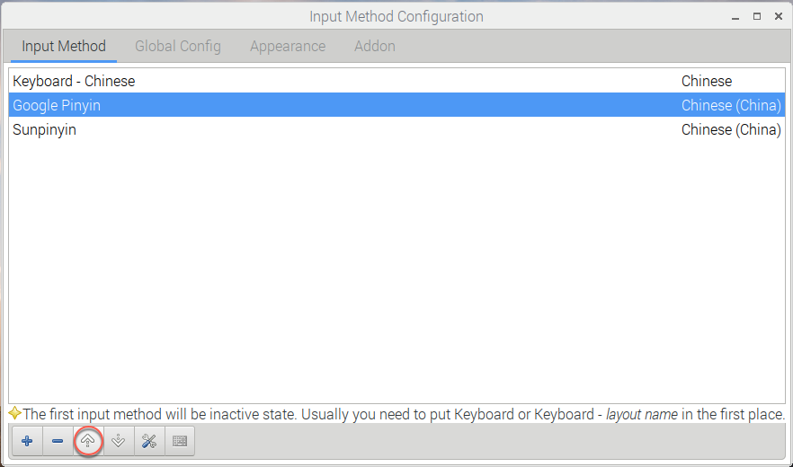
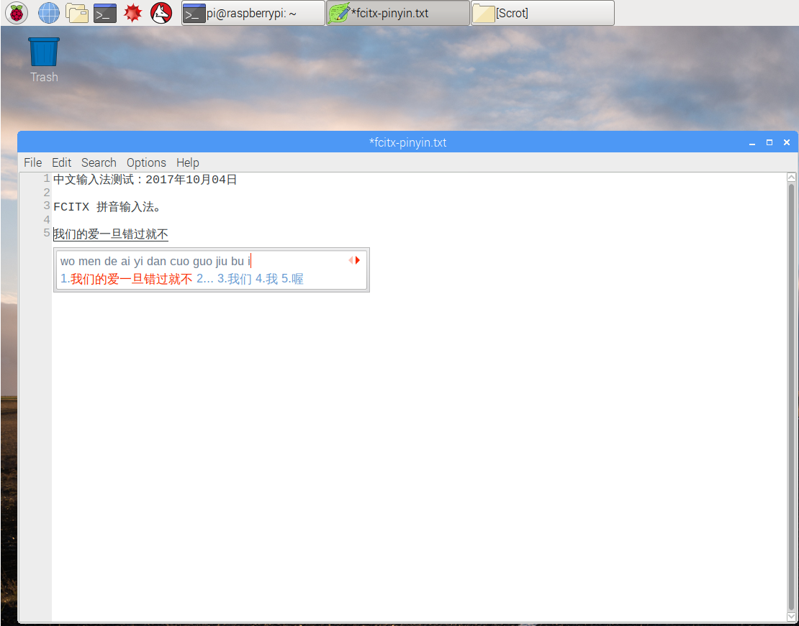

> [Debian下安装Google中文输入法](http://blog.csdn.net/tiewen/article/details/39432327)  

## SoC & OS

- **SoC**：`Raspberry Pi 3 Model B v1.2`(2015)  
- **OS**：`2017-09-07-raspbian-stretch.zip`

```Shell
pi@raspberrypi:~ $ cat /proc/version
Linux version 4.9.41-v7+ (dc4@dc4-XPS13-9333) (gcc version 4.9.3 (crosstool-NG crosstool-ng-1.22.0-88-g8460611) ) #1023 SMP Tue Aug 8 16:00:15 BST 2017

pi@raspberrypi:~ $ lsb_release -a
No LSB modules are available.
Distributor ID:	Raspbian
Description:	Raspbian GNU/Linux 9.1 (stretch)
Release:	9.1
Codename:	stretch
```

## [scim](https://en.wikipedia.org/wiki/Smart_Common_Input_Method)
安装 scim 及拼音输入法：

```Shell
sudo apt-get install scim
sudo apt-get install scim-pinyin
```

如需加装五笔输入法：

```Shell
sudo apt-get install scim-tables-zh
```

## [fcitx](https://fcitx-im.org/wiki/Fcitx)
[Raspbian系统中文化](http://www.guokr.com/post/520901/) 建议使用 [fcitx](https://en.wikipedia.org/wiki/Fcitx)（小企鹅输入法）。

安装 fcitx 及拼音和五笔：

```Shell
sudo apt-get install fcitx
```

### Google拼音输入法
> [给树莓派安装中文输入法Fcitx及Google拼音输入法](http://shumeipai.nxez.com/2015/03/11/raspberry-pi-to-install-chinese-input-method-fcitx-and-google-pinyin-ime.html)  

执行 `apt-cache search fcitx*` 查询 fcitx 相关的软件安装包，过滤出 pinyin 相关的工具包：

```Shell

fcitx-googlepinyin - Fcitx wrapper for Google Pinyin IM engine
fcitx-libpinyin - Fcitx wrapper for libpinyin
fcitx-module-cloudpinyin - Flexible Input Method Framework - cloudpinyin module
fcitx-pinyin - Flexible Input Method Framework - classic Pinyin engine
fcitx-sunpinyin - fcitx wrapper for Sunpinyin IM engine
fcitx-table-wbpy - Flexible Input Method Framework - WubiPinyin table
sunpinyin-utils - Simplified Chinese Input Method from SUN (utilities)

```

执行以下命令安装 googlepinyin、cloudpinyin 和 [sunpinyin](https://launchpad.net/ubuntu/+source/sunpinyin)：

```Shell
sudo apt-get install fcitx-googlepinyin fcitx-module-cloudpinyin fcitx-sunpinyin
```

1. 通过 Preferences | Input Method 打开 Input Method Configuration，选择 fcitx 框架：

	> 

2. 点击 [OK] 确认：

	> 

3. 通过 Preferences | Fcitx Configuration 打开 Fcitx Configuration：

	> 

4. 在 Fcitx Configuration 的 Input Method Configuration 页面中将 Google Pinyin 提到 Sunpinyin 前面：

	> 

5. 通过 ctrl+shift 切换输入法：

	> 

### [搜狗输入法 for Linux](http://pinyin.sogou.com/linux/)
>  [ubuntu 通过 fcitx 安装搜狗输入法](http://7071976.blog.51cto.com/7061976/1243471)  
> [Debian8下通过 fcitx 安装搜狗输入法](http://blog.csdn.net/cgniao/article/details/50272153)  
> [Debian8.2 安装搜狗输入法](http://www.cnblogs.com/ligongzi/p/6137601.html)  
> [ubuntu16.04安装搜狗拼音](http://blog.csdn.net/haohaojian/article/details/54588522)  
> [debian9 安装搜狗拼音输入法](http://blog.csdn.net/zage2012/article/details/74669799)  
> [Linux安装搜狗拼音和谷歌拼音输入法](http://www.sohu.com/a/130138662_285379)  

搜狗输入法 for Linux 官网目前只提供 intel/debian(ubuntu) 架构的安装包，尚未提供 arm/debian 安装包，因此 ARM 架构的 raspbian 系统暂时无法安装使用搜狗（拼音）输入法。  
根据[官方安装指南](http://pinyin.sogou.com/linux/help.php)，在  intel/debian(ubuntu)  下，先安装 fcitx，再安装 32位 的 `sogoupinyin_version_i386.deb` 或 64位 的  `sogoupinyin_version_amd64.deb` 即可。  