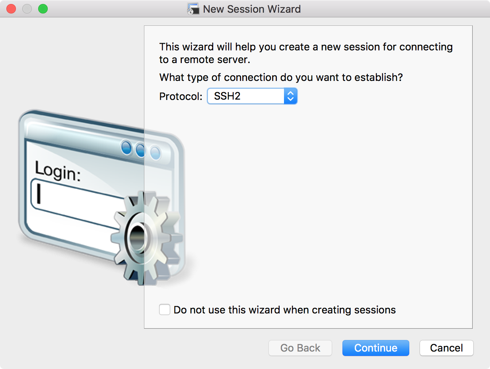
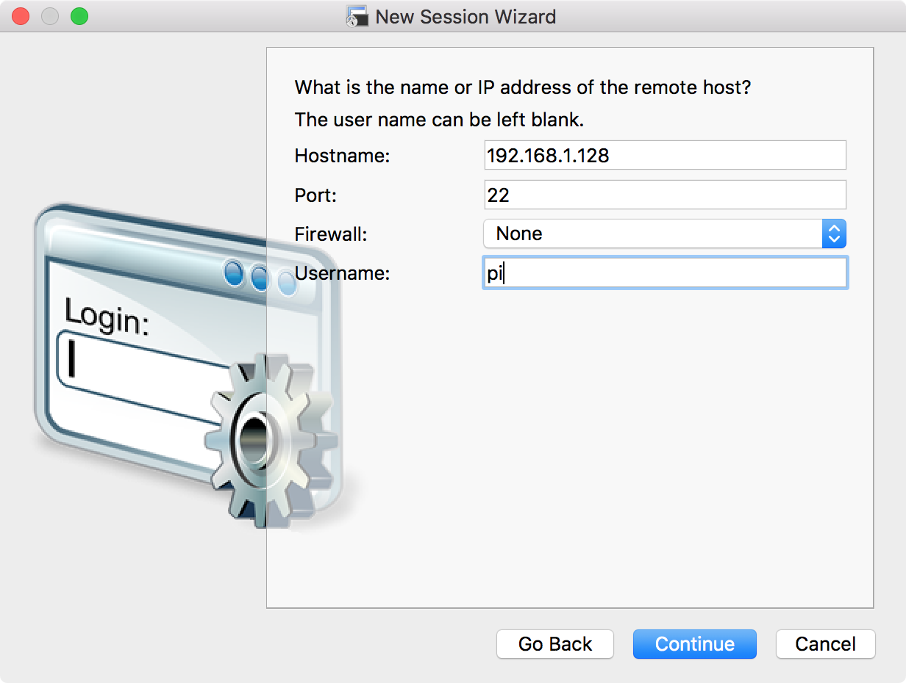
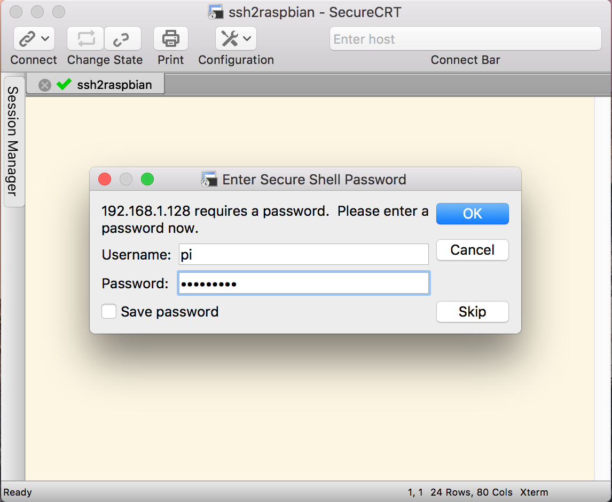
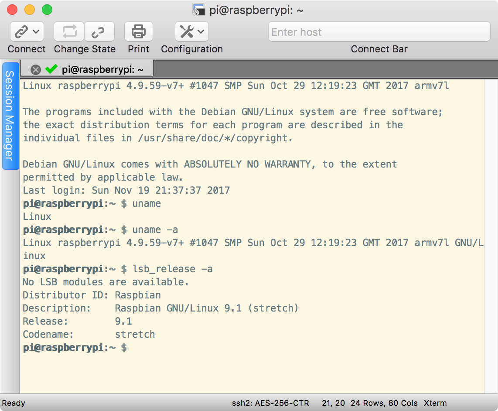

[SSH (SECURE SHELL)](https://www.raspberrypi.org/documentation/remote-access/ssh/README.md)  
[SSH USING LINUX OR MAC OS](https://www.raspberrypi.org/documentation/remote-access/ssh/unix.md)  
[SCP (SECURE COPY)](https://www.raspberrypi.org/documentation/remote-access/ssh/scp.md)  
[RSYNC](https://www.raspberrypi.org/documentation/remote-access/ssh/rsync.md)  

[Exit SSH session in OSX Terminal](https://superuser.com/questions/404103/exit-ssh-session-in-osx-terminal)  
[无屏幕和键盘配置树莓派WiFi和SSH](http://shumeipai.nxez.com/2017/09/13/raspberry-pi-network-configuration-before-boot.html?variant=zh-cn)  

## SoC & OS
- **Host**：MacBookPro11,3/macOS 10.12.6 (16G1023)/Darwin 16.7.0  

- **SoC**：`Raspberry Pi 3 Model B v1.2`(2015)  
- **OS**：`2017-09-07-raspbian-stretch.zip`  

```Shell
pi@raspberrypi:~ $ cat /proc/version
Linux version 4.9.41-v7+ (dc4@dc4-XPS13-9333) (gcc version 4.9.3 (crosstool-NG crosstool-ng-1.22.0-88-g8460611) ) #1023 SMP Tue Aug 8 16:00:15 BST 2017

pi@raspberrypi:~ $ lsb_release -a
No LSB modules are available.
Distributor ID:	Raspbian
Description:	Raspbian GNU/Linux 9.1 (stretch)
Release:	9.1
Codename:	stretch
```

## SSH
### OpenSSH
macOS 标配预装了开源免费的 [OpenSSH](http://www.openssh.com/) 命令行。

终端输入 `ssh -V` 可以查看 ssh 的版本：

```Shell
faner@THOMASFAN-MB0:~|⇒  ssh -V
OpenSSH_7.6p1, LibreSSL 2.6.2
```

终端输入 `ssh -h` 可以查看 ssh 的帮助：

```Shell
faner@THOMASFAN-MB0:~|⇒  ssh -h
ssh: illegal option -- h
usage: ssh [-46AaCfGgKkMNnqsTtVvXxYy] [-b bind_address] [-c cipher_spec]
           [-D [bind_address:]port] [-E log_file] [-e escape_char]
           [-F configfile] [-I pkcs11] [-i identity_file]
           [-J [user@]host[:port]] [-L address] [-l login_name] [-m mac_spec]
           [-O ctl_cmd] [-o option] [-p port] [-Q query_option] [-R address]
           [-S ctl_path] [-W host:port] [-w local_tun[:remote_tun]]
           [user@]hostname [command]
```

或输入 `man ssh` 查看更详细帮助手册：

```Shell
SSH(1)                    BSD General Commands Manual                   SSH(1)

NAME
     ssh -- OpenSSH SSH client (remote login program)

SYNOPSIS
     ssh [-46AaCfGgKkMNnqsTtVvXxYy] [-b bind_address] [-c cipher_spec]
         [-D [bind_address:]port] [-E log_file] [-e escape_char] [-F configfile]
         [-I pkcs11] [-i identity_file] [-J [user@]host[:port]] [-L address]
         [-l login_name] [-m mac_spec] [-O ctl_cmd] [-o option] [-p port]
         [-Q query_option] [-R address] [-S ctl_path] [-W host:port]
         [-w local_tun[:remote_tun]] [user@]hostname [command]
```

终端输入 `ssh pi@192.168.1.128`，即可尝试以 pi 的用户身份建立与主机 `192.168.1.128` 的连接。  
如果网络连接没问题，会提示输入 pi 用户的登录密码。若密码校验成功后，将打印连接成功信息。  

```Shell
faner@THOMASFAN-MB0:~|⇒  ssh pi@192.168.1.128
pi@192.168.1.128's password: 
Linux raspberrypi 4.9.59-v7+ #1047 SMP Sun Oct 29 12:19:23 GMT 2017 armv7l

The programs included with the Debian GNU/Linux system are free software;
the exact distribution terms for each program are described in the
individual files in /usr/share/doc/*/copyright.

Debian GNU/Linux comes with ABSOLUTELY NO WARRANTY, to the extent
permitted by applicable law.
Last login: Mon Nov 20 08:03:29 2017 from 192.168.1.106
pi@raspberrypi:~ $ uname -a
Linux raspberrypi 4.9.59-v7+ #1047 SMP Sun Oct 29 12:19:23 GMT 2017 armv7l GNU/Linux
pi@raspberrypi:~ $ lsb_release -a
No LSB modules are available.
Distributor ID:	Raspbian
Description:	Raspbian GNU/Linux 9.1 (stretch)
Release:	9.1
Codename:	stretch
pi@raspberrypi:~ $ exit
logout
Connection to 192.168.1.128 closed.
faner@THOMASFAN-MB0:~|⇒  
```

输入 `exit` 即可 logout 结束 SSH 会话连接。

### SecureCRT
在 SecureCRT 的 Session Manager 中点击 <kbd>+</kbd> 新建会话，打开 New Session Wizard：

1. 协议选择 `SSH2`：

	

2. 填写 `SSH2` 连接参数，**Hostname** 填写 raspbian 的 IP 地址，**端口**(port) 默认 22，**Username** 为登录用户名：

	

3. 填写登录用户名（Username）的密码，这里可以选择保存登录密码：

	

4. 成功连接上串口：

	

5. Session Manager 中会多出该会话：

	

## SCP
[SCP](http://blog.163.com/fjm_520/blog/static/18904914820119284847660/)：secure copy (remote file copy program) 是一个基于 SSH 安全协议的文件传输命令。

与 sftp 不同的是，它只提供主机间的文件传输功能，没有文件管理的功能。

1. 复制 local_file 到远程目录 remote_folder 下：

```Shell
scp local_file remote_user@host:remote_folder
```

2. 复制 local_folder 到远程 remote_folder（需要加参数 `-r` 递归）

```Shell
scp –r local_folder remote_user@host:remote_folder
```

以上命令反过来写就是从远程复制（下载）到本地。
