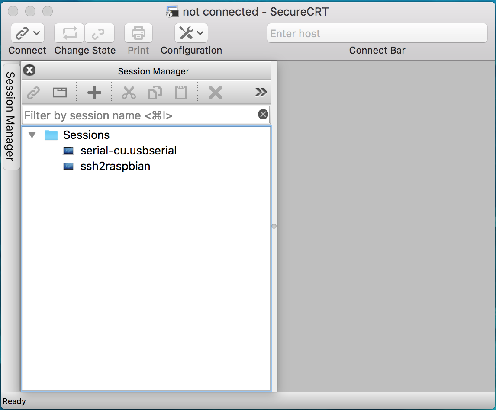

[SSH (SECURE SHELL)](https://www.raspberrypi.org/documentation/remote-access/ssh/README.md)  
[SSH USING LINUX OR MAC OS](https://www.raspberrypi.org/documentation/remote-access/ssh/unix.md)  
[SCP (SECURE COPY)](https://www.raspberrypi.org/documentation/remote-access/ssh/scp.md)  
[RSYNC](https://www.raspberrypi.org/documentation/remote-access/ssh/rsync.md)  

[Exit SSH session in OSX Terminal](https://superuser.com/questions/404103/exit-ssh-session-in-osx-terminal)  
[无屏幕和键盘配置树莓派WiFi和SSH](http://shumeipai.nxez.com/2017/09/13/raspberry-pi-network-configuration-before-boot.html?variant=zh-cn)  

## SoC & OS
- **Host**：MacBookPro11,3/macOS 10.12.6 (16G1023)/Darwin 16.7.0  

- **SoC**：`Raspberry Pi 3 Model B v1.2`(2015)  
- **OS**：`2017-09-07-raspbian-stretch.zip`  

```Shell
pi@raspberrypi:~ $ cat /proc/version
Linux version 4.9.41-v7+ (dc4@dc4-XPS13-9333) (gcc version 4.9.3 (crosstool-NG crosstool-ng-1.22.0-88-g8460611) ) #1023 SMP Tue Aug 8 16:00:15 BST 2017

pi@raspberrypi:~ $ lsb_release -a
No LSB modules are available.
Distributor ID:	Raspbian
Description:	Raspbian GNU/Linux 9.1 (stretch)
Release:	9.1
Codename:	stretch
```

## SSH
### OpenSSH
macOS 标配预装了开源免费的 [OpenSSH](http://www.openssh.com/) 命令行。

终端输入 `ssh -V` 可以查看 ssh 的版本：

```Shell
faner@THOMASFAN-MB0:~|⇒  ssh -V
OpenSSH_7.6p1, LibreSSL 2.6.2
```

终端输入 `ssh -h` 可以查看 ssh 的帮助：

```Shell
faner@THOMASFAN-MB0:~|⇒  ssh -h
ssh: illegal option -- h
usage: ssh [-46AaCfGgKkMNnqsTtVvXxYy] [-b bind_address] [-c cipher_spec]
           [-D [bind_address:]port] [-E log_file] [-e escape_char]
           [-F configfile] [-I pkcs11] [-i identity_file]
           [-J [user@]host[:port]] [-L address] [-l login_name] [-m mac_spec]
           [-O ctl_cmd] [-o option] [-p port] [-Q query_option] [-R address]
           [-S ctl_path] [-W host:port] [-w local_tun[:remote_tun]]
           [user@]hostname [command]
```

或输入 `man ssh` 查看更详细帮助手册：

```Shell
SSH(1)                    BSD General Commands Manual                   SSH(1)

NAME
     ssh -- OpenSSH SSH client (remote login program)

SYNOPSIS
     ssh [-46AaCfGgKkMNnqsTtVvXxYy] [-b bind_address] [-c cipher_spec]
         [-D [bind_address:]port] [-E log_file] [-e escape_char] [-F configfile]
         [-I pkcs11] [-i identity_file] [-J [user@]host[:port]] [-L address]
         [-l login_name] [-m mac_spec] [-O ctl_cmd] [-o option] [-p port]
         [-Q query_option] [-R address] [-S ctl_path] [-W host:port]
         [-w local_tun[:remote_tun]] [user@]hostname [command]
```

终端输入 `ssh pi@192.168.1.128`，即可尝试以 pi 的用户身份建立与主机 `192.168.1.128` 的连接。  
如果网络连接没问题，会提示输入 pi 用户的登录密码。若密码校验成功后，将打印连接成功信息。  

```Shell
faner@THOMASFAN-MB0:~|⇒  ssh pi@192.168.1.128
pi@192.168.1.128's password: 
Linux raspberrypi 4.9.59-v7+ #1047 SMP Sun Oct 29 12:19:23 GMT 2017 armv7l

The programs included with the Debian GNU/Linux system are free software;
the exact distribution terms for each program are described in the
individual files in /usr/share/doc/*/copyright.

Debian GNU/Linux comes with ABSOLUTELY NO WARRANTY, to the extent
permitted by applicable law.
Last login: Mon Nov 20 08:03:29 2017 from 192.168.1.106
pi@raspberrypi:~ $ uname -a
Linux raspberrypi 4.9.59-v7+ #1047 SMP Sun Oct 29 12:19:23 GMT 2017 armv7l GNU/Linux
pi@raspberrypi:~ $ lsb_release -a
No LSB modules are available.
Distributor ID:	Raspbian
Description:	Raspbian GNU/Linux 9.1 (stretch)
Release:	9.1
Codename:	stretch
pi@raspberrypi:~ $ exit
logout
Connection to 192.168.1.128 closed.
faner@THOMASFAN-MB0:~|⇒  
```

输入 `exit` 即可 logout 结束 SSH 会话连接。

#### mDNS
> [How (and Why) to Assign the .local Domain to Your Raspberry Pi](https://www.howtogeek.com/167190/how-and-why-to-assign-the-.local-domain-to-your-raspberry-pi/)  
> [Setting up a Bonjour (Zeroconf) service name for your Raspberry Pi and accessing it from an Android App](http://www.dodgycoder.net/2015/02/setting-up-bonjourzeroconfmdnsnsd.html)  

> [Turning on Bonjour](https://gist.github.com/stonehippo/5642771)  
> [Connecting to Raspberry Pi with Mac OS X](http://raspberry.znix.com/2013/03/connecting-to-raspberry-pi-with-mac-os-x.html)  
> [How to setup mDNS lookups on the Raspberry Pi](http://root42.blogspot.com/2015/02/how-to-setup-mdns-lookups-on-raspberry.html)  

如果没有为 raspbian 设置静态 IP 地址，可能每次输入 ssh 命令之前都要确认 raspbian 分配到的动态 IP 地址。可否像访问 web 网站那样，用户只需输入相对固定且简便易记的域名（Domain），然后由 DNS 解析出具体的 IP 地址，再进行具体的 TCP/IP 通信连接呢？ 

**mDNS**(Multicast Domain Name Service)  即是这样一种提供基于本地 DNS 解析的服务（local DNS resolution system），每台主机通常会对应一个本地局域网共享主机名（internal Sharing Local Hostname），类似 `hostname.local` 的域名结构形式。在访问局域网内的一些网络服务时，我们可以使用共享主机名来代替 IP 地址。

Microsoft 提供的 mDNS 服务框架为 *LLMNR*(Link-local Multicast Name Resolution)；Apple 对 mDNS 服务的实现则是更加知名的 *Bonjour* 局域网发现服务（local network discovery service）。  
考虑到 Apple Bonjour 服务框架更通用普及，最新的 raspbian 默认已经安装了 `avahi-daemon` 服务。

```shell
pi@raspberrypi:~ $ avahi-daemon -V
avahi-daemon 0.6.32

pi@raspberrypi:~ $ apt-cache search avahi-daemon
avahi-daemon - Avahi mDNS/DNS-SD daemon
mdns-scan - Scan for mDNS/DNS-SD services published on the local network

pi@raspberrypi:~ $ apt-cache show avahi-daemon
Package: avahi-daemon
Source: avahi
Version: 0.6.32-2
Architecture: armhf
Maintainer: Utopia Maintenance Team <pkg-utopia-maintainers@lists.alioth.debian.org>
Installed-Size: 244
Depends: libavahi-common3 (>= 0.6.16), libavahi-core7 (>= 0.6.24), libc6 (>= 2.8), libcap2 (>= 1:2.10), libdaemon0 (>= 0.14), libdbus-1-3 (>= 1.9.14), libexpat1 (>= 2.0.1), init-system-helpers (>= 1.18~), adduser, dbus (>= 0.60), lsb-base (>= 3.0-6), bind9-host | host
Recommends: libnss-mdns
Suggests: avahi-autoipd
Multi-Arch: foreign
Homepage: http://avahi.org/

# 省略...

Description: Avahi mDNS/DNS-SD daemon
 Avahi is a fully LGPL framework for Multicast DNS Service Discovery.
 It allows programs to publish and discover services and hosts
 running on a local network with no specific configuration. For
 example you can plug into a network and instantly find printers to
 print to, files to look at and people to talk to.
 .
 This package contains the Avahi Daemon which represents your machine
 on the network and allows other applications to publish and resolve
 mDNS/DNS-SD records.
Description-md5: 13d651a25febc553220e03e75c6f4c7b
```

raspberrypi/raspbian 默认的 mDNS 名称为 `raspberrypi.local`，这样在 macOS/OpenSSH 访问 RaspberryPi 时，可以用方便识记的域名 `raspberrypi.lcoal` 来代替 `ssh pi@IP` 中复杂的数字 IP 串， 简便易记。

```shell
faner@MBP-FAN:~|⇒  ssh pi@raspberrypi.local
pi@raspberrypi.local's password: 
Linux raspberrypi 4.9.59-v7+ #1047 SMP Sun Oct 29 12:19:23 GMT 2017 armv7l

The programs included with the Debian GNU/Linux system are free software;
the exact distribution terms for each program are described in the
individual files in /usr/share/doc/*/copyright.

Debian GNU/Linux comes with ABSOLUTELY NO WARRANTY, to the extent
permitted by applicable law.
Last login: Thu Jan  4 00:17:09 2018
```

### SecureCRT
在 SecureCRT 的 Session Manager 中点击 <kbd>+</kbd> 新建会话，打开 New Session Wizard：

1. 协议选择 `SSH2`：

	

2. 填写 `SSH2` 连接参数，**Hostname** 填写 raspbian 的 IP 地址，**端口**(port) 默认 22，**Username** 为登录用户名：

	

3. 填写登录用户名（Username）的密码，这里可以选择保存登录密码：

	

4. 成功连接上串口：

	

5. Session Manager 中会多出该会话：

	

## SCP
[SCP](http://blog.163.com/fjm_520/blog/static/18904914820119284847660/)：secure copy (remote file copy program) 是一个基于 SSH 安全协议的文件传输命令。

与 sftp 不同的是，它只提供主机间的文件传输功能，没有文件管理的功能。

1. 复制 local_file 到远程目录 remote_folder 下：

```Shell
scp local_file remote_user@host:remote_folder
```

2. 复制 local_folder 到远程 remote_folder（需要加参数 `-r` 递归）

```Shell
scp –r local_folder remote_user@host:remote_folder
```

以上命令反过来写就是从远程复制（下载）到本地。

### references
[使用 secureCRT](http://blog.csdn.net/u011299686/article/details/52687747) [在 Linux 与 Windows 之间传输文件](http://blog.csdn.net/rangf/article/details/6096365)  
