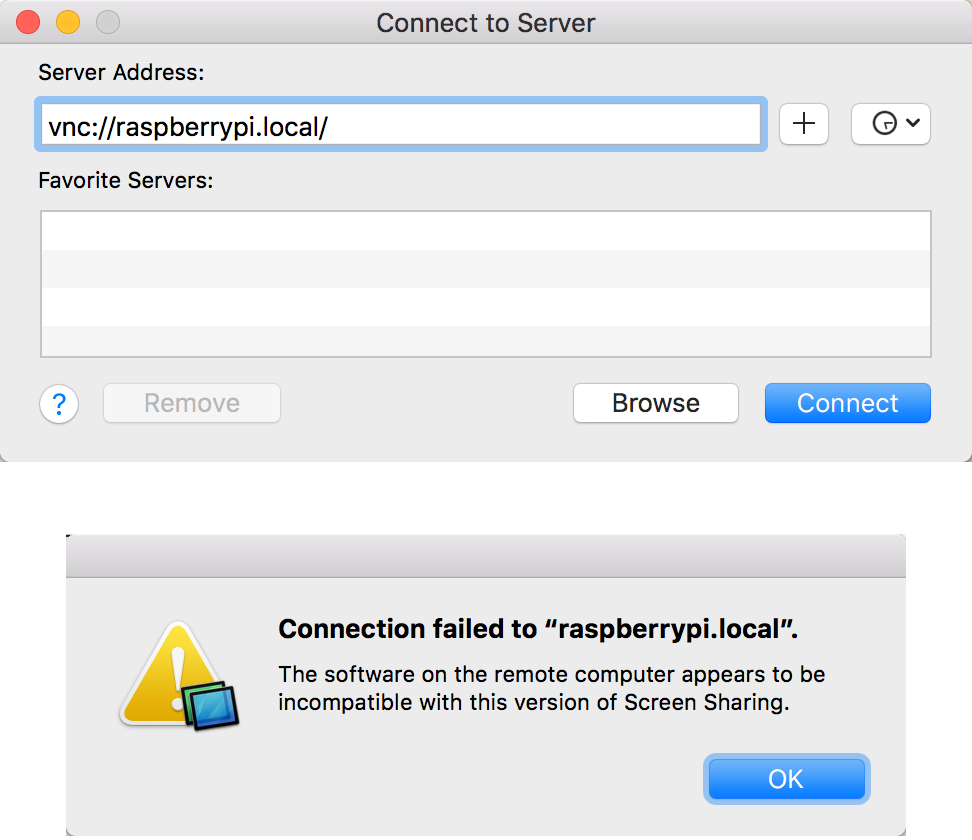

- raspberrypi 官方参考文档：remote access raspberrypi by [VNC (VIRTUAL NETWORK COMPUTING)](https://www.raspberrypi.org/documentation/remote-access/vnc/)；  
- realVNC 官方参考文档：[VNC Connect and Raspberry Pi](https://www.realvnc.com/en/connect/docs/raspberry-pi.html)。  

[Setting Up a VNC Server on Your Raspberry Pi](http://www.instructables.com/id/Setting-up-a-VNC-Server-on-your-Raspberry-Pi/)  

- [realVNC](https://www.realvnc.com/en/): apps for all platforms  
- [TightVNC](http://www.tightvnc.com/): simple Web Browser for macOS with Java Viewer  
- [UltraVNC](http://www.uvnc.com/): simple Web Browser for macOS with Java Viewer  

## [realVNC](https://www.realvnc.com/en/)
### [realVNC for raspberrypi](https://www.realvnc.com/en/raspberrypi/)

VNC Connect is included with Raspbian for Raspberry Pi  
Connect to your Raspberry Pi from anywhere  

RealVNC/[raspi-preview](https://github.com/RealVNC/raspi-preview)

### [VNC Connect and Raspberry Pi](https://www.realvnc.com/en/connect/docs/raspberry-pi.html)

- **VNC Server** enables you to connect to your Pi from a desktop computer or mobile device, watch its screen in real-time, and exercise control as though you were sitting in front of it.  
- **VNC Viewer** enables you to connect to and control a desktop computer (or another Pi) from your Pi, should you want to.  

```Shell
sudo apt-get update 
sudo apt-get install realvnc-vnc-server 
sudo apt-get install realvnc-vnc-viewer
```

### [Download VNC Viewer to the device to control from](https://www.realvnc.com/en/connect/download/viewer/raspberrypi/)

### geometry
[How can I change the geometry of a VNC Server in Virtual Mode desktop?](https://support.realvnc.com/Knowledgebase/Article/View/393/5/how-can-i-change-the-geometry-of-a-vnc-server-in-virtual-mode-desktop)  

```Shell
vncserver -geometry 800x600
```

[Change screen resolution over VNC](https://www.raspberrypi.org/forums/viewtopic.php?f=66&t=41378&sid=f2b85139e6fb9b707ddff076dc17c5c6)
[Troubleshooting VNC Server on the Raspberry Pi](https://support.realvnc.com/Knowledgebase/Article/View/523/2/troubleshooting-vnc-server-on-the-raspberry-pi) / Changing the Raspberry Pi's screen resolution  

## Apple Remote Desktop
[Remote Desktop Support](https://support.apple.com/remote-desktop) / [Apple Remote Desktop 3](https://www.apple.com/cn/remotedesktop/)  

[下载：Apple Remote Desktop 3.9.2 客户端](https://support.apple.com/kb/DL1909?locale=zh_CN)  
[Download: Apple Remote Desktop 3.9.3 Client](https://support.apple.com/kb/DL1924?locale=en_US)  

[macOS Sierra: Allow Remote Desktop to access your computer](https://support.apple.com/kb/PH25556?viewlocale=en_US&locale=en_US)  
[How to display your Raspberry Pi’s desktop on a Mac](https://smittytone.wordpress.com/2016/03/02/mac_remote_desktop_pi/)  

### raspberrypi.local
[How (and Why) to Assign the .local Domain to Your Raspberry Pi](https://www.howtogeek.com/167190/how-and-why-to-assign-the-.local-domain-to-your-raspberry-pi/)  
[Turning on Bonjour](https://gist.github.com/stonehippo/5642771)  
[Connecting to Raspberry Pi with Mac OS X](http://raspberry.znix.com/2013/03/connecting-to-raspberry-pi-with-mac-os-x.html)  
[How to setup mDNS lookups on the Raspberry Pi](http://root42.blogspot.com/2015/02/how-to-setup-mdns-lookups-on-raspberry.html)  
[Setting up a Bonjour (Zeroconf) service name for your Raspberry Pi and accessing it from an Android App](http://www.dodgycoder.net/2015/02/setting-up-bonjourzeroconfmdnsnsd.html)  



[how-to-fix-connection-failed-error-on-mac](http://www.adeepbite.com/how-to-fix-connection-failed-error-on-mac/)  

## [xrdp](http://www.xrdp.org/)
[Why use VNC and not XRDP?](https://www.raspberrypi.org/forums/viewtopic.php?f=91&t=74998&sid=d1a6e24579bf1bd05ec6f3bd489e1bbf)  
[Enabling Remote Desktop Access with xrdp on a Raspberry Pi](https://www.maketecheasier.com/enabling-remote-desktop-access-on-raspberry-pi/)  
[Raspberry Pi 的基礎 - 遠端遙控 X-Window 桌面環境 (XRDP 篇)](http://blog.itist.tw/2015/02/use-xrdp-service-to-remote-controll-x-window-for-raspberry-pi.html)  

## references
[树莓派 raspbian 开启VNC](http://bbs.shumeipaiba.com/thread-12-1-1.html)  
[VNC远程登录树莓派的图形界面](http://shumeipai.nxez.com/2013/09/04/login-rpi-with-vnc.html?variant=zh-cn)  
[使用VNC远程登录树莓派的图形界面](http://www.cnblogs.com/haochuang/p/6743387.html)  
[树莓派：VNC远程登录Raspbian图形界面（tightvncserver）](http://blog.csdn.net/lu_embedded/article/details/50621203)  
