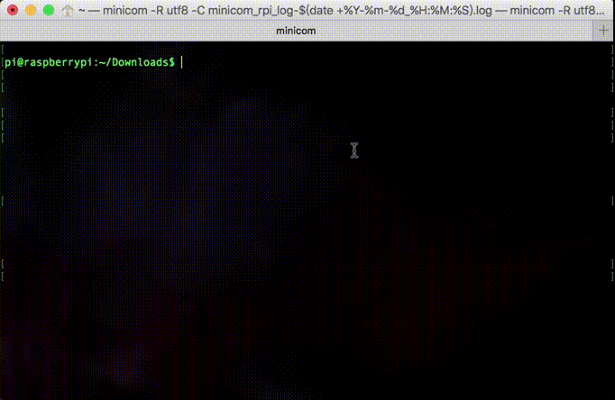

# install lrzsz
若要使用 ZModem 协议收发文件，则收发两端都必须安装 lrzsz 服务组件。

1. 在 macOS 上执行 `brew install lrzsz` 命令安装 lrzsz。  
2. 在 raspbian 上执行 `sudo apt-get install lrzsz` 命令安装 lrzsz。  

## macOS 安装 lrzsz
在 macOS 上执行 `brew install lrzsz` 命令安装 lrzsz。  
关于 macOS 下使用 homebrew 安装软件的步骤可参考《[Mac 下的软件安装 —— 从 pkg,dmg 到 brew,cask](http://col.dog/2015/11/22/homebrew/)》。  

```Shell
faner@THOMASFAN-MB0:~|⇒  brew search lrzsz
==> Searching local taps...
lrzsz
==> Searching taps on GitHub...
==> Searching blacklisted, migrated and deleted formulae...
faner@THOMASFAN-MB0:~|⇒  brew install lrzsz

==> Downloading https://homebrew.bintray.com/bottles/lrzsz-0.12.20.sierra.bottle.tar.gz
######################################################################## 100.0%
==> Pouring lrzsz-0.12.20.sierra.bottle.tar.gz
🍺  /usr/local/Cellar/lrzsz/0.12.20: 18 files, 415.9KB
```

执行 `ls /usr/local/Cellar/lrzsz/0.12.20/bin` 可以查看安装的 lrzsz binutils：

```Shell
faner@THOMASFAN-MB0:~|⇒  ls /usr/local/Cellar/lrzsz/0.12.20
AUTHORS              INSTALL_RECEIPT.json TODO
COPYING              NEWS                 bin
ChangeLog            README               share
faner@THOMASFAN-MB0:~|⇒  cd /usr/local/Cellar/lrzsz/0.12.20/bin
faner@THOMASFAN-MB0:/usr/local/Cellar/lrzsz/0.12.20/bin|
⇒  ls
lrb lrx lrz lsb lsx lsz rz  sz
```

- **xmodem**: lrx / lsx  
- **ymodem**: lrb / lsb  
- **zmodem**: lrz / lsz  

sz 是 lsz 的替身；rz 是 lrz 的替身。

### Usage help
1. 执行 `sz -h` 查看发送组件命令 [sz](https://linux.die.net/man/1/sz) 的帮助说明：

```Shell
faner@THOMASFAN-MB0:~|⇒  sz -h
sz version 0.12.20
Usage: sz [options] file ...
   or: sz [options] -{c|i} COMMAND
Send file(s) with ZMODEM/YMODEM/XMODEM protocol
```

2. 执行 `rz -h` 查看接收组件命令 [rz](https://linux.die.net/man/1/rz) 的帮助说明：

```Shell
faner@THOMASFAN-MB0:~|⇒  rz -h
rz version 0.12.20
Usage: rz [options] [filename.if.xmodem]
Receive files with ZMODEM/YMODEM/XMODEM protocol
```

### [minicom](https://linux.die.net/man/1/minicom) 设置传输协议
> [Homebrew](https://brew.sh/) installs packages to their own directory and then symlinks their files into /usr/local.  
> `/usr/local` must be writable!  

brew 将 lrzsz 安装到 `/usr/local/Cellar/lrzsz/` 目录，然后会执行 `ln -s` 命令将 sz/rz 软链到 `/usr/local/bin/` 目录下。  

执行 `which sz` 和 `which rz`：

```Shell
faner@THOMASFAN-MB0:~|⇒  which sz
/usr/local/bin/sz
faner@THOMASFAN-MB0:~|⇒  which rz
/usr/local/bin/rz
```

在 macOS 终端运行命令 `minicom -s`，弹出 minicom 的配置控制台。  

```Shell
+-----[configuration]------+
| Filenames and paths      |
| File transfer protocols  |
| Serial port setup        |
| Modem and dialing        |
| Screen and keyboard      |
| Save setup as dfl        |
| Save setup as..          |
| Exit                     |
| Exit from Minicom        |
+--------------------------+
```

通过上下箭头定位到 `File transfer protocols`，点击进去可以看到 minicom 调用 zmodem 收发文件的实际程序（Program）是 `/usr/local/bin/rz` 和 `/usr/local/bin/sz`。

```Shell
+------------------------------------------------------------------------------+
|     Name             Program                 Name U/D FullScr IO-Red. Multi  |
| A  zmodem     /usr/local/bin/sz -vv           Y    U    N       Y       Y    |
| B  ymodem     /usr/local/bin/sb -vv           Y    U    N       Y       Y    |
| C  xmodem     /usr/local/bin/sx -vv           Y    U    N       Y       N    |
| D  zmodem     /usr/local/bin/rz -vv           N    D    N       Y       Y    |
| E  ymodem     /usr/local/bin/rb -vv           N    D    N       Y       Y    |
| F  xmodem     /usr/local/bin/rx -vv           Y    D    N       Y       N    |
| G  kermit     /usr/local/bin/kermit -i -l %l  Y    U    Y       N       N    |
| H  kermit     /usr/local/bin/kermit -i -l %l  N    D    Y       N       N    |
| I  ascii      /usr/bin/ascii-xfr -dsv         Y    U    N       Y       N    |
| J    -                                                                       |
| K    -                                                                       |
| L    -                                                                       |
| M  Zmodem download string activates... D                                     |
| N  Use filename selection window...... Yes                                   |
| O  Prompt for download directory...... No                                    |
|                                                                              |
|   Change which setting? (SPACE to delete)                                    |
+------------------------------------------------------------------------------+
```

- **xmodem**: 需要修改配置为 lsx / lrx  
- **ymodem**: 需要修改配置为 lsb / lrb  
- 建议开启 Prompt for download directory...... Yes  

至此，macOS/minicom 安装配置好了 lrzsz，minicom 即可调用 lrzsz 协议（xmodem/ymodem/zmodem）进行文件传输（Send Files/Recv Files）。

### minicom 设置下载目录
在 macOS 终端运行命令 `minicom -s`，弹出 minicom 的配置控制台。  
通过上下箭头定位到 `Filenames and paths`：  

```Shell
+-----------------------------------------------------------------------+
| A - Download directory :                                              |
| B - Upload directory   :                                              |
| C - Script directory   :                                              |
| D - Script program     : runscript                                    |
| E - Kermit program     :                                              |
| F - Logging options                                                   |
|                                                                       |
|    Change which setting?                                              |
+-----------------------------------------------------------------------+
```

点按 <kbd>A</kbd> 定位到 Download directory，可修改默认下载目录。  
例如设置为 `/Users/faner/Downloads/`，点按  <kbd>enter</kbd> 确认返回到 [configuration] 对话框，选中 `Save setup as dfl`，再次点按  <kbd>enter</kbd> 确认保存配置修改并退出。  

## raspbian 安装 lrzsz
1. 在 raspbian 上执行 `sudo apt-get install lrzsz` 命令安装 lrzsz。

```Shell
pi@raspberrypi:~$ sudo apt-get install lrzsz
Reading package lists... 0%Reading package lists... 100%Reading package lists... Done
Building dependency tree... 0%Building dependency tree... 0%Building dependency tree... 50%Building dependency tree... 50%Building dependency tree... 96%Building dependency tree       
Reading state information... 0%Reading state information... 0%Reading state information... Done
Suggested packages:
  minicom
The following NEW packages will be installed:
  lrzsz
0 upgraded, 1 newly installed, 0 to remove and 0 not upgraded.
Need to get 81.8 kB of archives.
After this operation, 196 kB of additional disk space will be used.
0% [Working]0% [Working]0% [Working]0% [Working]0% [Connecting to mirrordirector.raspbian.org (93.93.128.193)]                                                              0% [Waiting for headers]                        0% [Working]0% [Working]0% [Working]0% [Connecting to mirrors.zju.edu.cn (210.32.158.231)]                                                      Get:1 http://mirrors.zju.edu.cn/raspbian/raspbian stretch/main armhf lrzsz armhf 0.12.21-8 [81.8 kB]
                                                      3% [1 lrzsz 2,625 B/81.8 kB 3%]72% [1 lrzsz 73.2 kB/81.8 kB 89%]                                 100% [Working]              Fetched 81.8 kB in 5s (15.6 kB/s)
Selecting previously unselected package lrzsz.
(Reading database ... (Reading database ... 5%(Reading database ... 10%(Reading database ... 15%(Reading database ... 20%(Reading database ... 25%(Reading database ... 30%(Reading database ... 35%(Reading database ... 40%(Reading database ... 45%(Reading database ... 50%(Reading database ... 55%(Reading database ... 60%(Reading database ... 65%(Reading database ... 70%(Reading database ... 75%(Reading database ... 80%(Reading database ... 85%(Reading database ... 90%(Reading database ... 95%(Reading database ... 100%(Reading database ... 122683 files and directories currently installed.)
Preparing to unpack .../lrzsz_0.12.21-8_armhf.deb ...
Unpacking lrzsz (0.12.21-8) ...
Setting up lrzsz (0.12.21-8) ...
Processing triggers for man-db (2.7.6.1-2) ...
```

2. 执行 `sz -h` 查看发送组件命令 sz 的帮助说明：

```Shell
pi@raspberrypi:~$ sz -h
sz version 0.12.21rc
Usage: sz [options] file ...
   or: sz [options] -{c|i} COMMAND
Send file(s) with ZMODEM/YMODEM/XMODEM protocol
```

3. 执行 `rz -h` 查看接收组件命令 rz 的帮助说明：

```Shell
pi@raspberrypi:~$ rz -h
rz version 0.12.21rc
Usage: rz [options] [filename.if.xmodem]
Receive files with ZMODEM/YMODEM/XMODEM protocol
```

# transfering by lrzsz
[lrzsz](http://freecode.com/projects/lrzsz/) is a portable and fast implementation of the X/Y/Zmodem protocols.  

[lrzsz](https://ohse.de/uwe/software/lrzsz.html)：free x/y/zmodem implementation  
*lrzsz* is a unix communication package providing the [XMODEM, YMODEM](ftp://ftp.std.com/obi/Standards/FileTransfer/YMODEM8.DOC.1.Z) [ZMODEM](http://www.easysw.com/~mike/serial/zmodem.html) file transfer protocols  

lrzsz 是一个 UNIX 通信套件，实现了 XModem，YModem 和 ZModem 文件传输协议。  

在嵌入式开发初期，SoC 开发板除了串口，没有任何外部输入输出设备，也没有网线。要想和这块板子传输文件，就需要用到串口传输了。  
宿主电脑（Host PC，本文中指 macOS）通过串口连接到 SoC 目标开发板（Remote Target Board，本文中指 raspbian）。板上嵌入式 elinux 一般都会移植 lrzsz 传输组件，宿主电脑通过支持 ZModem 的 telnet 或 SSH 客户端（例如 SecureCRT、minicom），即可实现与开发板互传文件。一种典型的场景可能是：将交叉编译生成的系统镜像（binary image）传输到开发板，然后通过 uboot 引导启动调试。  

考虑这样一种场景，如果通过 ssh 连接到主机A，再在 A 上 通过 ssh 连接到B，怎样把 B 的文件传到本地呢？如果使用 [scp](https://www.raspberrypi.org/documentation/remote-access/ssh/scp.md) 或 [sftp](https://www.raspberrypi.org/documentation/remote-access/ssh/sftp.md)（支持 ssh 的机器通常支持这两种协议），得先把文件从 B 通过 scp 传输到 A，再从 A 通过 scp 传输到本地。如果使用基于 ZModem 的传输协议命令 [sz/rz](http://iukg.blog.163.com/blog/static/19412814220100842148614/)，则可以一次搞定。  

宿主电脑（Host macOS/minicom）和目标板（Remote raspbian）上都安装了 lrzsz 组件后，双方可以通过 sz/rz 收发文件：接收端执行 rz 监听接收文件；发送端执行 sz 主动发送文件。  

- Host macOS 上传文件到 Remote raspbian（Remote raspbian 从 Host macOS 下载文件）：raspbian(lrzsz) 执行 rz；minicom 执行 Send Files（也可直接在 mac 终端执行 sz 命令）；  
- Host macOS 从 Remote raspbian 下载文件（Remote raspbian 上传文件到 Host macOS）：minicom 执行 Receive Files（也可直接在 mac 终端执行 rz 命令）；raspbian(lrzsz) 执行 sz。  

## Send Files(sz)
在 raspbian 当前目录（~/Downloads）执行 rx 命令接收文件。

- `-E` 选项表示接收到已有同名文件则重命名；  
- `-Z` 选项表示指定使用 ZMODEM 协议。  

```Shell
pi@raspberrypi:~/Downloads$ rx -EZ
rx waiting to receive.
```

在 macOS/minicom 终端窗口中，按 <kbd>esc</kbd><kbd>S</kbd> 组合键可打开发送文件（Upload）对话框。

```Shell
+-[Upload]--+
| zmodem    |
| ymodem    |
| xmodem    |
| kermit    |
| ascii     |
+-----------+
```

1. 选择 zmodem 传输协议，进入本地文件浏览器 `[Select one or more files for upload]` ；  
	> 当带参数 `-R utf8` 启动 minicom，这里出现乱码，暂时不明原因。  
2. 按 <kbd>↑</kbd><kbd>↓</kbd> 在当前文件夹的 item 上移动光标。  
3. 双击空格键确定进入光标所在文件夹（Space to tag）；光标 <kbd>↑</kbd> 上移到 `[..]`，双击空格则回到上一级目录。  
4. 若光标在文件上，按下空格键选中，再按一次撤销选中。通过按 <kbd>↑</kbd><kbd>↓</kbd> 可选中多个文件。选好后，按下 <kbd>enter</kbd> 键确认发送。  
	> 这里选择的和实际鼠标定位错位，暂时不明原因。  
	> 如果没有选中任何文件，按下 <kbd>enter</kbd> 键，则会弹出 `No file selected - enter filename:` 对话框，可直接输入当前目录下想要发送的文件名。  
5. 按 <kbd>←</kbd><kbd>→</kbd> 在底部的菜单栏（Goto、Prev、Show、Tag、Untag）切换。  

	- Goto：输入子目录路径。  
	- Prev：执行上一次命令。  

正常情况下，会弹出如下所示的 `zmodem upload` 上传进度提示对话框，按下 <kbd>ctrl</kbd>-<kbd>C</kbd> 可中止传输。  

```Shell
+-----------[zmodem upload - Press CTRL-C to quit]------------+
|Sending: NSURLSession.h                                      |
|Bytes Sent:  31744/  47129   BPS:11532    ETA 00:01          |
|                                                             |
|                                                             |
+-------------------------------------------------------------+
```

传输完成会提示 `Transfer complete`：

```Shell
+-----------[zmodem upload - Press CTRL-C to quit]------------+
|Sending: NSURLSession.h                                      |
|Bytes Sent:  47129   BPS:11144                               |
|                                                             |
|Transfer complete                                            |
|                                                             |
+-------------------------------------------------------------+
```



传输速度较慢，仅适合传输小文件；若要传输大文件，还是建议接好网线配好网络，采用基于 SSH 的 SCP/SFTP 传输协议。

## Receive Files(rz)
在 macOS/minicom 上通过 rz 接收文件，在 raspbian 中执行 sz 发送文件。

在 Host macOS 上的 minicom 终端窗口中，按 <kbd>esc</kbd><kbd>R</kbd> 组合键可打开接收文件（Download）对话框。

```Shell
+-[Download]--+
| zmodem      |
| ymodem      |
| xmodem      |
| kermit      |
+-------------+
```

# references

> [How to Transfer Text Files Between Linux, Macintosh, and Microsoft Windows Operating Systems](http://www.websiterepairguy.com/articles/os/crlf.html)  
> [Transfering file using zmodem/picocom/minicom noninteractively](https://stackoverflow.com/questions/19273030/transfering-file-using-zmodem-picocom-minicom-noninteractively)  
> [Transfer File From Computer to Raspberry Pi Using USB-Serial Cable by mirza irwan osman in raspberry-pi](http://www.instructables.com/id/Transfer-file-from-PC-to-Raspberry-Pi-Using-USB-Se/)  
> [mac 怎么登录到 linux 服务器并传输文件？](https://www.zhihu.com/question/22407930)  
> [KERMIT,XMODEM,YMODEM,ZMODEM传输协议小结](http://blog.sina.com.cn/s/blog_81f1e2680101bdws.html)  
> [Linux下几种文件传输命令 sz rz sftp scp](http://blog.163.com/fjm_520/blog/static/18904914820119284847660/)  
> [lrzsz串口工具移植到ARM Linux教程](http://www.veryarm.com/879.html)  
> [Linux系统上传下载命令rz和sz](http://oldboy.blog.51cto.com/2561410/588592)  