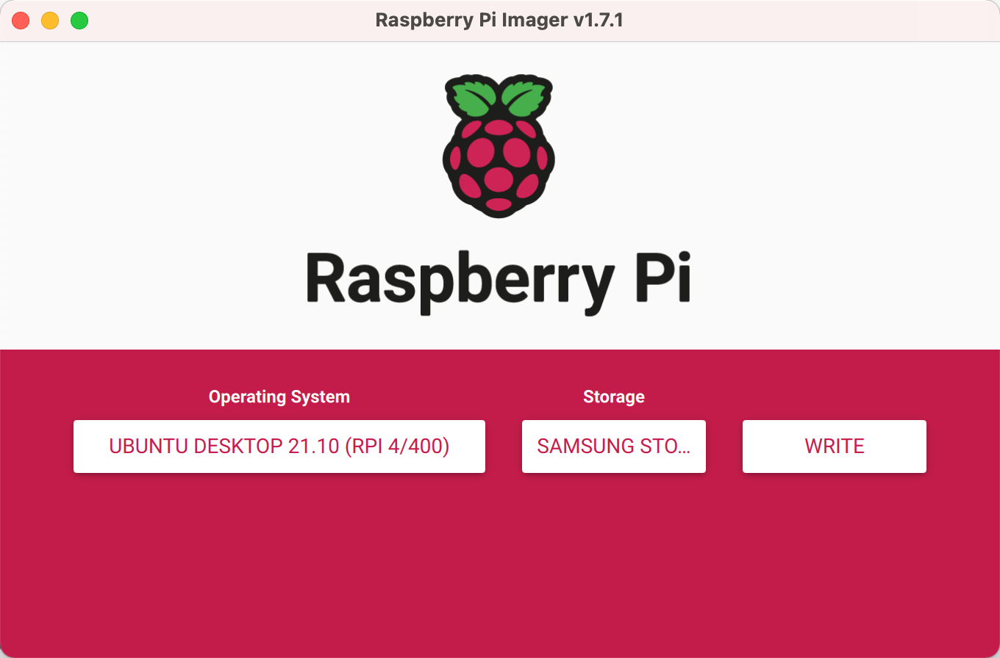

## ubuntu

[Install Ubuntu on a Raspberry Pi](https://ubuntu.com/download/raspberry-pi)

Raspberry Pi 4: At least 4 GB RAM required

[How to install Ubuntu Desktop on Raspberry Pi 4](https://ubuntu.com/tutorials/how-to-install-ubuntu-desktop-on-raspberry-pi-4)

1. How to create a bootable Ubuntu Desktop microSD card
2. How to setup your Ubuntu Desktop for daily use

[Ubuntu 20.04, 18.04 on RPi4b](https://forums.raspberrypi.com/viewtopic.php?t=280819&sid=c751f5348b1c5876f866630c875e1aa6)

[在树莓派4B上安装Ubuntu Mate 20.04 和ROS](https://blog.csdn.net/weixin_42967006/article/details/115400196)

- Ubuntu Desktop 版只推荐4G和8G的树莓派安装。

[树莓派4B（rpi4b）引导ubuntu分析.md](https://segmentfault.com/a/1190000023138778)

## RPi-Imager

参考 [How to install Ubuntu Desktop on Raspberry Pi 4](https://ubuntu.com/tutorials/how-to-install-ubuntu-desktop-on-raspberry-pi-4)，基于 RPi Imager 安装。

[Raspberry Pi OS](https://www.raspberrypi.com/software/)

- Install Raspberry Pi OS using [Raspberry Pi Imager](https://www.raspberrypi.com/news/raspberry-pi-imager-imaging-utility/) 下载 Raspberry Pi Imager for macOS。

[Raspberry Pi Documentation](https://www.raspberrypi.com/documentation/computers/getting-started.html) - Computers - Getting Started

- Installing the Operating System - Using Raspberry Pi Imager

Raspberry Pi have developed a graphical SD card writing tool that works on Mac OS, Ubuntu 18.04, and Windows called `Raspberry Pi Imager`; this is the easiest option for most users since it will download the image automatically and install it to the SD card.

[树莓派安装 Ubuntu 系统](https://getiot.tech/rpi/how-to-install-ubuntu-desktop-on-raspberry-pi.html)  
[在树莓派 4 上安装 Ubuntu 桌面系统](https://os.51cto.com/article/683524.html) @[FOSS](https://itsfoss.com/install-ubuntu-desktop-raspberry-pi/)  
[在Raspberry Pi 4上玩 Ubuntu 桌面](https://www.codenong.com/b50d44bd70c25279d130/) - 日语  
[Raspberry Pi 400 介紹與 Ubuntu 系統安裝](https://www.circuspi.com/index.php/2021/02/09/raspberry-pi-400-ubuntu/)  
[9-Steps Raspberry Pi Headless Setup with Ubuntu 21.04](https://dev.to/henri_rion/9-steps-raspberry-pi-headless-setup-with-ubuntu-21-04-3el3)  



### 连接键鼠屏

根据 [How to install Ubuntu Desktop on Raspberry Pi 4](https://ubuntu.com/tutorials/how-to-install-ubuntu-desktop-on-raspberry-pi-4) 的第三步 [Boot your Desktop](https://ubuntu.com/tutorials/how-to-install-ubuntu-desktop-on-raspberry-pi-4#3-boot-your-desktop) 中提示：

> Now, ensure your HDMI screen and a USB keyboard are plugged in **before** plugging in and powering on the Raspberry Pi. 

**注意**：RPi4B-Ubuntu 默认不支持 microHDMI 热插拔（hotplug），故一定要在上电启动前，插上 microHDMI 连接好显示器，再启动 RPi 则显示正常！

连接显示后，语言可选择 English，键盘需选择 Chinese，然后连接上 WiFi，设置机器名和账户密码。

## Manually

Manually install an operating system image

[Raspberry Pi OS](https://www.raspberrypi.com/software/)

- Manually install an operating system image

- [Operating system images](https://www.raspberrypi.com/software/operating-systems/) 列举了支持 RPi 的操作系统。

[Raspberry Pi Documentation](https://www.raspberrypi.com/documentation/computers/getting-started.html) - Computers - Getting Started

- Installing Images on Mac OS

Raspberry Pi Imager is the recommended option for most users to write images to SD cards. However, if you do not want to use the Imager you can still copy an operating system to the card from the command line.

具体参考 [macOS向microSD写入raspbian-stretch](../raspbian/install/macOS向microSD写入raspbian-stretch.img.md)。
首先，需要将 SD 卡文件系统格式化为 DOS_FAT_32 格式。

[Mac 制作 树莓派4B+系统 安装ubuntu系统](https://www.jianshu.com/p/9c04b0b7b40e)  

### 下载解压镜像

进入 [Install Ubuntu on a Raspberry Pi](https://ubuntu.com/download/raspberry-pi)，点击 `Download 64-bit` 按钮下载 Ubuntu Desktop 21.10。

下载下来的镜像 ubuntu-21.10-preinstalled-desktop-arm64+raspi.img.xz 大约1.9G。
在 macOS 下双击，将调起 Archive Utility 软件解压出9.41G的原始镜像。

### 查找SD卡盘符

查找 SD 卡对应的盘符 `/dev/disk2`：

```Shell
$ diskutil list
/dev/disk0 (internal, physical):
   #:                       TYPE NAME                    SIZE       IDENTIFIER
   0:      GUID_partition_scheme                        *500.3 GB   disk0
   1:                        EFI EFI                     209.7 MB   disk0s1
   2:                 Apple_APFS Container disk1         500.1 GB   disk0s2

/dev/disk1 (synthesized):
   #:                       TYPE NAME                    SIZE       IDENTIFIER
   0:      APFS Container Scheme -                      +500.1 GB   disk1
                                 Physical Store disk0s2
   1:                APFS Volume HD                      16.0 GB    disk1s1
   2:              APFS Snapshot com.apple.os.update-... 16.0 GB    disk1s1s1
   3:                APFS Volume Preboot                 1.4 GB     disk1s2
   4:                APFS Volume Recovery                626.5 MB   disk1s3
   5:                APFS Volume VM                      6.3 GB     disk1s4
   6:                APFS Volume HD - Data               412.4 GB   disk1s5

/dev/disk2 (external, physical):
   #:                       TYPE NAME                    SIZE       IDENTIFIER
   0:     FDisk_partition_scheme                        *63.9 GB    disk2
   1:             Windows_FAT_32 boot                    268.4 MB   disk2s1
   2:                      Linux                         63.6 GB    disk2s2
```

### 卸载SD卡分区卷

卸载分区卷 dev/disk2：

```Shell
$ diskutil unmount /dev/disk2
disk2 was already unmounted or it has a partitioning scheme so use "diskutil unmountDisk" instead
# 改为 unmountDisk 命令
$ diskutil unmountDisk /dev/disk2
Unmount of all volumes on disk2 was successful
```

### 写入镜像到SD卡

将系统镜像 img 写入 SD 卡：

```Shell
$ cd ~/Downloads
#sudo ** bs=1m if=ubuntu-21.10-preinstalled-desktop-arm64+raspi.img of=/dev/rdisk2 conv=sync
$ sudo ** bs=1m if=ubuntu-21.10-preinstalled-desktop-arm64+raspi.img of=/dev/rdisk2; sync
```

输入密码后开始写入，写入速度约14M/s，大约需要十几分钟。
中途无可以（多次）按下 control+T 发送 `SIGINFO` 信号，打印当前写入进度。

最终写入完成，屏幕输出信息如下。

```Shell
~/Downloads » sudo ** bs=1m if=ubuntu-21.10-preinstalled-desktop-arm64+raspi.img of=/dev/rdisk2; sync
Password:
# 按下 ^T 查看进度
load: 2.74  cmd: ** 14903 uninterruptible 0.00u 1.21s
1998+0 records in
1997+0 records out
2094006272 bytes transferred in 143.556525 secs (14586632 bytes/sec)
#...
8965+1 records in
8965+1 records out
9400728576 bytes transferred in 629.445978 secs (14934925 bytes/sec)
```

此时，重新执行 `diskutil list` 查看 /dev/disk2 分区信息如下：

> macOS 桌面上多了一个卷标 system-boot。

```Shell
~/Downloads » diskutil list
/dev/disk0 (internal, physical):
   #:                       TYPE NAME                    SIZE       IDENTIFIER
   0:      GUID_partition_scheme                        *500.3 GB   disk0
   1:                        EFI EFI                     209.7 MB   disk0s1
   2:                 Apple_APFS Container disk1         500.1 GB   disk0s2

/dev/disk1 (synthesized):
   #:                       TYPE NAME                    SIZE       IDENTIFIER
   0:      APFS Container Scheme -                      +500.1 GB   disk1
                                 Physical Store disk0s2
   1:                APFS Volume HD                      16.0 GB    disk1s1
   2:              APFS Snapshot com.apple.os.update-... 16.0 GB    disk1s1s1
   3:                APFS Volume Preboot                 1.4 GB     disk1s2
   4:                APFS Volume Recovery                626.5 MB   disk1s3
   5:                APFS Volume VM                      6.3 GB     disk1s4
   6:                APFS Volume HD - Data               421.8 GB   disk1s5

/dev/disk2 (external, physical):
   #:                       TYPE NAME                    SIZE       IDENTIFIER
   0:     FDisk_partition_scheme                        *63.9 GB    disk2
   1:             Windows_FAT_32 system-boot             268.4 MB   disk2s1
   2:                      Linux                         9.1 GB     disk2s2
                    (free space)                         54.5 GB    -
```

接下来，参考 [macOS向microSD写入raspbian-stretch](../raspbian/install/macOS向microSD写入raspbian-stretch.img.md) 为 RPi 配置网络，以便 SSH 远程连接控制。

最后，执行 eject 命令可以将 SD 卡分区卷安全弹出：

```Shell
sudo diskutil eject /dev/rdisk2
```

### 无屏配置

> 折腾了一通，SSH还是无法连接！

[树莓派4b ubuntu 设置屏幕热插拔](https://blog.csdn.net/benchuspx/article/details/112576609)

[树莓派raspberry pi 4b ubuntu20.04LTS 配置（含显示器以及wifi）](https://blog.csdn.net/weixin_43403879/article/details/114230532)

- 在 network 文件里面添加wifi信息？

[Setup ubuntu server on Raspberry Pi 4 without keyboard](https://askubuntu.com/questions/1192485/setup-ubuntu-server-on-raspberry-pi-4-without-keyboard)  

/boot/config.txt  

```
# uncomment if hdmi display is not detected and composite is being output
# a** by faner, 05Feb22.
hdmi_force_hotplug=1

# uncomment to force a specific HDMI mode (this will force VGA)
# a** by faner, 05Feb22.
hdmi_group=2
hdmi_mode=82 # 1080p60Hz
```

/boot/network-config  

```
version: 2
ethernets:
  eth0:
    dhcp4: true
    optional: true
wifis:
  wlan0:
  dhcp4: true
  optional: true
  access-points:
    your_wifi_name:
    password: "your_wifi_password"
```

## 替换软件源

/etc/apt/sources.list

清空所有内容，输入清华源，链接如下：

```
https://mirrors.tuna.tsinghua.edu.cn/help/ubuntu-ports/
```
