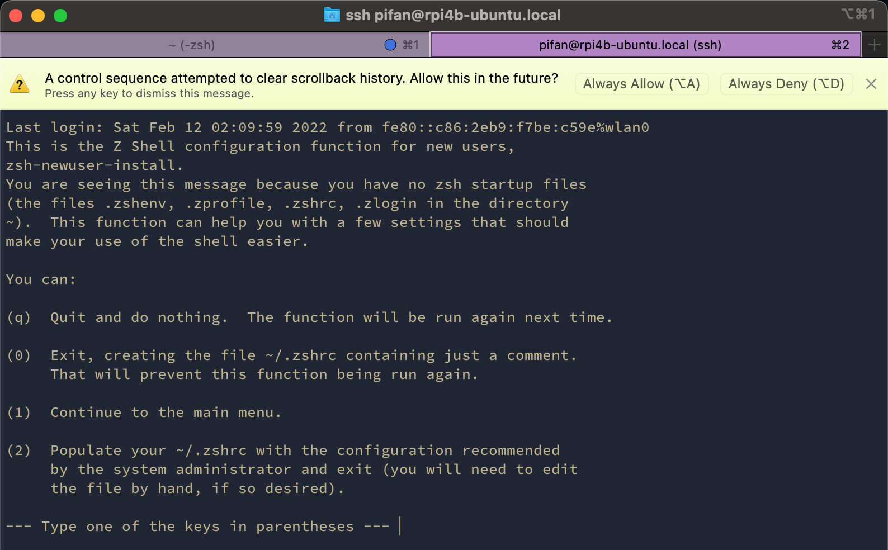

## shell

查看 ubuntu 支持哪些 shell：

```Shell
pifan@rpi4b-ubuntu:~$ cat /etc/shells
# /etc/shells: valid login shells
/bin/sh
/bin/bash
/usr/bin/bash
/bin/rbash
/usr/bin/rbash
/usr/bin/sh
/bin/dash
/usr/bin/dash
/usr/bin/tmux
/usr/bin/screen
```

查看当前正在使用的 shell：

```Shell
pifan@rpi4b-ubuntu:~$ echo $SHELL
/bin/bash
```

## zsh

```Shell
pifan@rpi4b-ubuntu:~$ apt search --names-only zsh
Sorting... Done
Full Text Search... Done
fizsh/impish 1.0.9-1 all
  Friendly Interactive ZSHell

zsh/impish 5.8-6build1 arm64
  shell with lots of features

zsh-antigen/impish 2.2.3-4 all
  manage your zsh plugins

zsh-autosuggestions/impish 0.6.4-1 all
  Fish-like fast/unobtrusive autosuggestions for zsh

zsh-common/impish 5.8-6build1 all
  architecture independent files for Zsh

zsh-dev/impish 5.8-6build1 arm64
  shell with lots of features (development files)

zsh-doc/impish 5.8-6build1 all
  zsh documentation - info/HTML format

zsh-static/impish 5.8-6build1 arm64
  shell with lots of features (static link)

zsh-syntax-highlighting/impish 0.7.1-2 all
  Fish shell like syntax highlighting for zsh

zsh-theme-powerlevel9k/impish 0.6.7-2 all
  powerlevel9k is a theme for zsh which uses powerline fonts
```

执行 `apt install zsh` 安装 zsh：

```Shell
pifan@rpi4b-ubuntu:~$ sudo apt install zsh
```

重新查看 /etc/shells 中新增了两项 ：

```Shell
pifan@rpi4b-ubuntu:~$ cat /etc/shells

/bin/zsh
/usr/bin/zsh
```

首次启动Shell，加载 zsh 会提示如下信息，可以按下q忽略，或按下0生成~/.zshrc：



### oh-my-zsh

- [Ubuntu | 安装oh-my-zsh](https://www.jianshu.com/p/ba782b57ae96)  
- [Ubuntu 安装 oh my zsh 效率翻倍](https://chensir.ink/02206e0e927c/)  
- [Ubuntu 下 Oh My Zsh 的最佳实践「安装及配置」](https://segmentfault.com/a/1190000015283092)  

下载安装脚本，报错无法连接：

```Shell
rpi4b-ubuntu% sudo vim /etc/resolv.conf
rpi4b-ubuntu% curl -fsSL https://raw.github.com/robbyrussell/oh-my-zsh/master/tools/install.sh | zsh
curl: (7) Failed to connect to raw.githubusercontent.com port 443: Connection refused
```

参考 [Failed to connect to raw.githubusercontent.com:443](https://zhuanlan.zhihu.com/p/115450863)

> [如何解决类似 curl: (7) Failed to connect to raw.githubusercontent.com port 443: Connection refused 的问题 #10](https://github.com/hawtim/hawtim.github.io/issues/10)

可直接在浏览器上访问 github [ohmyzsh tools](https://github.com/ohmyzsh/ohmyzsh/blob/master/tools)，点进 install.sh - Raw 保存到本地，chmod 增加可执行权限，然后 sh -c 运行该脚本即可安装。

如果还不行，可以通过临时修改hosts解决此问题。

在 https://www.ipaddress.com/ 上查询 http://raw.githubusercontent.com 的真实IP。

然后 `sudo vim /etc/hosts` 修改 hosts，添加如下内容：

```Shell
# cat /etc/hosts
185.199.108.133 raw.githubusercontent.com
185.199.109.133 raw.githubusercontent.com
185.199.110.133 raw.githubusercontent.com
185.199.111.133 raw.githubusercontent.com
```

### change cursor

[How do I change my terminal’s cursor from a block to a blinking vertical bar? [closed]](https://stackoverflow.com/questions/66975024/how-do-i-change-my-terminal-s-cursor-from-a-block-to-a-blinking-vertical-bar)  
[Changing cursor style based on mode in both zsh and vim](https://unix.stackexchange.com/questions/433273/changing-cursor-style-based-on-mode-in-both-zsh-and-vim)  

ubuntu 默认的光标样式是柱体，可在 zsh 配置文件中添加以下代码修改为闪动的竖线：

```Shell
# ~/.zshrc

# change cursor from a block to a blinking vertical bar
_fix_cursor() {
   echo -ne '\e[5 q'
}
precmd_functions+=(_fix_cursor)
```

## powerline

[linux下的powerline安装教程](https://www.cnblogs.com/brooksj/p/10428730.html)  
[oh-my-zsh powerline打造终极shell](https://blog.csdn.net/jqwang1992/article/details/74858252)  
[iTerm2 + Oh my ZSH+ Powerline 打造个性终端最终版](https://blog.csdn.net/lablenet/article/details/73900461)  
[Powerline：漂亮的 Vim 狀態列與 Bash Shell 命令提示字串外掛](https://blog.gtwang.org/linux/powerline-adds-powerful-statuslines-and-prompts-to-vim-and-bash/)  

```Shell
pifan@rpi4b-ubuntu:~$ apt search powerline --names-only
Sorting... Done
Full Text Search... Done
elpa-powerline/impish 2.4-4 all
  Emacs version of the Vim powerline

elpa-smart-mode-line-powerline-theme/impish 2.13-2 all
  Smart Mode Line themes that use Emacs Powerline

fonts-powerline/impish 2.8.2-1 all
  prompt and statusline utility (symbols font)

powerline/impish 2.8.2-1 arm64
  prompt and statusline utility

powerline-doc/impish 2.8.2-1 all
  prompt and statusline utility (documentation)

powerline-gitstatus/impish 1.3.1-2 all
  Powerline Git segment

python3-powerline/impish 2.8.2-1 all
  prompt and statusline utility (Python 3.x module)

python3-powerline-gitstatus/impish 1.3.1-2 all
  Powerline Git segment for Python (3.x)

python3-powerline-taskwarrior/impish 0.7.2-1.1 all
  Powerline segment for showing Taskwarrior information (Python 3)
```